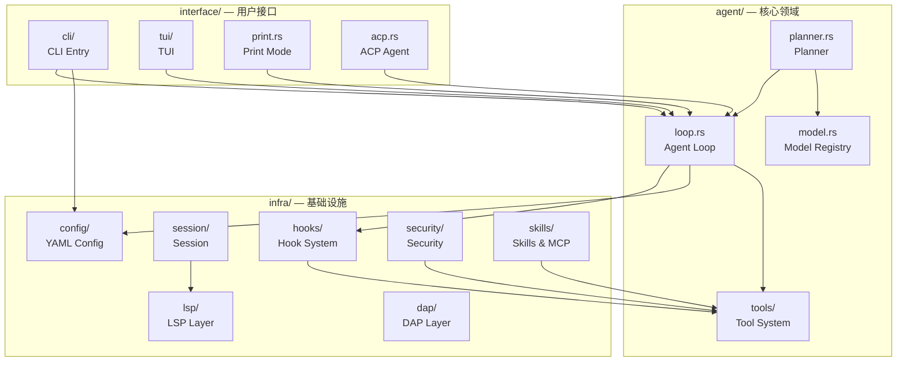
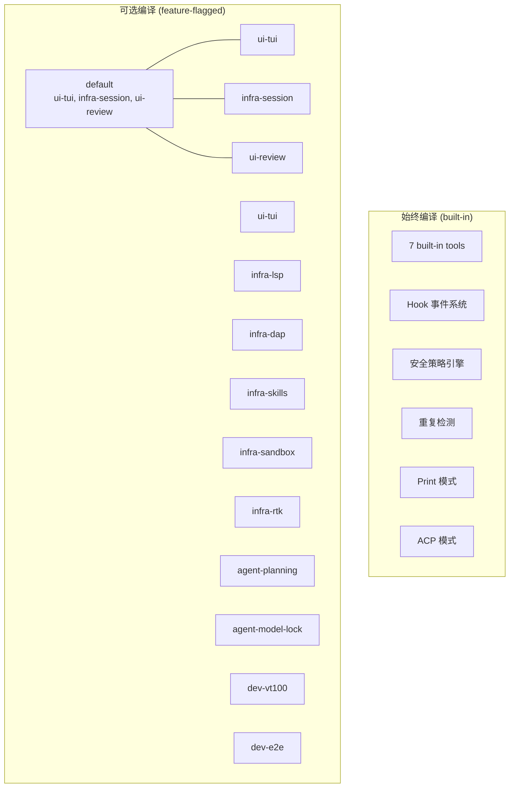

# c05-init-skeleton — Design

## Context

- PRD: §0.9（依赖总图）、§0.3（内部包对标 adk-rust/ratatui/lspz）、§0.8（技术栈选型）
- 依赖关系见 proposal.md frontmatter（depends_on / blocks 为 SSOT）
- 关键约束: 单 crate + feature flags 替代 PRD 推荐的 9-crate workspace（决策已在 proposal 中论证）

## Goals / Non-Goals

### Goals

- 建立三层领域目录结构（agent/infra/interface），编译通过
- 定义全部 feature flags，`cargo check --all-features` 通过
- 各模块放置占位入口，暴露 trait/struct 骨架但不实现
- 清晰的模块可见性边界：层间通过 `pub(crate)` 控制

### Non-Goals

- 不引入任何外部依赖（纯骨架）
- 不实现任何业务逻辑（由 c10-c88 各 change 填充）
- 不处理构建脚本或条件编译的具体逻辑

## Decisions

### Decision 1: 三层架构的模块边界与可见性

**背景**: 需要确定各层之间的访问控制策略，防止循环依赖和不当耦合。

**选择**: `pub(crate)` 默认 + 跨层仅暴露必要接口

```
可见性规则:
├── lib.rs         — pub(crate) 重导出各层根模块
├── agent/         — pub(crate)，核心领域逻辑
├── infra/         — pub(crate)，基础设施
└── interface/     — pub(crate)，用户接口
    └── 跨层访问通过 lib.rs 的 re-export 暴露
```



**权衡**: `pub(crate)` 比 `pub` 更安全但比 `pub(crate in path)` 更简单。单 crate 内不需要更细粒度的可见性控制。

### Decision 2: Feature flags 两层启用策略

**背景**: 部分 feature 之间存在逻辑依赖（如 ui-review 需要 hooks），需要定义隐式启用关系。同时，部分功能（hooks、security、repeat-detection、print-mode）轻量且对 agent 正确运行至关重要，不应通过 feature flag 控制。

**选择**: 两层启用策略——始终编译（built-in, config 层控制）+ 可选编译（feature-flagged）



**命名规则**: `<domain>-<capability>`

| 前缀 | 层 | 含义 |
|------|-----|------|
| `agent-` | `agent/` | 改变 agent 核心行为 |
| `infra-` | `infra/` | 基础设施集成 |
| `ui-` | `interface/` | 用户交互模式 |
| `dev-` | test-only | 开发/测试专用 |

逻辑依赖关系（在代码中用 `cfg` 守卫处理，非 feature 声明）：

| Feature | 运行时依赖 | 说明 |
|---------|-----------|------|
| ui-review | hooks (built-in) | 审查流程触发 hook 事件，始终可用 |
| ui-tui | ui-review | TUI 内嵌 diff 审查组件，ui-review 未启用时隐藏审查 UI |
| agent-model-lock | agent-planning | Phase 2: 仅本地模型需要。planning 未启用时锁无使用者 |
| infra-session | infra-lsp | 快照的 code_summaries 可选依赖 LSP，infra-lsp 未启用时认知为空 |

**权衡**: 不在 Cargo.toml 中声明 feature 依赖（避免编译时强制拉入），而是在模块代码中用 `#[cfg(all(feature = "a", feature = "b"))]` 处理组合逻辑。运行时缺少依赖 feature 时优雅降级而非编译失败。

始终编译的功能通过 config.yaml 运行时控制，无 feature gate：
- `hooks: []` — 空列表即 no-op dispatcher
- `security.enabled: true/false` — 安全策略引擎开关
- `repeat_detection.enabled: true/false` — 重复检测开关
- 运行模式由 CLI `--mode` 选择（print / acp / tui）

### Decision 3: 占位模块策略

**背景**: 骨架阶段需要为下游 change 提供可编译的入口，同时不提前锁定具体实现。

**选择**: 定义核心 trait/struct 骨架 + `todo!()` 实现

```rust
// 示例: src/agent/tools/mod.rs
/// 工具执行结果
pub struct ToolResult {
    pub output: String,
    pub success: bool,
}

/// 工具 trait — 后续 c20 实现
pub trait Tool: Send + Sync {
    fn name(&self) -> &str;
    fn execute(&self, args: serde_json::Value) -> ToolResult;
}

/// 工具注册表 — 后续 c20 实现
pub struct ToolRegistry { /* c20 填充 */ }
```

**权衡**: 比"空文件"多一步——锁定核心类型签名，使下游 change 可以并行开发而不会产生接口冲突。但比"完整实现"少一步——不写死内部逻辑。

### Decision 4: Cargo.toml 共享元数据策略

**背景**: 单 crate 的 Cargo.toml 需要管理所有依赖和 feature flags，随着 change 增长会变大。

**选择**: 集中管理 + feature-gated 依赖

```toml
[dependencies]
# 核心依赖（始终编译）
serde = { version = "1", features = ["derive"] }
serde_json = "1"
tokio = { version = "1", features = ["full"] }
anyhow = "1"
thiserror = "2"
tracing = "0.1"

# 可选依赖 — 由对应 feature flag 控制
clap = { version = "4.6", optional = true }
ratatui = { version = "0.30", optional = true }
lspz = { version = "0.9.2", optional = true }
# ... 各 change 按需添加

[features]
default = ["ui-tui", "infra-session", "ui-review"]
ui-tui = ["dep:ratatui"]
infra-lsp = ["dep:lspz"]
# ...
```

**权衡**: 单 Cargo.toml 会随项目增长变大（预计 ~200 行依赖段），但比 workspace 多 crate 的版本协调简单得多。每个 change 实现时添加自己的依赖即可。

## Risks / Trade-offs

### 技术风险

| 风险 | 等级 | 缓解 |
|------|------|------|
| 单 crate 编译时间随 feature 增长变慢 | 低 | feature flags 裁剪编译范围；开发时仅启用需要的 feature |
| `pub(crate)` 可见性过宽导致模块间耦合 | 中 | 各模块内部用 `pub(super)` 或私有控制；通过 clippy 的 `cognitive_complexity` lint 辅助 |
| 占位 trait 签名与最终实现不匹配 | 中 | 下游 change 实现时有权修改 trait，但需在 proposal 中说明变更理由 |

### 集成风险

- 下游 change 实现时可能发现模块放置不合理（如某功能应从 `infra/` 移到 `agent/`）——允许通过 refactor change 调整
- feature flag 组合爆炸（2^13 种）——不测试所有组合，仅测试 default + all-features + 关键子集

### 待确认问题

（已解决）`core-tools` 改为始终编译（built-in），无需 feature flag。`default` 包含 `ui-tui`, `infra-session`, `ui-review`。
