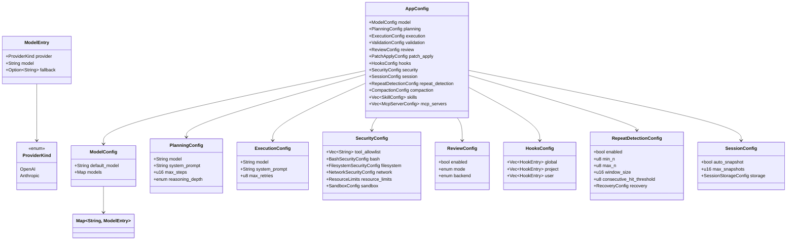
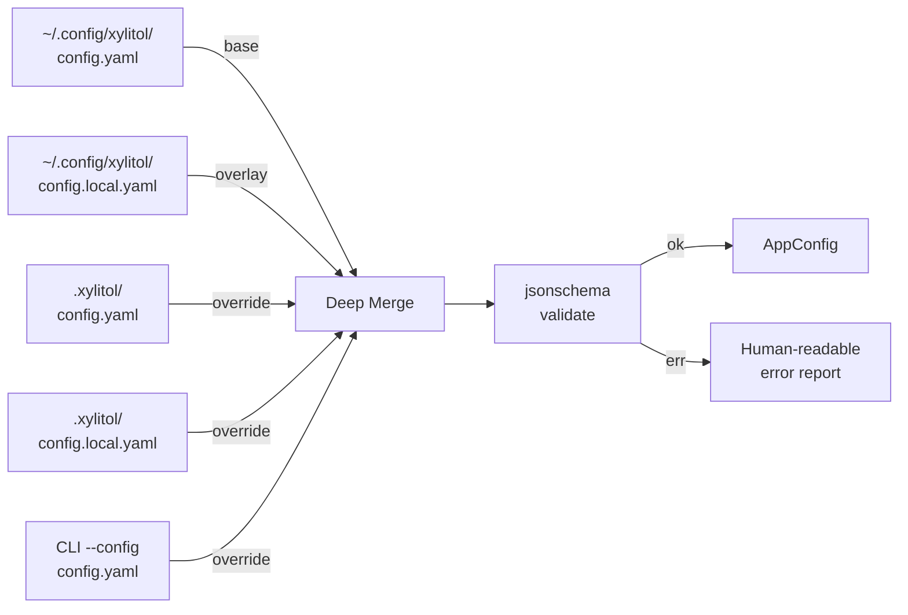
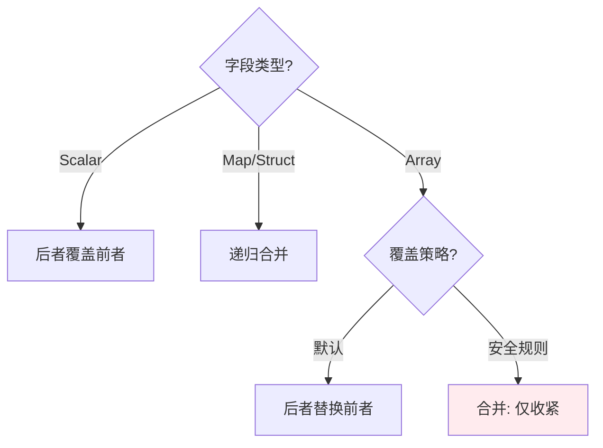
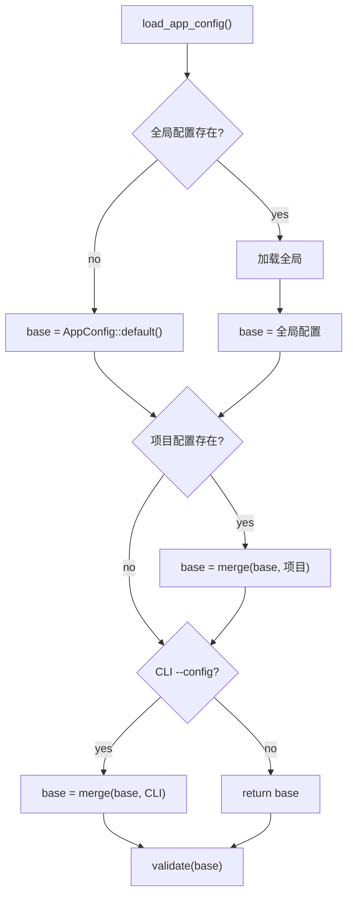
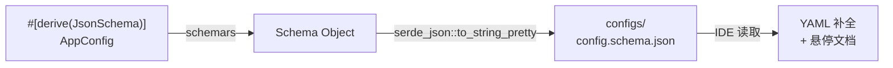

# c10-add-config — Design

## Context

- PRD: §2（核心架构配置驱动）、§5（规划器/执行器模型绑定）、§11.9（session 配置）、§12.2（安全配置结构）
- **adk-rust 集成**: AppConfig 作为 YAML 配置入口，通过构建器模式映射到 `adk-runner::RunnerConfig` 和 `adk-agent::LlmAgentBuilder`。无需自建运行时配置系统，adk-rust 已提供 `RunnerConfig`、`GenerateContentConfig` 等类型。
- **硬约束**: MVP 仅支持 OpenAI-compatible Response API 和 Anthropic-compatible API 两种 provider。ProviderKind 枚举仅含 `OpenAI | Anthropic`，不扩展。fallback 为可选单跳（OpenAI↔Anthropic），非多模型链。
- 依赖关系见 proposal.md frontmatter（depends_on / blocks 为 SSOT）

## Goals / Non-Goals

### Goals

- 定义完整 `AppConfig` 结构体，覆盖所有模块的配置需求
- 三级配置加载（全局 ~/.config/xylitol/ → 项目 .xylitol/ → CLI --config）
- 深层合并（后者覆盖前者，逐字段而非替换整个 section）
- JSON Schema 生成（`schemars`）供 IDE 补全
- 运行时校验（`jsonschema`）+ 人可读错误

### Non-Goals

- 不实现热重载（配置加载一次，运行时不变）
- 不实现配置迁移/版本升级逻辑
- 不实现加密存储（API key 明文存储在 `secret.env` 或环境变量中，由 OS 文件权限保护。加密 vault 集成留作后续增强）

## Decisions

### Decision 1: AppConfig 结构体设计

**背景**: 配置是所有模块的"神经系统"，需要在单一结构体中覆盖全部功能域，同时保持可扩展。



**选择**: 扁平化顶层 + 嵌套子结构。每个子结构对应一个功能域（由对应 change 实现）。`AppConfig` 包含一个 `runner` 字段直接映射 `adk-runner::RunnerConfig`，xylitol 特有字段（hooks、security、repeat_detection 等）作为扩展字段。

**权衡**: 扁平化比深层嵌套更容易做深层合并和 JSON Schema 生成。MVP 仅 `ProviderKind::OpenAI | ProviderKind::Anthropic` 两种变体。

### Decision 2: 三级配置加载与合并算法

**背景**: 用户可能在全局设默认，项目级覆盖，CLI 临时覆盖。合并必须正确处理嵌套结构。



**合并规则**:



安全规则合并的特殊逻辑（§12.3）：
- `allowed_patterns`: 后者与前者取**交集**（仅收紧）
- `forbidden_patterns`: 后者与前者取**并集**（仅收紧）
- `path_allowlist`: 取交集
- `path_blocklist`: 取并集

**选择**: 5 级加载（global base → global local → project base → project local → CLI），每级 YAML 先经模板渲染再解析为 `serde_json::Value`，然后按优先级深层合并，最后反序列化为 `AppConfig`

**权衡**: 两步反序列化比直接 merge struct 更灵活（可以处理未知字段），但有少量运行时开销。

### Decision 3: 配置文件发现与缺失处理

**背景**: 三级配置中任何一级都可能不存在。



**选择**: 全部三级都是可选的。没有任何配置文件时使用 `AppConfig::default()`（内置默认值），确保无配置也能运行。

**权衡**: 零配置可运行（友好）vs 强制要求至少一个配置文件（安全）。选择友好——安全策略默认 deny-all 由 c50 处理，不依赖配置文件存在。

### Decision 4: JSON Schema 生成流程



**选择**: 编译时通过 `build.rs` 或手动脚本生成 schema 文件，而非运行时生成。

**权衡**: build.rs 增加编译时间但自动化；手动脚本灵活但容易忘记运行。先用手动脚本（`just gen-schema`），后期可改 build.rs。

### Decision 5: 模板渲染引擎

**背景**: 配置文件需要引用环境变量和密钥（如 API key），但不能将这些值硬编码进 YAML。模板渲染必须在 YAML 解析前执行。

**选择**: minijinja v2.x

**理由**:
- 模板需求极简：仅需 `{{ env.KEY }}`、`{{ secret.KEY }}` 和 `| default()` 变量替换，不需要控制流（if/for）
- minijinja ~300KB 编译体积，依赖极少，stable v2
- tera 功能更全（内置过滤器、日期、slug 等）但这些在配置场景中无用；且 tera v2 仍处于 alpha
- 支持 sandbox 模式（禁用 `include/extends/import`，符合 YAML SSOT 安全建议）

**模板上下文构建**:
- `env.*` 命名空间：从 `std::env::vars()` 构建
- `secret.*` 命名空间：从每个配置位置的 `secret.env` 文件（dotenv 格式，由 `dotenvy` 解析）构建

**错误处理**:
- 使用 `StrictUndefined`：缺失变量立即失败
- 错误信息包含：文件路径 + 行号、缺失的 key 列表、应编辑的文件路径

### Decision 6: Secret 环境文件策略

**背景**: 模型 API key（OpenAI/Anthropic）是最核心的密钥。MVP 需要一个实用的密钥注入路径，同时保持密钥不进入 git 历史。

**选择**: 每个配置位置的 companion `secret.env` 文件（dotenv 格式）

**密钥解析优先级**（高→低）：
1. OS 环境变量（如 `export ANTHROPIC_API_KEY=sk-xxx`）
2. 配置位置的 `secret.env` 文件（如 `~/.config/xylitol/secret.env` 或 `.xylitol/secret.env`）
3. 模板中的 `| default()` 值

**文件治理**:
- `.xylitol/secret.env.example`：committed，列出所需 key（无值）
- `.xylitol/secret.env`：gitignored（已有 `*.env` 模式覆盖）
- `~/.config/xylitol/secret.env`：用户目录，天然不入 git

**安全措施**:
- 启动时检查 `secret.env` 文件权限，若 group/other readable 则发出警告（类似 ssh 对 `~/.ssh/` 的检查）

### Decision 7: 本地叠加策略

**背景**: 3 级配置（global → project → CLI）的层级设计正确，但每个位置是单个文件。团队共享的项目配置和个人开发者偏好需要可分离。

**选择**: global 和 project 位置支持可选的 `config.local.yaml` 叠加

**合并顺序**（最低→最高优先级）:
1. `~/.config/xylitol/config.yaml`（全局基础）
2. `~/.config/xylitol/config.local.yaml`（全局本地，可选）
3. `.xylitol/config.yaml`（项目基础）
4. `.xylitol/config.local.yaml`（项目本地，可选，gitignored）
5. CLI `--config` 路径（单文件）

**权衡**: 5 个潜在来源 vs 原来 3 个，但所有 `.local.yaml` 文件都是可选的。无 `.local.yaml` 时行为与原 3 级设计完全一致。零配置可运行的保证不变。

### Decision 8: 项目双根配置

**背景**: 项目级存在两种配置约定：xylitol 专属的 `.xylitol/` 和社区通用的 `.agents/`（尤以 `.agents/skills/` 最为重要）。需要让配置基础设施同时支持两个根目录，使 `.agents/skills/` 作为零配置技能来源被自动发现。

**选择**: `ConfigPaths` 结构体同时暴露 `.xylitol/` 和 `.agents/` 路径

```rust
struct ConfigPaths {
    global_dir: PathBuf,           // ~/.config/xylitol/
    project_dir: Option<PathBuf>,  // <project>/.xylitol/
    agents_dir: Option<PathBuf>,   // <project>/.agents/
}
```

**设计要点**:
- CWD walk 时同时识别 `.xylitol/` 和 `.agents/` 作为项目标记（找到任一即确定项目根）
- `.agents/` 是只读约定目录（xylitol 不写入），`.xylitol/` 是 xylitol 管理的配置目录
- `.agents/` 的实际内容解析由下游 change 负责（如 c65 解析 `.agents/skills/*/SKILL.md`）
- `ConfigPaths` 仅提供路径，不解析 `.agents/` 内部结构

**权衡**: 引入 `.agents/` 增加了项目根发现的复杂度（需识别两个标记目录），但换来零配置技能集成的用户体验收益。两个目录可以在不同项目根下独立存在（如 monorepo 场景）。

## Risks / Trade-offs

### 技术风险

| 风险 | 等级 | 缓解 |
|------|------|------|
| `serde_yaml` 已 deprecated 但仍是 Rust 生态使用最广的 YAML crate | 中 | 监控社区收敛方向；内部封装 yaml 解析逻辑以便将来切换到 `saphyr` 或其他替代 |
| AppConfig 结构体随功能增长膨胀 | 中 | 子结构体各由对应 change 定义在自己的模块中，AppConfig 仅聚合引用 |
| ModelEntry.provider 约束过严 | 低 | 硬约束：MVP 仅 OpenAI-compatible + Anthropic-compatible 两种 API 模式，不扩展 ProviderKind |
| 安全规则合并逻辑复杂 | 低 | 独立函数 + 单元测试覆盖所有组合 |
| 模板渲染在 YAML 解析前执行，模板语法错误可能产生难以理解的错误 | 低 | minijinja 提供详细错误报告（含行号），包装为 `config file <path>, line <n>: <template error>` 格式 |
| `secret.env` 文件权限泄露 | 中 | 启动时检查文件权限，group/other readable 时发出警告 |

### 集成风险

- 下游 change 新增配置字段时需修改 AppConfig——这是预期行为，每个 change 的 tasks 中已包含"注册配置"
- `serde_yaml` deprecated 可能影响用户信心——可在文档中说明当前选型理由

### 待确认问题

- 无
