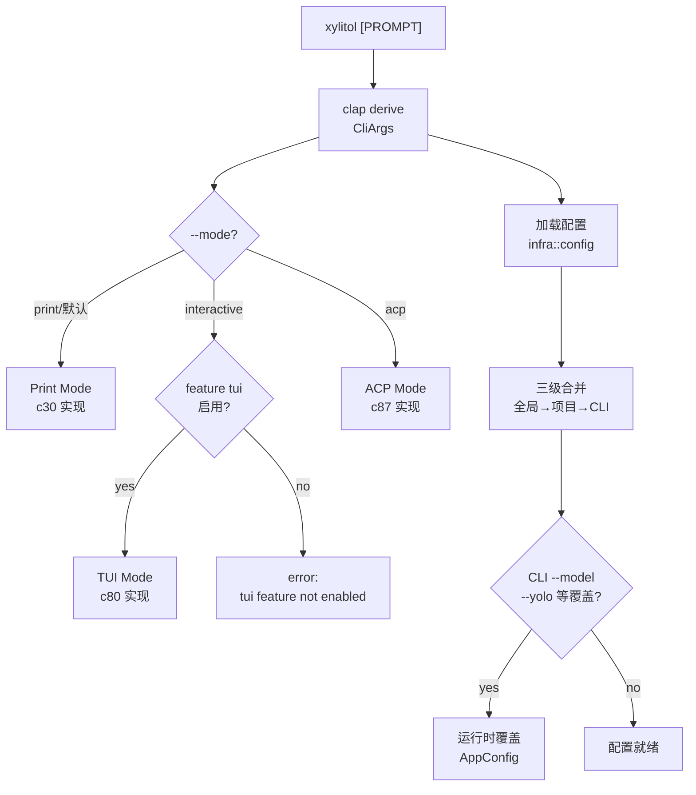
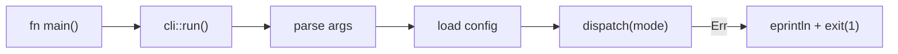
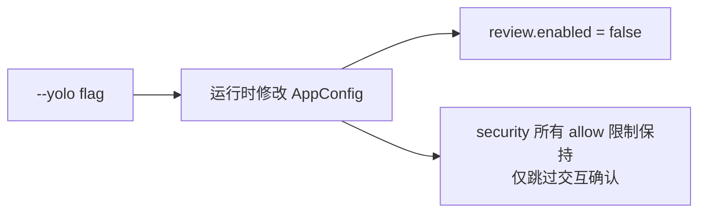

# c15-add-cli — Design

## Context

- PRD: §2（核心架构 CLI 入口）、§0.2（三种模式：Interactive/Print/ACP）
- **adk-rust 集成**: 扩展 `adk-cli::Launcher` 而非从零构建 CLI。adk-cli 已提供 clap 参数解析、chat 子命令、rustyline REPL、StreamPrinter。xylitol 添加 `--mode`（print/interactive/json）、`--yolo`、`--project` 等 coding agent 特有参数。
- 依赖关系见 proposal.md frontmatter（depends_on / blocks 为 SSOT）

## Goals / Non-Goals

### Goals

- clap derive 参数解析（mode/config/project/model/yolo/--features）
- RunMode 分派到 Print/Interactive(TUI)/Acp 三种模式
- 集成配置加载（调用 infra::config）
- main.rs 最小化——仅调用 CLI 入口

### Non-Goals

- 不实现各模式的具体逻辑（c30/c80/c87-add-acp-mode 负责）
- 不处理信号/优雅退出（后续 change）

## Decisions

### Decision 1: 扩展 adk-cli Launcher 的参数结构

**背景**: adk-cli 的 `Launcher` 已实现 clap 参数解析和基本 chat 功能。xylitol 扩展它以支持 coding agent 特有的参数和模式。



**clap derive 结构**:

```
CliArgs:
  prompt: Option<String>          # 位置参数，用户输入
  --mode: RunMode                 # print | interactive | acp（默认 print）
  --config: Option<PathBuf>       # 覆盖配置文件路径
  --project: Option<PathBuf>      # 项目根目录（默认 CWD）
  --model: Option<String>         # 覆盖默认模型
  --yolo: bool                    # 全自动（跳过所有确认）
  --features: Vec<String>         # 运行时启用特性（补充编译时 flags）
```

**选择**: prompt 作为可选位置参数——无 prompt 时进入交互等待（TUI 模式）或 stdin 读取（RPC 模式），有 prompt 时直接执行。

### Decision 2: main.rs 极简入口



**选择**: main.rs 仅调用 `cli::run()` 并处理顶层错误。所有逻辑在 `interface::cli` 模块内。

**权衡**: 极简 main.rs 比"在 main 中做逻辑"更易测试（`cli::run` 可单元测试）。

### Decision 3: --yolo 模式的配置覆盖

**背景**: `--yolo` 应跳过所有用户确认（diff review、工具审批等），等效于设置 `review.enabled = false` + `security.allow_interactive = false` 等。

**选择**: `--yolo` 作为 `AppConfig` 的运行时覆盖，不修改配置文件，仅在内存中生效。



**权衡**: yolo 不放松安全限制（bash forbidden patterns 仍然生效），仅跳过交互确认步骤。

## Risks / Trade-offs

| 风险 | 等级 | 缓解 |
|------|------|------|
| clap derive 宏增加编译时间 | 低 | clap 是 CLI 标配，可接受 |
| --features 运行时启用与编译时 feature flag 混淆 | 中 | 文档明确区分；--features 仅控制可选功能的运行时启用，编译时 flags 通过 Cargo.toml 控制 |

### 待确认问题

- 无
