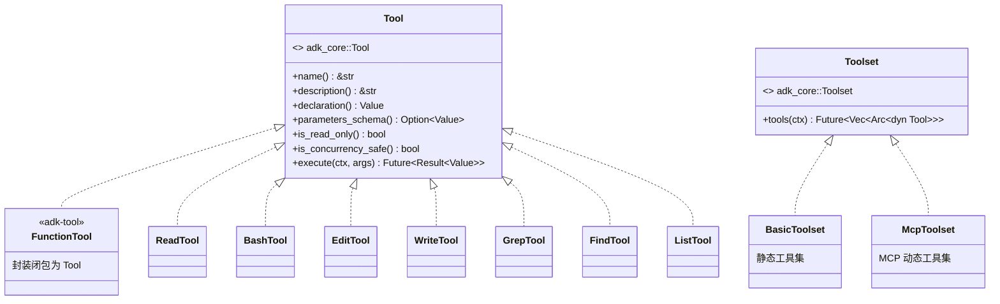
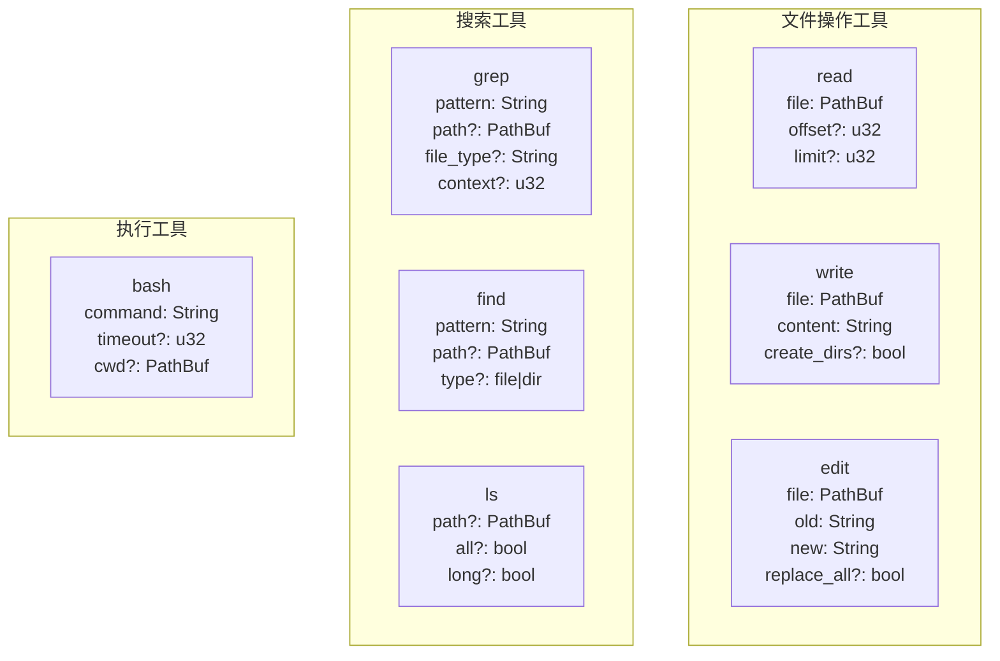
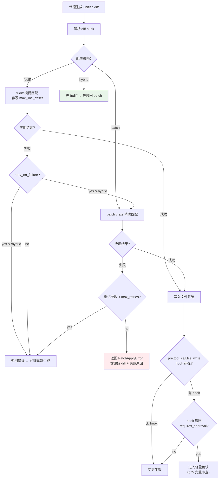
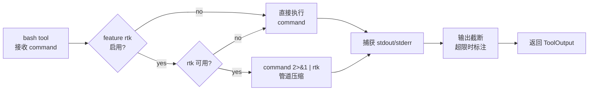

# c20-add-tools — Design

## Context

- PRD: §0.3（adk-tool FunctionTool 对标）、§7.5（AI Patch Apply 策略）、§0.6（rtk 集成方式）
- 依赖关系见 proposal.md frontmatter（depends_on / blocks 为 SSOT）

## Goals / Non-Goals

### Goals

- 定义 Tool trait，兼容 adk-core 的 FunctionTool 接口
- 实现 7 个内置工具（read, bash, edit, write, grep, find, ls）
- 实现 AI Patch Apply 三级策略（fudiff → patch → 错误回退）
- ToolRegistry 工具注册与查找
- bash 工具集成 rtk 管道压缩（feature-gated）

### Non-Goals

- 不实现 MCP 远程工具（c65 负责）
- 不实现 diff 审查 UI（c75 负责）
- 不实现 hooks 拦截逻辑（c40 负责），仅在关键点预留事件触发位置
- 不实现 sandbox 隔离执行（c50 负责）

## Decisions

### Decision 1: 基于 adk-core Tool trait 的工具实现

**背景**: adk-rust 作为主力框架，工具直接实现 `adk_core::Tool` trait，无需自建 trait 或适配层。



**选择**: 直接 `impl adk_core::Tool` for 7 个内置工具。使用 `adk_tool::FunctionTool` 简化简单工具创建。工具集通过 `BasicToolset` 管理，后续 MCP 工具通过 `McpToolset` 加入。

**权衡**: 直接使用 adk-core trait 消除了适配层开销，但工具实现需遵循 adk-core 的 `ToolContext` 接口。adk-core 的 `ToolContext` 提供 `function_call_id()`, `actions()`, `search_memory()` 等能力，足够满足内置工具需求。

### Decision 2: 7 个内置工具的参数与行为



**edit 工具选择 old/new 搜索替换模式**（与 codex 一致），而非行号模式。理由：
- AI 模型生成行号经常偏移，old/new 文本匹配更可靠
- old/new 可直接映射为 unified diff 的 hunk（用于 patch apply）
- `replace_all` 支持批量替换

**bash 工具关键行为**:
- 超时控制（默认 120s，可通过参数覆盖）
- 输出截断（超过限制时截断并标注 `[truncated]`）
- rtk 管道压缩（feature flag `rtk` 门控，通过管道 `command | rtk` 实现）
- 工作目录默认为 `project_root`

### Decision 3: Patch Apply 三级策略



**选择**: `hybrid` 作为推荐策略（fudiff 优先 + patch 兜底），因为 AI 生成的 diff 最常见的问题是行号偏移，fudiff 专为此场景设计。

**PatchApplyConfig 映射**（来自 c10）:
```yaml
patch_apply:
  strategy: "hybrid"          # fudiff | patch | hybrid
  max_line_offset: 50          # fudiff 最大容忍偏移
  retry_on_failure: true       # 失败是否触发代理重生成
  max_retries: 2               # 最大重试
```

**权衡**: hybrid 比 pure fudiff 多一次 fallback 开销，但显著降低应用失败率。fudiff 极早期（v0.0.x），可能需要调整容忍度参数。

### Decision 4: rtk 管道集成方式



**选择**: 管道模式（`command | rtk`）而非库模式。rtk 当前是外部二进制，库 feature flag 尚未贡献。

**权衡**: 管道模式需要 rtk 在 PATH 中可用，但不需修改 rtk 代码。未来 rtk 提供 library feature 后可切换为进程内压缩（消除子进程开销）。

## Risks / Trade-offs

| 风险 | 等级 | 缓解 |
|------|------|------|
| fudiff 极早期（v0.0.x），API 可能不稳定 | 高 | 封装 PatchApplier trait，fudiff 仅作为实现细节；hybrid 策略下 patch 兜底保底 |
| adk-core Tool trait 与 xylitol 需求不完全匹配 | 中 | 直接 impl adk_core::Tool，按需实现 optional 方法（is_read_only, is_concurrency_safe 等） |
| bash 工具的安全边界（命令注入风险） | 高 | 安全策略由 c50 统一管控（forbidden_patterns、sandbox），本 change 仅执行 |
| edit 工具 old/new 匹配在多行重复时歧义 | 低 | `replace_all=false` 时仅替换首个匹配；匹配失败时返回错误让代理重试 |

### 待确认问题

- rtk 库模式时间线——如果 rtk 短期内不提供 library feature，是否仍保持管道模式？
