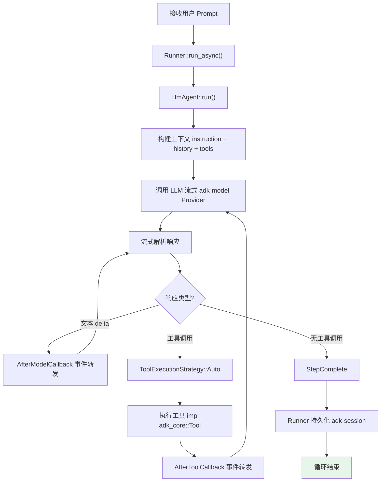
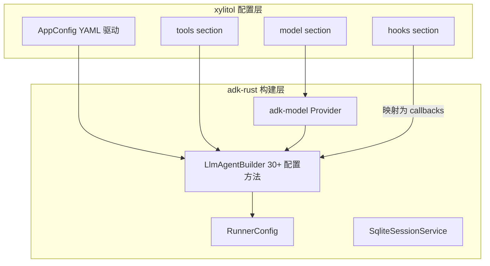
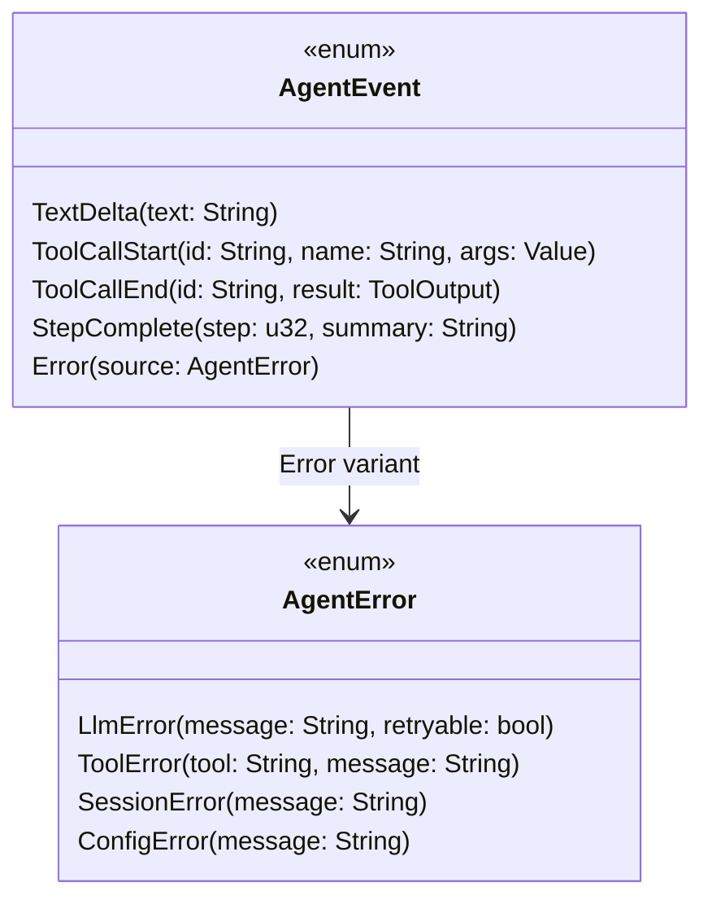
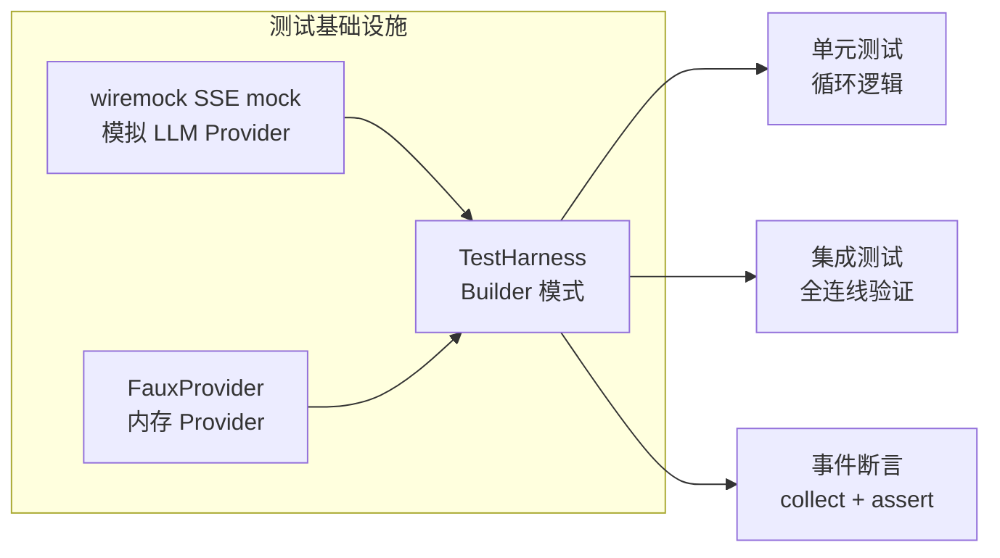

# c25-add-agent-loop — Design

## Context

- PRD: §2（核心架构 Agent 调度器）、§0.8.1（adk-rust v0.8 子 crate）、§0.3（adk-core/adk-agent/adk-runner 直接等效 pi-agent-core）
- 依赖关系见 proposal.md frontmatter（depends_on / blocks 为 SSOT）

## Goals / Non-Goals

### Goals

- 实现 agent 执行循环（prompt → LLM 流式 → 解析 → 工具分派 → 循环）
- 集成 adk-model LLM Provider（仅 OpenAI-compatible Response API + Anthropic-compatible 两种模式，流式 SSE 响应）
- 定义 AgentEvent 枚举 + 事件流发射
- 工具调用分派（集成 ToolRegistry）
- Session runtime（adk-session SQLite 后端）
- 上下文构建（对话历史 + 系统提示词 + 工具结果）

### Non-Goals

- 不实现规划-执行分离（c55 负责）
- 不实现上下文压缩/compaction（c70 快照系统的子功能）
- 不实现重复检测中断（c35 负责）
- 不实现模型抢占锁（c60 负责）
- 不实现 hooks 拦截（c40 负责，本 change 仅预留事件触发点）

## Decisions

### Decision 1: 基于 adk-rust LlmAgent + Runner 的 Agent 运行时

**背景**: adk-rust 的 `LlmAgent` + `Runner` 已实现完整的 ReAct 循环，包括流式解析、工具调用提取、多轮对话拼接、重试、熔断器。无需自建 agent loop。



**选择**: 使用 `adk-runner::Runner` 管理完整生命周期（session 加载/保存、事件持久化、transfer 路由、取消）。使用 `adk-agent::LlmAgent` 实现核心循环。xylitol 通过 callbacks 注册自定义逻辑：

1. `AfterModelCallback` — 转发 adk Event 为 xylitol AgentEvent（供 Print/TUI/RPC 消费）
2. `AfterToolCallback` — 触发 hook 系统（c40）+ 安全检查（c50）
3. `BeforeToolCallback` — 重复检测中断（c35）

**权衡**: 依赖 adk-rust API 稳定性，但消除自建循环的大量代码。如遇问题可直接修改 adk-rust 源码。

### Decision 2: xylitol AppConfig 与 adk RunnerConfig 的映射



**选择**: `AppConfig` 作为 YAML 配置入口，通过构建器模式映射到 `LlmAgentBuilder` 和 `RunnerConfig`。xylitol 的 hooks、security、repeat-detection 映射为 adk-agent 的 callback 系统。

### Decision 3: AgentEvent 枚举设计（adk Event → xylitol 事件）



**选择**: 5 种事件类型覆盖循环生命周期。通过 `AfterModelCallback` / `AfterToolCallback` 从 adk Event 流中提取并转发为 xylitol AgentEvent，通过 `tokio::sync::broadcast` 通道发射。

**事件映射**:
```
adk Event (LlmResponse with text)     → AgentEvent::TextDelta
adk Event (LlmResponse with func_call) → AgentEvent::ToolCallStart
adk Event (FunctionResponse)           → AgentEvent::ToolCallEnd
adk Runner (invocation complete)       → AgentEvent::StepComplete
adk Runner (error)                     → AgentEvent::Error
```

### Decision 4: Session 集成策略

```mermaid
sequenceDiagram
    participant User
    participant Loop as AgentLoop
    participant Runner as adk-runner
    participant Session as adk-session<br/>(SQLite)

    User->>Loop: run(prompt)
    Loop->>Runner: create InvocationContext
    Runner->>Session: load_or_create(session_id)

    loop 每轮 LLM 调用
        Loop->>Runner: invoke(agent, ctx)
        Runner->>Session: save_turn(state)
    end

    Runner->>Session: save_final(state)
    Runner-->>Loop: events + final result
    Loop-->>User: AgentEvent stream
```

**选择**: 使用 adk-session SQLite 后端持久化每轮对话状态。session_id 由 CLI 层生成（或从配置恢复）。

**权衡**: SQLite 比内存存储多一层 I/O，但支持断点恢复和快照派生（c70 依赖此能力）。

### Decision 5: 测试策略——wiremock + TestHarness



**选择**: `wiremock` mock SSE 响应 + `FauxProvider` 内存 Provider + `TestHarness` Builder。

**测试场景覆盖**:
- 纯文本响应（无工具调用）
- 文本 + 工具调用 + 最终响应
- 多轮工具调用
- LLM 错误 + 重试
- 工具执行错误

## Risks / Trade-offs

| 风险 | 等级 | 缓解 |
|------|------|------|
| adk-rust API 不稳定（v0.8 pre-release） | 高 | 回调层隔离变更；如遇问题可直接修改 adk-rust 源码（fork + patch） |
| adk-model provider 扩展 | 低 | 硬约束：仅启用 OpenAI + Anthropic 两个 provider，不扩展。ProviderKind 枚举锁定为 `OpenAI | Anthropic` |
| adk-runner 生命周期管理与 xylitol 预期不符 | 中 | Runner 提供 cancel/session 管理接口；测试覆盖生命周期场景 |
| broadcast channel 消费者慢导致背压 | 低 | 事件通道使用 bounded buffer + 溢出丢弃策略（非阻塞） |

### 待确认问题

- adk-rust v1.0 发布时间线——如果推迟太久，是否需要降低耦合度？
