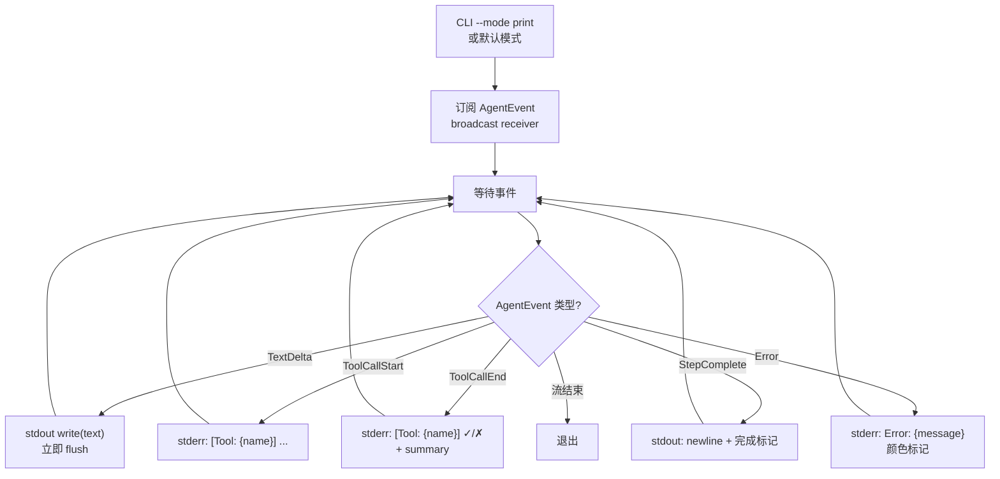
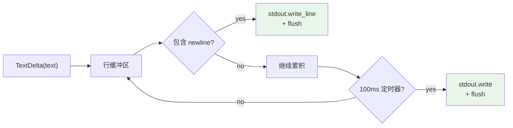

# c30-add-print-mode — Design

## Context

- PRD: §0.2（三种模式：Interactive/Print/ACP）
- 依赖关系见 proposal.md frontmatter（depends_on / blocks 为 SSOT）

## Goals / Non-Goals

### Goals

- 订阅 AgentEvent 流，将文本输出流式写入 stdout
- 工具调用结果显示（工具名 + 简要结果）
- 流式输出（逐字符/逐行刷新）
- 错误输出到 stderr
- 与 CLI `--mode print` 默认分派集成

### Non-Goals

- 不实现 ANSI 颜色/富文本渲染（保持纯文本，颜色可选）
- 不实现 TUI 交互（c80 负责）
- 不实现 stdin 交互式多轮对话（Print 模式单次执行）
- 不实现 ACP 协议（c87-add-acp-mode 负责）

## Decisions

### Decision 1: Print 模式事件处理流程



**选择**: 文本输出走 stdout（可管道），工具/状态/错误走 stderr。这样用户可以 `xylitol "fix the bug" > output.txt` 而不混入工具信息。

### Decision 2: 输出格式

```
$ xylitol "Fix the compilation error in src/main.rs"

I'll read the file first to understand the error.

[Tool: read src/main.rs] ✓

The issue is a missing semicolon on line 42. Let me fix it.

[Tool: edit src/main.rs] ✓ Replaced line 42

The compilation error has been fixed. The missing semicolon on line 42 of src/main.rs
has been added.

Done.
```

**选择**: 简洁格式——agent 文本直接输出，工具行以 `[Tool: name]` 前缀标注，工具信息用 ANSI 颜色区分（可 `--no-color` 关闭）。

### Decision 3: 流式输出策略



**选择**: 行缓冲 + 定时器刷新（100ms）。遇到换行立即 flush，无换行时每 100ms flush 一次，保证流式感同时减少系统调用。

## Risks / Trade-offs

| 风险 | 等级 | 缓解 |
|------|------|------|
| broadcast receiver 慢导致事件丢失 | 低 | Print 模式是唯一消费者时不会慢；多消费者时使用 bounded buffer |
| stdout 管道场景下 flush 开销 | 低 | 行缓冲减少 flush 次数；管道模式可检测 isatty 关闭颜色 |

### 待确认问题

- 无
