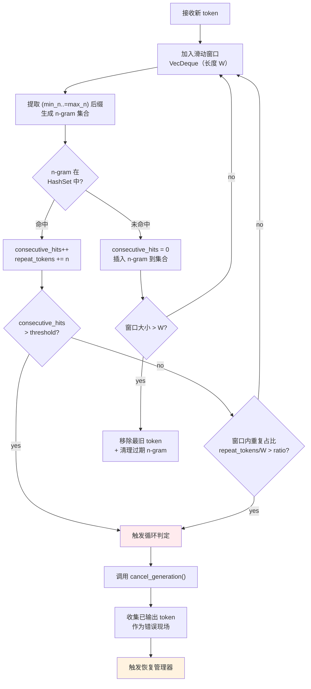
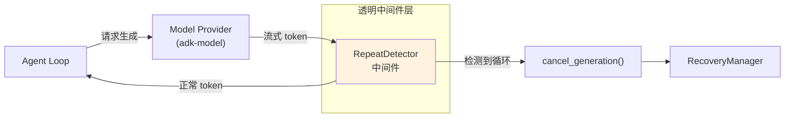
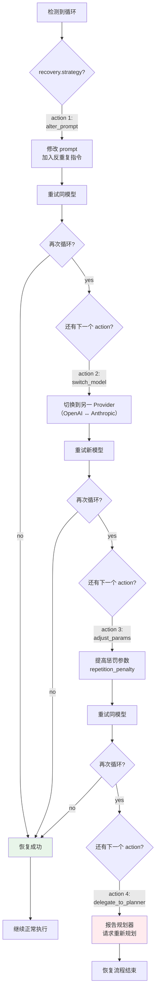

# c35-add-repeat-detection — Design

## Context

- PRD: §10（自动重复检测与中断恢复）、§10.3（流式检测算法）、§10.4（中断推理机制）、§10.5（恢复策略链）
- 依赖关系见 proposal.md frontmatter（depends_on / blocks 为 SSOT）

## Goals / Non-Goals

### Goals

- 实现流式重复检测中间件（RepeatDetector）
- 滑动窗口 + n-gram HashSet 实时检测
- 中断推理机制（cancel_generation）
- 恢复管理器（alter_prompt / switch_model / adjust_params / delegate_to_planner）
- 配置驱动（YAML）

### Non-Goals

- 不修改模型供应插件接口（以中间件装饰器形式挂载）
- 不实现布隆过滤器优化（HashSet 先够用）
- 不实现 parallel 恢复策略（仅 sequential）
- 不处理本地引擎特有的中断 API（由 adk-model 统一 cancel_generation 抽象）

## Decisions

### Decision 1: 重复检测算法核心



**选择**: 经典 n-gram + 滑动窗口检测。连续命中阈值和窗口重复占比双条件，任一触发即判定循环。

**数据结构**:
- `VecDeque<u32>` 滑动窗口（token ID）
- `HashSet<Vec<u32>>` n-gram 集合（动态长度 `min_n..=max_n`）
- `consecutive_hits: u32` 连续命中计数器

**权衡**: HashSet 比 Bloom filter 精确无假阳性，但内存占用更高。窗口大小 W=50 时内存可忽略。

### Decision 2: 中间件集成位置



**选择**: RepeatDetector 作为 `Stream` 装饰器，包装模型输出流。对上层（agent loop）完全透明——正常的 token 照常传递，循环时流提前终止。

**实现方式**: 实现 `Stream<Item = Token>` trait 的装饰器，内部维护检测状态。

### Decision 3: 恢复策略链



**选择**: sequential 恢复策略——按配置顺序依次尝试 4 种 action，直到成功或全部失败。`max_attempts` 限制总尝试次数。

**权衡**: sequential 比 parallel 简单且可预测。parallel 可能更快但浪费 API 调用（同时请求多个模型）。

### Decision 4: 配置映射

```yaml
repeat_detection:
  enabled: true
  min_n: 3
  max_n: 10
  window_size: 50
  consecutive_hit_threshold: 5
  window_repeat_ratio: 0.8
  early_stop_tokens: 100

  recovery:
    strategy: "sequential"
    max_attempts: 3
    actions:
      - type: "alter_prompt"
        prepend: "WARNING: Avoid repetition."
      - type: "switch_model"
        model_id: null          # null = 切换到另一 provider（OpenAI ↔ Anthropic）
      - type: "adjust_params"
        params:
          repetition_penalty: 1.4
      - type: "delegate_to_planner"
```

**选择**: 直接映射 PRD §10.5 配置结构。`early_stop_tokens` 作为性能优化——输出超过此长度未检测到重复则停止监控。

## Risks / Trade-offs

| 风险 | 等级 | 缓解 |
|------|------|------|
| n-gram HashSet 内存增长（长输出） | 低 | early_stop_tokens 限制监控长度；LRU 清理过期 n-gram |
| cancel_generation() 抽象不完整（不同后端行为不一致） | 中 | 依赖 adk-model 统一抽象；fallback 到关闭 HTTP 流 |
| 误判（代码中合法重复被中断） | 中 | consecutive_hit_threshold 可调高；代码模式可通过配置排除 |
| 恢复策略全部失败 | 低 | 最终兜底 delegate_to_planner 让规划器重新分解任务 |

### 待确认问题

- 无
