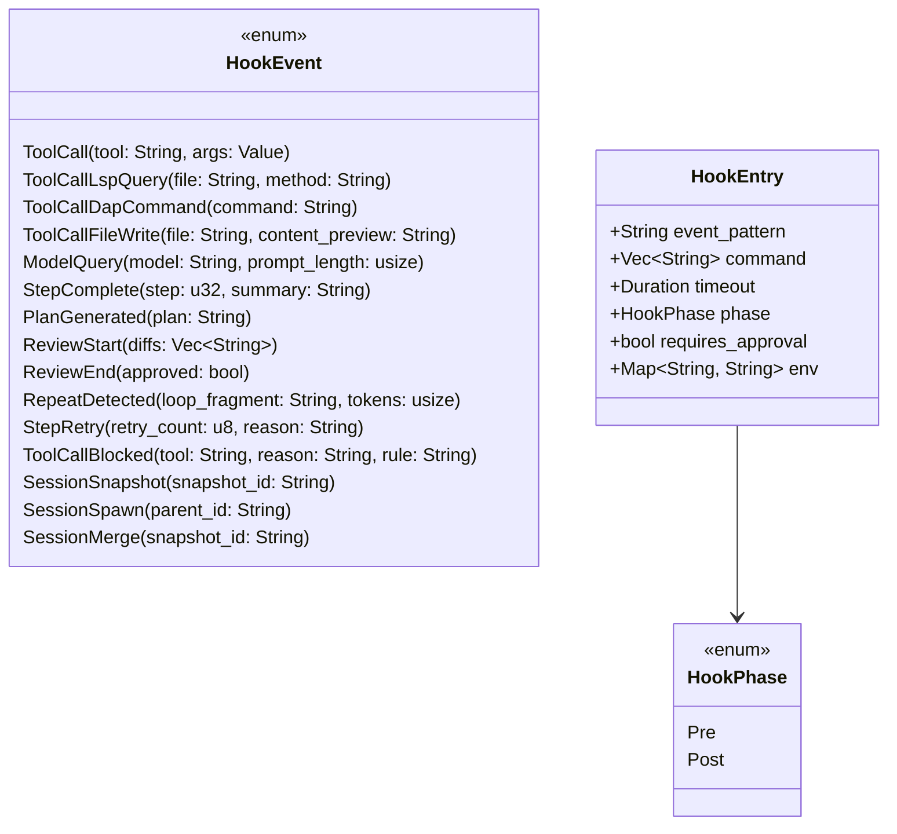
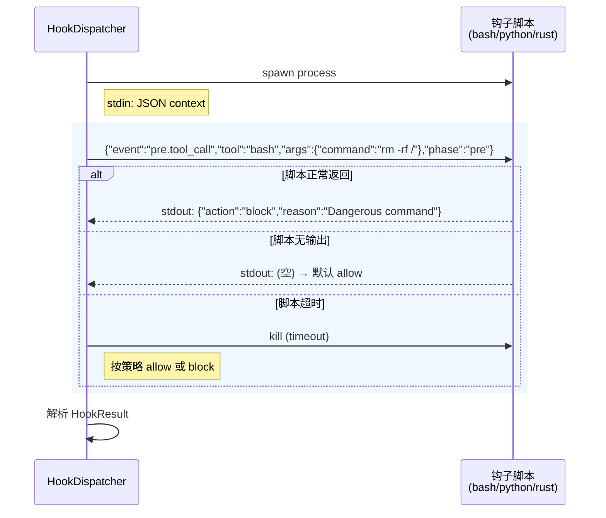
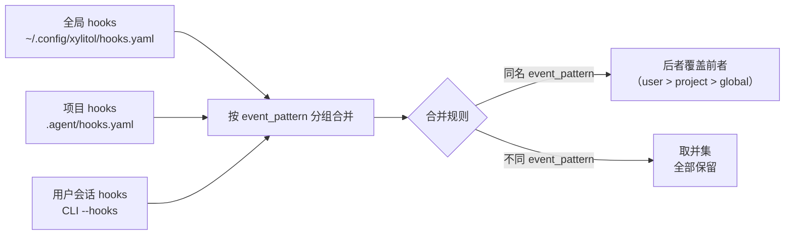

# c40-add-hooks — Design

## Context

- PRD: §8（Hook 机制——事件驱动扩展）、§7.5（before_apply_hook 联动）、§12（tool_call_blocked 安全拦截事件）
- 依赖关系见 proposal.md frontmatter（depends_on / blocks 为 SSOT）

## Goals / Non-Goals

### Goals

- 定义 HookEvent 枚举（13+ 事件类型，pre/post）
- 实现 HookDispatcher 调度器（事件分发 + 超时控制）
- 三级配置合并（全局/项目/用户会话）
- 钩子脚本执行协议（stdin JSON → stdout 控制指令）
- block/allow/modify 控制指令解析

### Non-Goals

- 不实现具体钩子脚本（用户自定义）
- 不实现 hooks 的热重载（配置加载一次）
- 不实现钩子脚本沙箱隔离（由 c50 security 统一管控）
- 不在 agent loop 中实际插入调用点（由 c25 集成，本 change 提供 API）

## Decisions

### Decision 1: HookDispatcher 架构

```mermaid
flowchart TD
    SOURCE["事件源<br/>（agent loop / tools / security）"] --> EMIT["HookDispatcher::dispatch(event)"]

    EMIT --> RESOLVE["解析匹配的钩子<br/>event pattern → hook list"]
    RESOLVE --> MERGE["合并三级钩子<br/>global + project + user<br/>后者覆盖同名"]

    MERGE --> SORT["排序（按优先级/scope）"]
    SORT --> EXEC_LOOP["逐个执行钩子"]

    EXEC_LOOP --> SPAWN["spawn 钩子脚本<br/>stdin: JSON context"]
    SPAWN --> WAIT["等待 stdout + 超时"]

    WAIT --> PARSE{"stdout 内容?"}
    PARSE -->|空/无输出| ALLOW["放行"]
    PARSE -->|JSON: allow| ALLOW
    PARSE -->|JSON: block| BLOCK["阻断 + 返回原因"]
    PARSE -->|JSON: modify| MODIFY["修改参数<br/>（如替换 args）"]
    PARSE -->|超时| TIMEOUT{"timeout_policy?"}
    TIMEOUT -->|"allow"| ALLOW
    TIMEOUT →|"block"| BLOCK

    BLOCK --> STOP["停止后续钩子<br/>返回 HookResult::Blocked"]
    ALLOW --> NEXT{"还有钩子?"}
    NEXT -->|yes| EXEC_LOOP
    NEXT -->|no| DONE["返回 HookResult::Allowed"]

    style BLOCK fill:#ffebee
    style DONE fill:#e8f5e9
```

**选择**: 同步串行执行（按 scope 排序），任何钩子返回 block 即中断链。这确保全局安全钩子优先执行，项目/用户钩子可以覆盖。

**权衡**: 串行比并行慢（多个钩子需要逐个等待），但保证执行顺序和阻断语义。超时钩子默认 allow（避免卡死），可配置为 block。

### Decision 2: HookEvent 枚举与匹配



**事件匹配规则**: event_pattern 支持精确匹配和前缀匹配：
- `pre.tool_call` — 匹配所有工具调用的 pre 阶段
- `pre.tool_call.bash` — 仅匹配 bash 工具
- `post.step_complete` — 匹配步骤完成

### Decision 3: 钩子脚本执行协议



**stdin JSON 结构**:
```json
{
  "event": "pre.tool_call",
  "tool": "bash",
  "args": {"command": "rm -rf /"},
  "phase": "pre",
  "session_id": "...",
  "project_root": "..."
}
```

**stdout 控制指令**:
```json
{"action": "allow"}
{"action": "block", "reason": "Dangerous command"}
{"action": "modify", "args": {"command": "rm -rf /safe/dir"}}
```

**选择**: 简单的 JSON-over-stdin/stdout 协议。空输出 = allow（保持向后兼容，简单脚本不需要输出任何内容）。

### Decision 4: 三级配置合并



**选择**: 按 `event_pattern` 标识同组钩子。用户级可覆盖项目级同名钩子，非同名钩子取并集。

## Risks / Trade-offs

| 风险 | 等级 | 缓解 |
|------|------|------|
| 钩子脚本恶意执行 | 高 | 安全策略（c50）管控脚本执行环境；timeout 防止无限挂起 |
| 串行执行多钩子延迟累积 | 中 | 超时机制（默认 5s）+ 简单钩子推荐 shell one-liner |
| event_pattern 匹配规则复杂度 | 低 | 仅支持精确和前缀匹配，不支持正则（降低复杂度） |

### 待确认问题

- 无
