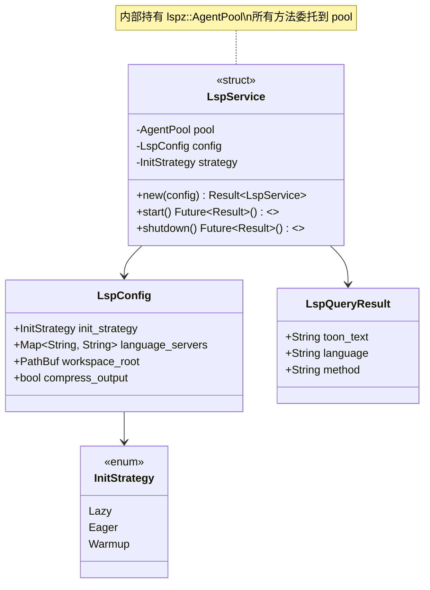
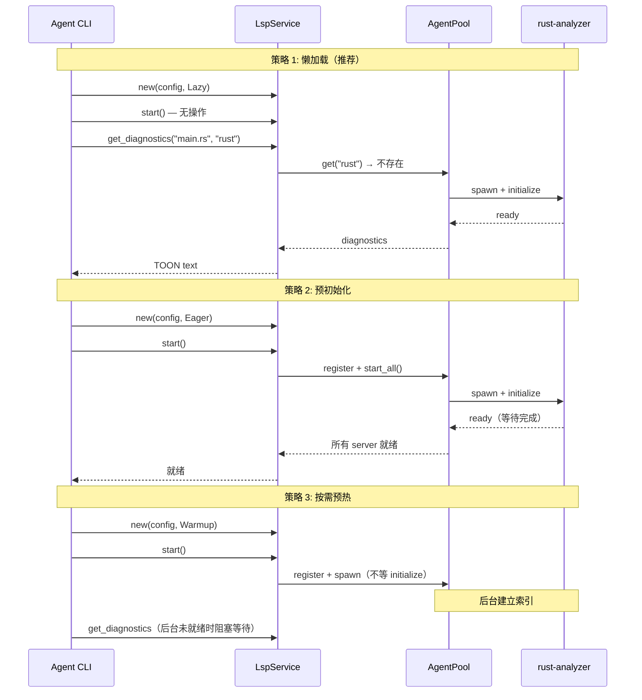
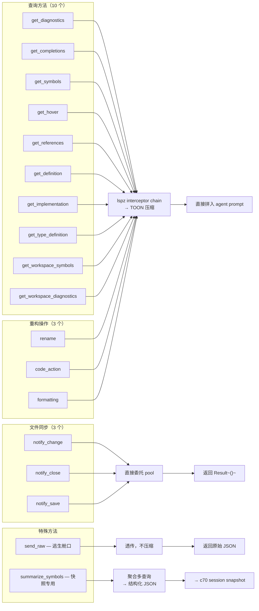
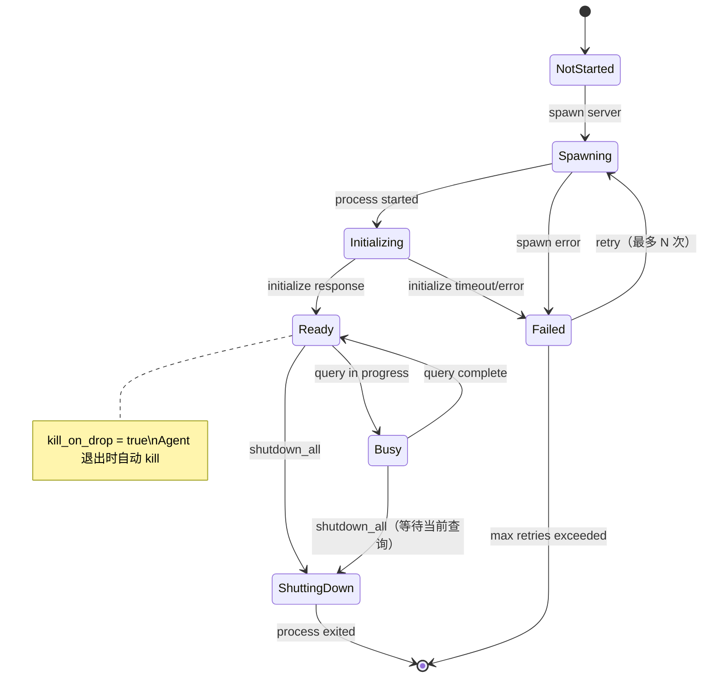

# c45-add-lsp-layer — Design

## Context

- PRD: §3（LSP Token 节省兼容层）、§3.1（运行模型 Client 模式）、§3.2（初始化时机）、§3.3（返回格式 TOON 文本）、§3.4（能力与缺口）
- 依赖关系见 proposal.md frontmatter（depends_on / blocks 为 SSOT）

## Goals / Non-Goals

### Goals

- 封装 lspz `agent-sdk` feature 的 `AgentPool` / `AgentHandle`
- 三种初始化策略（懒加载/预初始化/按需预热）
- LSP server 子进程生命周期管理
- 10 个查询方法 + 3 个文件同步方法 + 3 个重构操作
- TOON 文本压缩输出（直接拼入 LLM prompt）
- feature flag `infra-lsp` 门控

### Non-Goals

- 不实现 LSP server 本身（使用现成的 rust-analyzer / pyright / ts-language-server）
- 不实现自定义 interceptor（使用 lspz 内置链）
- 不实现 LSP 协议序列化细节（lspz 封装）
- 不处理多 workspace 场景（单 workspace root）

## Decisions

### Decision 1: 封装层架构——lspz AgentPool wrapper



**选择**: 薄封装层（`LspService`）包裹 `lspz::AgentPool`，不暴露 lspz 类型到 `LspService` 之外。

**理由**:
- lspz API 可能在后续版本变化，封装层隔离变更
- 统一错误类型（lspz 错误 → xylitol 错误）
- 可在封装层添加日志、指标、缓存等横切关注点

### Decision 2: 三种初始化策略的实现



**选择**: 懒加载为默认策略。配置文件可覆盖：

```yaml
lsp:
  enabled: true
  init_strategy: "lazy"     # lazy | eager | warmup
  language_servers:
    rust: "rust-analyzer"
    python: "basedpyright"
    typescript: "typescript-language-server"
  compress_output: true
```

**权衡**:
- 懒加载：零启动开销，但首次查询有延迟（rust-analyzer 索引需数秒）
- 预初始化：首次查询即时响应，但 CLI 启动变慢
- 按需预热：折中方案，启动快但首次查询可能仍需等待

### Decision 3: 查询方法分组与 TOON 压缩



**选择**: 查询和重构结果走 lspz 内置 interceptor chain 自动压缩为 TOON 文本，返回 `String`。`summarize_symbols` 为特殊方法，聚合多查询返回结构化 JSON（供 c70 快照使用）。

**TOON 压缩示例**:
```
// get_diagnostics 返回：
// "E[1:0] unused variable `x`\nW[5:10] missing documentation"

// get_definition 返回：
// "src/lib.rs:42:8 → fn example()"
```

### Decision 4: 子进程生命周期管理



**选择**: `kill_on_drop` 确保 agent 异常退出时 LSP server 不会成为孤儿进程。

**重启策略**: 失败后自动重试（最多 3 次，指数退避），超过重试次数标记为 Failed 不再尝试，该语言的所有查询返回降级错误。

## Risks / Trade-offs

| 风险 | 等级 | 缓解 |
|------|------|------|
| lspz API 不稳定（v0.9.x pre-release） | 高 | LspService 封装层隔离变更；lsp 为可选 feature，不影响核心功能 |
| rust-analyzer 首次索引耗时（数秒到十几秒） | 中 | 懒加载默认策略 + 配置可切换预初始化；后续可在 TUI 中显示索引进度 |
| LSP server 子进程泄漏（agent crash） | 低 | kill_on_drop + shutdown handler 双保险 |
| TOON 压缩格式丢失信息 | 中 | send_raw 逃生舱口可获取完整 JSON；compress_output 可配置关闭 |

### 待确认问题

- lspz v1.0 发布时间线——如果 API 发生 breaking change，封装层调整范围有多大？
