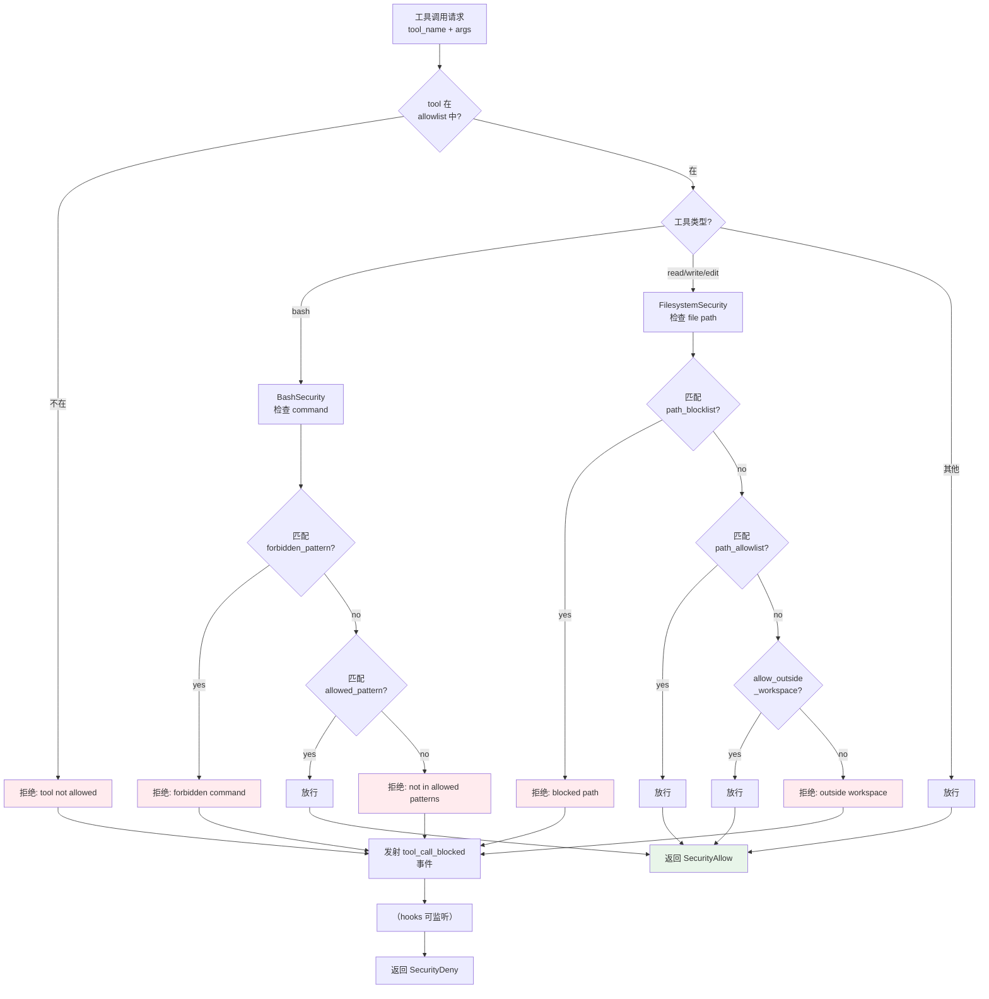
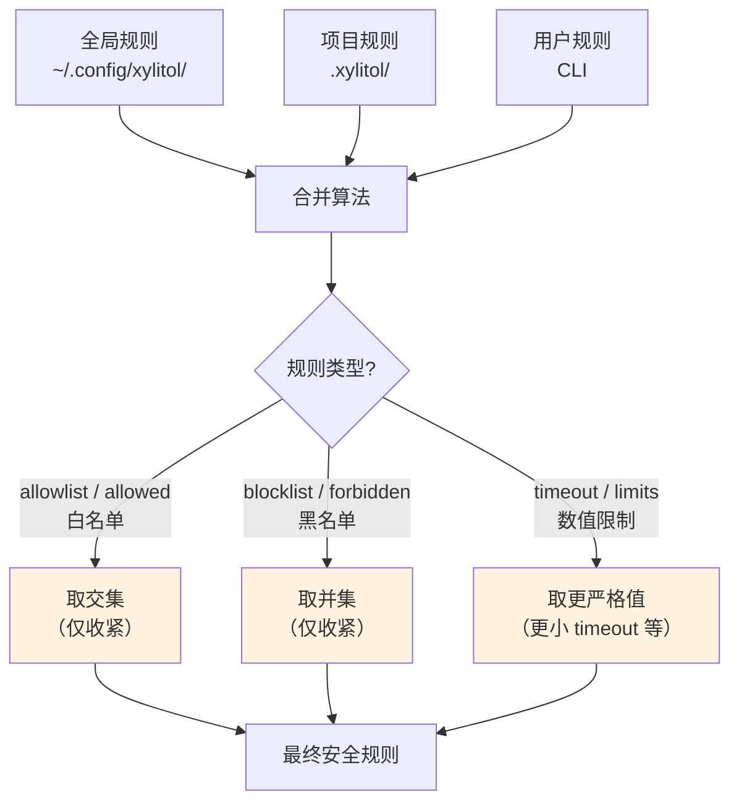

# c50-add-security — Design

## Context

- PRD: §12（工具调用安全策略）、§12.1（零信任默认 deny-all）、§12.3（规则优先级仅收紧）、§12.4（与 Hook 交互）、§12.6（沙箱 Phase 2 预留）
- 依赖关系见 proposal.md frontmatter（depends_on / blocks 为 SSOT）

## Goals / Non-Goals

### Goals

- 实现 SecurityPolicy 引擎（声明式规则检查）
- 三级安全限制：bash 命令、文件系统、网络
- 规则三级合并（仅收紧不放宽）
- 资源配额（子进程数、内存、CPU 时间）
- 拦截时触发 `tool_call_blocked` 事件
- sandbox 配置入口预留（Phase 2 不实现）

### Non-Goals

- 不实现沙箱执行环境（Docker/nsjail Phase 2）
- 不实现网络流量拦截（仅规则检查）
- 不实现加密/密钥管理
- 不替换操作系统安全机制

## Decisions

### Decision 1: 安全策略执行架构



**选择**: 先检查黑名单再检查白名单。默认 deny-all（空 allowlist = 拒绝所有）。这是"零信任"原则的直接体现。

**关键约束**: 安全检查发生在 Hook 执行之前。被安全层拒绝的调用不会触发 `pre.tool_call` hook。

### Decision 2: 规则三级合并（仅收紧）



**合并示例**:
- 全局 allowed_commands: `[cargo.*, python.*]`
- 项目 forbidden_commands: `[cargo test]`
- 结果: allowed = `[cargo.*, python.*]` ∩ (项目无覆盖) = `[cargo.*, python.*]`，forbidden = `[]` ∪ `[cargo test]` = `[cargo test]`
- 最终: `cargo test` 被禁止，其余 cargo/python 命令允许

**选择**: 白名单交集 + 黑名单并集，确保后者只能收紧不能放宽。这是 §12.3 的核心原则。

### Decision 3: bash 命令匹配策略

```mermaid
flowchart LR
    CMD["bash command"] --> NORMALIZE["标准化<br/>去除前导空格<br/>提取首个命令"]
    NORMALIZE --> FORBID{"regex 匹配<br/>forbidden_patterns?"}
    FORBID -->|匹配| DENY["拒绝"]
    FORBID -->|不匹配| ALLOW_MATCH{"regex 匹配<br/>allowed_patterns?"}
    ALLOW_MATCH -->|匹配| OK["允许"]
    ALLOW_MATCH -->|不匹配| DEFAULT{"default_policy?"}
    DEFAULT -->|"deny"| DENY
    DEFAULT →|"allow"| OK
```

**选择**: 使用 `regex` crate 做模式匹配。先检查 forbidden（优先级更高），再检查 allowed。不匹配 allowed 时按 `default_policy: deny` 处理。

**权衡**: regex 比简单字符串匹配更强大，但编译正则有少量启动开销。预编译所有 pattern 到 `RegexSet` 缓解。

### Decision 4: sandbox 配置预留

```yaml
security:
  sandbox:
    enabled: false
    engine: "docker"    # docker | nsjail | none
    image: "xylitol-sandbox:latest"
```

**选择**: 仅定义配置入口结构体，`enabled: false` 为默认值。Phase 2 实现时填充执行逻辑。

## Risks / Trade-offs

| 风险 | 等级 | 缓解 |
|------|------|------|
| 正则匹配性能（复杂 pattern） | 低 | RegexSet 预编译 + 一次匹配；pattern 数量通常 < 20 |
| 白名单过严导致 agent 无法完成任务 | 中 | 默认配置提供常用 pattern；文档说明如何开放必要权限 |
| 三级合并逻辑复杂（边界情况） | 中 | 独立函数 + 单元测试覆盖所有组合（白名单交集、黑名单并集、数值取最小） |
| sandbox 预留配置未来变更 | 低 | 结构体设计预留了 engine 枚举扩展性 |

### 待确认问题

- 无
