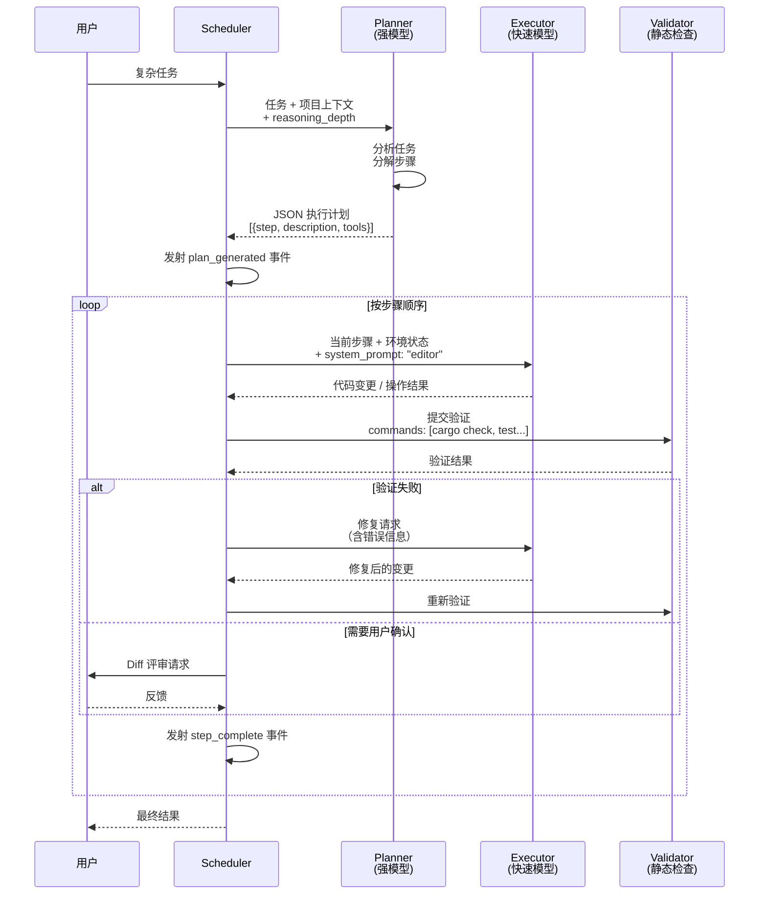
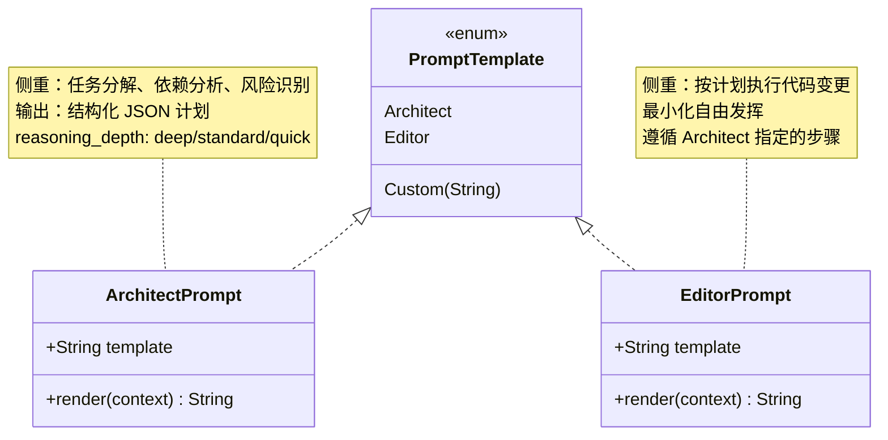
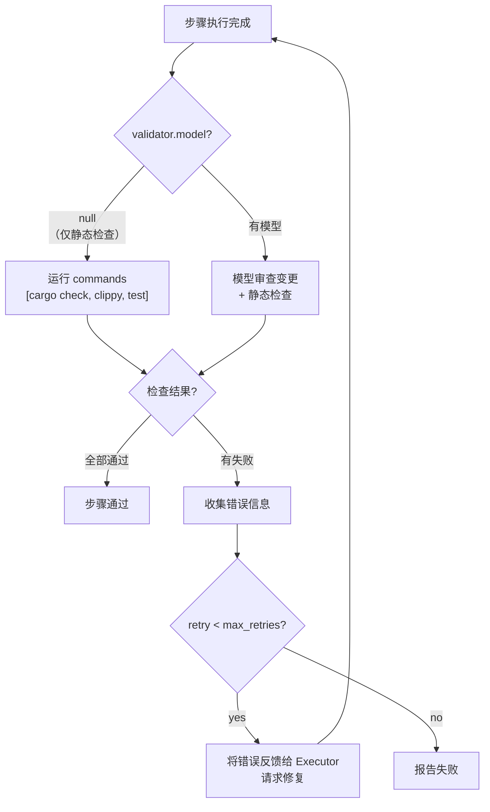

# c55-add-planning-execution — Design

## Context

- PRD: §5（规划-执行分离 OpusPlan）
- **硬约束**: MVP 仅支持 OpenAI-compatible 和 Anthropic-compatible 两种 provider。模型路由在两者之间切换。fallback 为可选单跳（OpenAI↔Anthropic），非多模型链。
- 依赖关系见 proposal.md frontmatter（depends_on / blocks 为 SSOT）

## Goals / Non-Goals

### Goals

- 实现 Planner/Executor/Validator 三角色
- 模型路由：规划器和执行器绑定不同模型
- 步骤编排：按计划顺序执行，每步可触发验证
- fallback：自动切换到配置的备用模型（OpenAI↔Anthropic 单跳）
- 系统提示词模板（architect / editor）
- reasoning_depth 控制

### Non-Goals

- 不实现 ParallelAgent（多步并行执行）
- 不实现规划器的自动重规划（仅 manual trigger）
- 不实现 checkpoint/恢复被中断的计划
- 不实现跨 session 计划持久化

## Decisions

### Decision 1: 三角色协作流程



**选择**: 经典的 Plan → Execute → Validate 循环。Planner 使用强推理模型做任务分解，Executor 使用快速模型做代码变更，Validator 运行静态检查命令。

**计划格式（JSON）**:
```json
[
  {"step": 1, "description": "Read main.rs to understand the error", "tools": ["read"]},
  {"step": 2, "description": "Fix the missing semicolon on line 42", "tools": ["edit"]},
  {"step": 3, "description": "Run cargo check to verify the fix", "tools": ["bash"]}
]
```

### Decision 2: 模型路由与 fallback

```mermaid
flowchart TD
    TASK["任务到达"] --> RESOLVE_P["解析 planning.model<br/>→ 查找 ModelEntry"]

    RESOLVE_P --> PROVIDER_P["获取 Provider 实例<br/>（OpenAI 或 Anthropic）"]
    PROVIDER_P --> CALL_P["调用 Planner LLM"]

    CALL_P -->|"成功"| PLAN["获得执行计划"]
    CALL_P -->|"失败"| FALLBACK_P{"有 fallback?"}
    FALLBACK_P -->|yes| SWITCH_P["切换到另一 Provider<br/>（OpenAI ↔ Anthropic）"]
    SWITCH_P --> CALL_P
    FALLBACK_P -->|no| ERROR_P["规划失败"]

    PLAN --> RESOLVE_E["解析 execution.model<br/>→ 查找 ModelEntry"]
    RESOLVE_E --> PROVIDER_E["获取 Provider 实例"]

    loop 每个步骤
        PROVIDER_E --> CALL_E["调用 Executor LLM"]
        CALL_E -->|"失败"| FALLBACK_E{"有 fallback?"}
        FALLBACK_E -->|yes| SWITCH_E["切换到另一 Provider"]
        SWITCH_E --> CALL_E
        FALLBACK_E -->|no| RETRY{"retry < max_retries?"}
        RETRY -->|yes| CALL_E
        RETRY -->|no| ERROR_E["步骤失败"]
    end
```

**选择**: 规划器和执行器独立解析模型 ID，各自维护可选的 fallback（指向另一个模型 ID）。`switch_model` 恢复策略（c35）引用同一 fallback。

**模型 ID 解析规则**:
- `anthropic/claude-opus-4` → 从 models 注册表查找已注册实例（ProviderKind::Anthropic）
- `openai/gpt-4o-mini` → 从 models 注册表查找已注册实例（ProviderKind::OpenAI）
- fallback 为可选单跳，指向另一个已注册模型 ID（如 OpenAI↔Anthropic）

### Decision 3: 系统提示词模板



**选择**: 内置两种模板 + 自定义支持。`reasoning_depth` 控制 Architect 的思考深度：
- `deep`: 长链推理，适合复杂架构决策
- `standard`: 平衡模式
- `quick`: 快速分解，适合简单任务

### Decision 4: 验证器设计



**选择**: 验证器默认仅运行静态检查命令（`model: null`），不调用 LLM。这是最常见且成本最低的验证方式。

## Risks / Trade-offs

| 风险 | 等级 | 缓解 |
|------|------|------|
| Planner 生成的计划格式不规范 | 中 | 使用 structured output（JSON schema）约束 LLM 输出；解析失败时重试 |
| Executor 偏离计划自由发挥 | 中 | editor 系统提示词强调"严格遵循计划"；Validator 验证结果 |
| fallback 全部失败 | 低 | 最终兜底 delegate_to_planner 让规划器重新分解 |
| max_steps 过大导致成本失控 | 低 | 默认 10 步上限 + 配置可调；每步后检查是否超出预算 |

### 待确认问题

- 无
