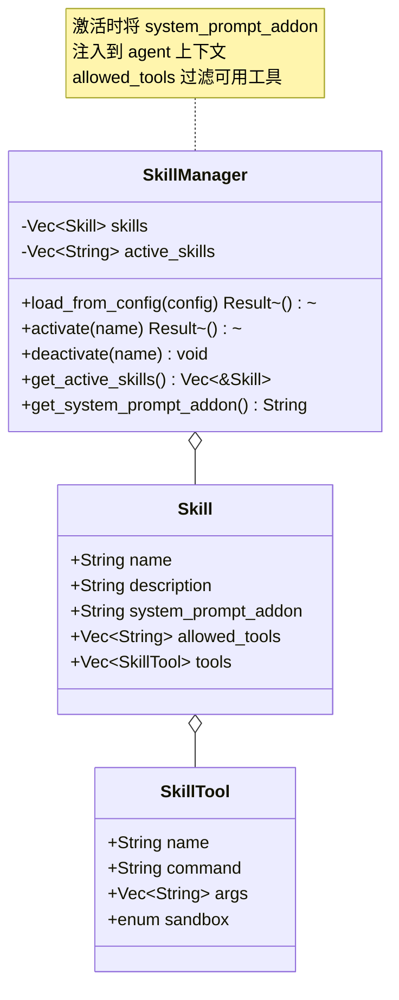
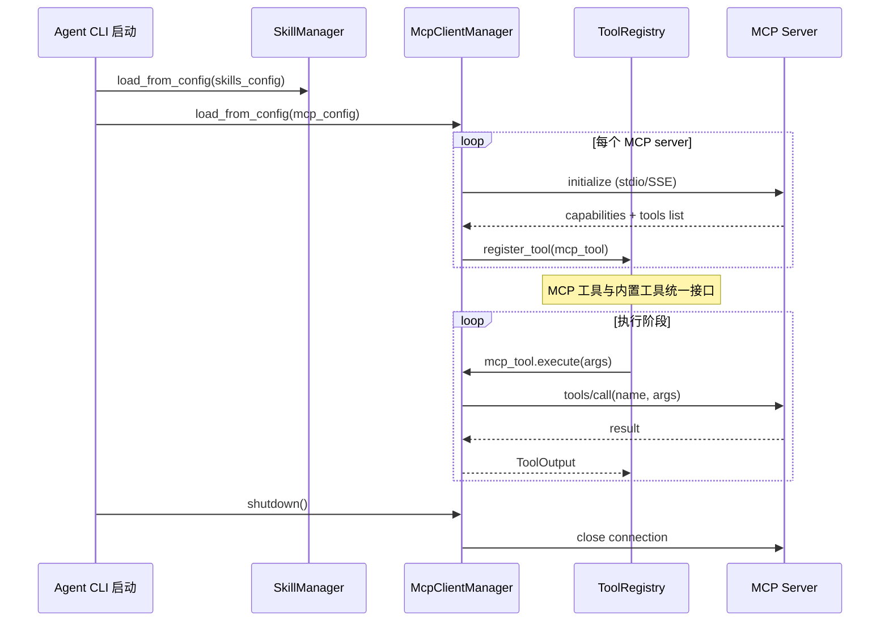
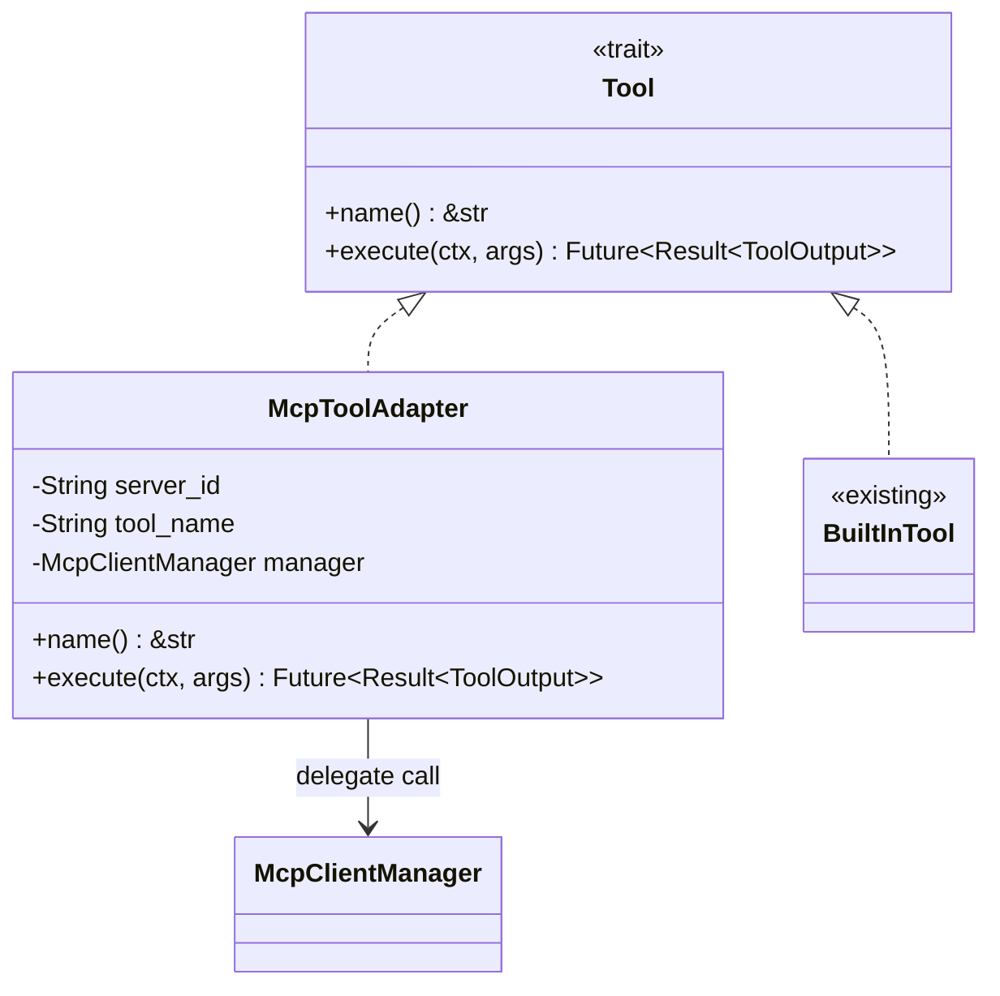
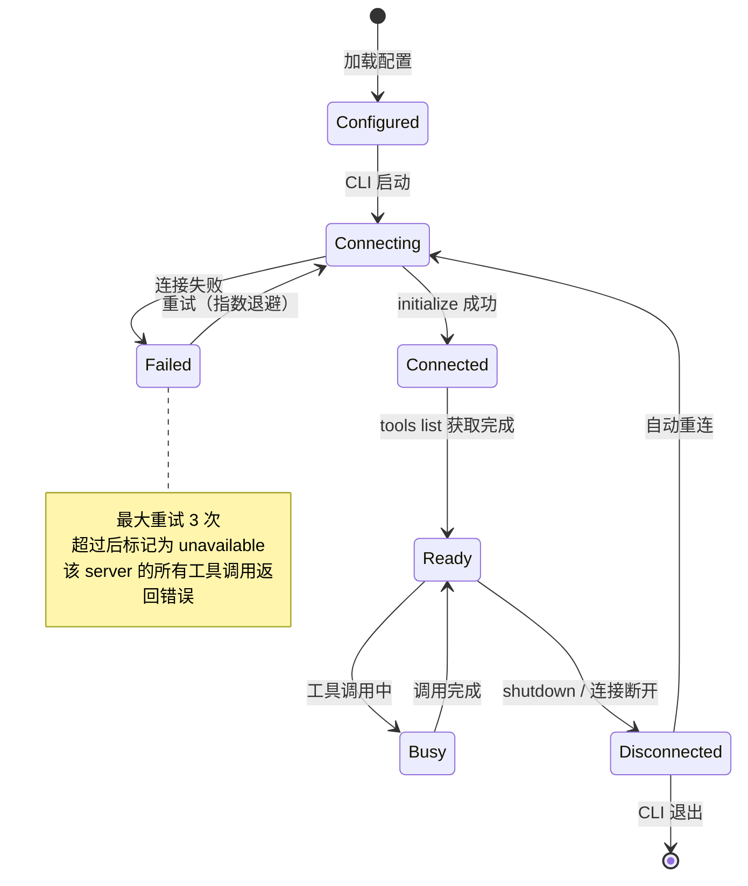

# c65-add-skills-mcp — Design

## Context

- PRD: §9（Skills 与 MCP 支持）
- 依赖关系见 proposal.md frontmatter（depends_on / blocks 为 SSOT）

## Goals / Non-Goals

### Goals

- 实现 Skill 声明式定义（YAML）+ 运行时加载
- 实现 MCP 客户端（stdio + SSE 两种传输）
- MCP 工具动态注册（从 MCP server 获取工具列表）
- 集成到 ToolRegistry（MCP 工具作为普通工具调用）

### Non-Goals

- 不实现 MCP server（仅客户端）
- 不实现 Skill 插件仓库/市场
- 不实现 MCP 工具的缓存/批处理优化
- 不实现 Skill 的版本管理

## Decisions

### Decision 1: Skill 系统架构

**选择**: Skill 在 session 开始时按项目类型或用户指令激活，激活后：
1. `system_prompt_addon` 注入 agent 上下文
2. `allowed_tools` 限制可用工具子集
3. `tools` 中的自定义工具注册到 ToolRegistry

**权衡**: Skill 的 `allowed_tools` 限制是白名单模式——激活 Skill 后，agent 只能使用该 Skill 允许的工具。这确保 Skill 不越权，但要求配置者正确列出所有需要的工具。

### Decision 2: MCP 客户端集成

**选择**: 使用 `rmcp`（v1.7）通过 adk-tool 集成 MCP 协议。MCP 工具通过适配器包装为 xylitol `Tool` trait，注册到 ToolRegistry 后与内置工具统一调用。

**传输方式**:
- **stdio**: spawn 子进程，通过 stdin/stdout JSON-RPC 通信
- **SSE**: HTTP 连接到远程 MCP server

### Decision 3: MCP 工具适配器

**选择**: `McpToolAdapter` 实现 `Tool` trait，将 execute 委托到 `McpClientManager`。ToolRegistry 不区分内置工具和 MCP 工具。

**权衡**: 统一接口简化了 agent loop 的工具调用逻辑，但 MCP 工具的网络延迟可能比内置工具高很多。后续可通过超时机制和异步执行缓解。

### Decision 4: MCP 服务器生命周期

**选择**: stdio 模式下 MCP server 是子进程（kill_on_drop），SSE 模式下是 HTTP 长连接。两种模式都支持自动重连。

## Risks / Trade-offs

| 风险 | 等级 | 缓解 |
|------|------|------|
| MCP server 不稳定（崩溃/超时） | 中 | 自动重连 + 超时 + 错误传播到 agent（可重试） |
| MCP 工具与内置工具命名冲突 | 低 | 注册时检测重名，MCP 工具加 `mcp:{server_id}:{name}` 前缀 |
| Skill allowed_tools 白名单过严导致 agent 受限 | 中 | 文档建议使用 `allowed_tools: ["*"]` 表示不限制 |
| rmcp API 变更（通过 adk-tool 间接依赖） | 低 | 适配器隔离；adk-tool 稳定后锁定版本 |

### 待确认问题

- 无
