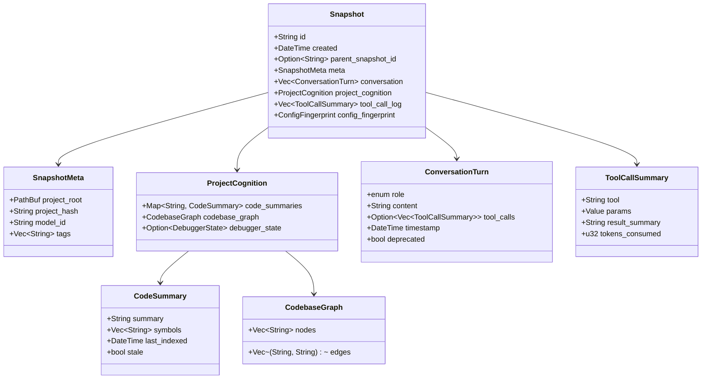
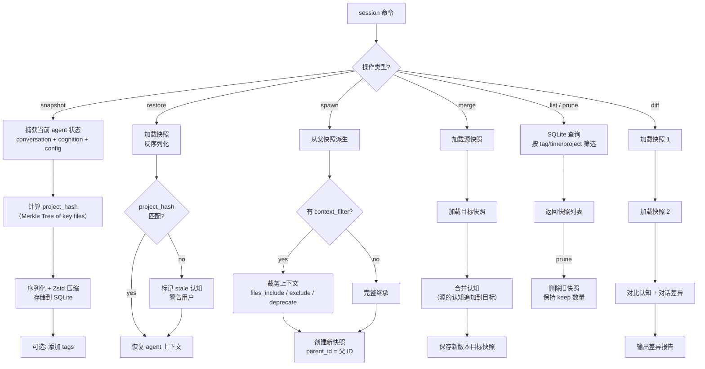
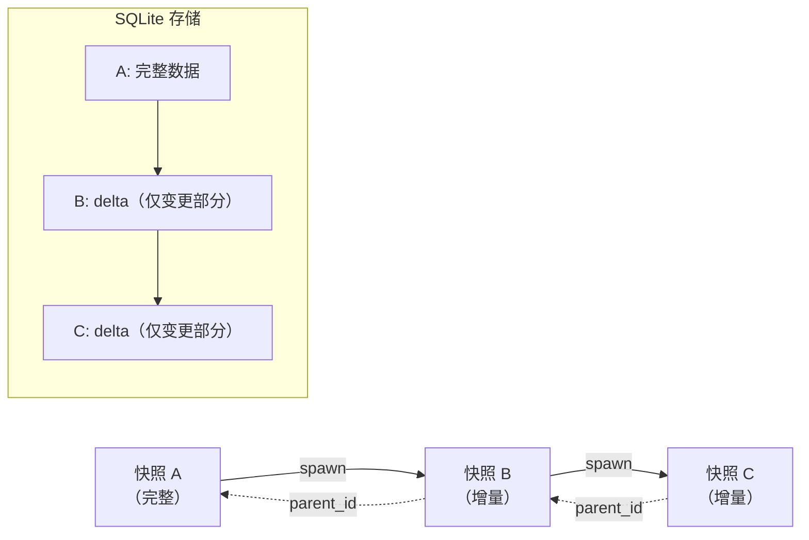

# c70-add-session-snapshot — Design

## Context

- PRD: §11（Session 快照系统）、§11.2（数据结构）、§11.3（核心操作 API）、§11.4（微调上下文）、§11.7（compaction）
- 依赖关系见 proposal.md frontmatter（depends_on / blocks 为 SSOT）

## Goals / Non-Goals

### Goals

- 实现快照核心数据结构（不可变、可派生）
- 核心操作：snapshot / restore / spawn / list / prune / diff / merge
- 上下文压缩（compaction）：对话摘要 + 工具调用折叠
- 增量快照（CoW）+ Zstandard 压缩
- 过期检测（project hash 比对 → stale 标记）

### Non-Goals

- 不实现蜂群协作的多进程调度（仅数据结构和操作 API）
- 不实现交互式上下文编辑器 UI（`session fine-tune` CLI 命令，后续 change）
- 不实现快照的远程同步/备份
- 不实现 codebase_graph 的自动构建（仅存储由 LSP 提供的数据）

## Decisions

### Decision 1: 快照数据结构



**选择**: 扁平化结构体，conversation 以数组存储（保留时序），project_cognition 按文件 key 索引。`stale` 字段标记过期认知。

**序列化**: serde → MessagePack（紧凑二进制，比 JSON 节省 ~40% 空间）。Zstandard 压缩存储。

### Decision 2: 快照操作流程



**选择**: 所有快照操作通过 SQLite 后端（adk-session）。`spawn` 支持上下文裁剪（`context_filter`），`merge` 合并认知不合并对话。

### Decision 3: Compaction 策略

```mermaid
flowchart TD
    TRIGGER{"触发条件?"}

    TRIGGER -->|"token > 75% 窗口"| INTRA["intra_compaction"]
    TRIGGER -->|"用户 manual"| MANUAL["manual_compaction"]
    TRIGGER →|"快照派生"| DERIVE_C["derive_compaction"]

    INTRA --> SELECT["选择最近的 N 轮对话"]
    MANUAL --> SELECT
    DERIVE_C --> SELECT

    SELECT --> SUMMARY["发送到轻量模型<br/>生成结构化摘要"]
    SUMMARY --> REPLACE["用摘要替换原始对话"]
    REPLACE --> FOLD["折叠工具调用<br/>→ 'executed N tools'"]

    FOLD --> KEEP["保留 project_cognition<br/>（不受压缩影响）"]
    KEEP --> DONE["压缩完成"]

    style KEEP fill:#e8f5e9
```

**选择**: 三种 compaction 策略共用同一压缩逻辑（对话摘要 + 工具折叠），仅触发时机不同。`project_cognition` 始终保留——这是 agent 的"长期记忆"，不应被压缩。

**配置映射**:
```yaml
session:
  auto_snapshot: true
  max_snapshots: 50
  storage:
    backend: "sqlite"
    compress: true
compaction:
  strategy: "intra"
  token_threshold: 0.75
  summary_model: null
  keep_tool_summaries: true
```

### Decision 4: 增量快照与存储



**选择**: 增量存储（CoW）——子快照仅存储与父快照的差异部分。加载时沿 parent 链回溯重建完整快照。Zstandard 压缩减少存储空间。

**权衡**: 增量存储节省空间但读取需要回溯。设置最大回溯深度（如 10 层），超过则自动合并为完整快照。

## Risks / Trade-offs

| 风险 | 等级 | 缓解 |
|------|------|------|
| 快照体积膨胀（长对话 + 大认知） | 中 | Zstd 压缩 + 工具调用仅保留摘要 + prune 策略 |
| 增量快照回溯链过长导致读取慢 | 低 | 自动合并阈值（10 层）+ 定期 GC |
| project_hash 计算耗时（大项目） | 低 | 仅 hash 关键源文件（排除 target/node_modules 等） |
| stale 检测误报（非关键文件变更） | 低 | hash 范围可配置；stale 仅警告不阻塞 |

### 待确认问题

- 无
