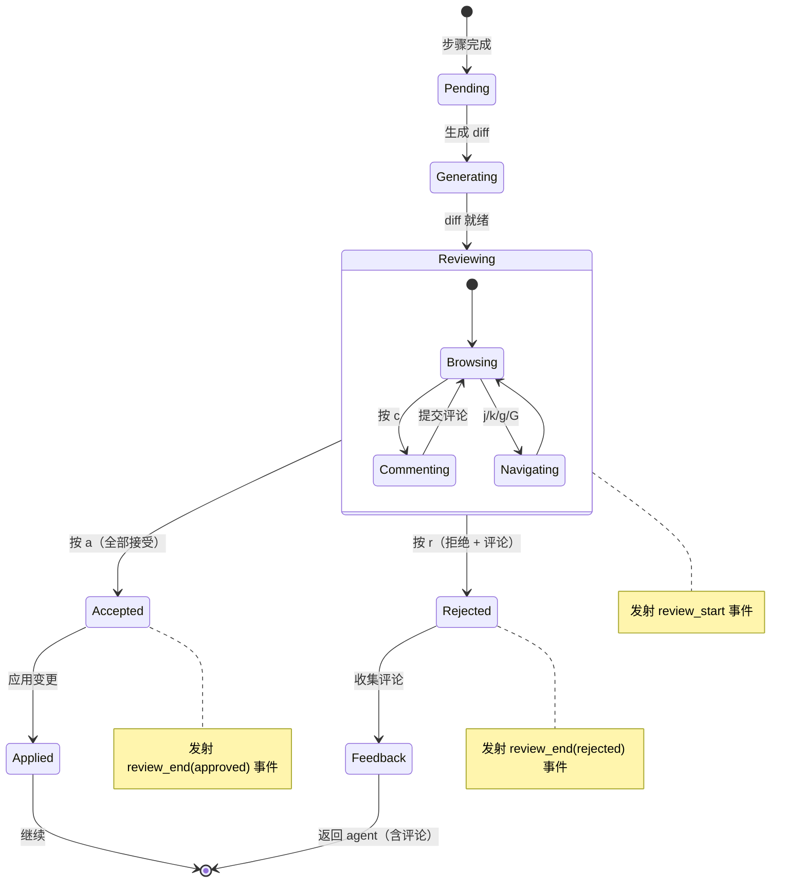
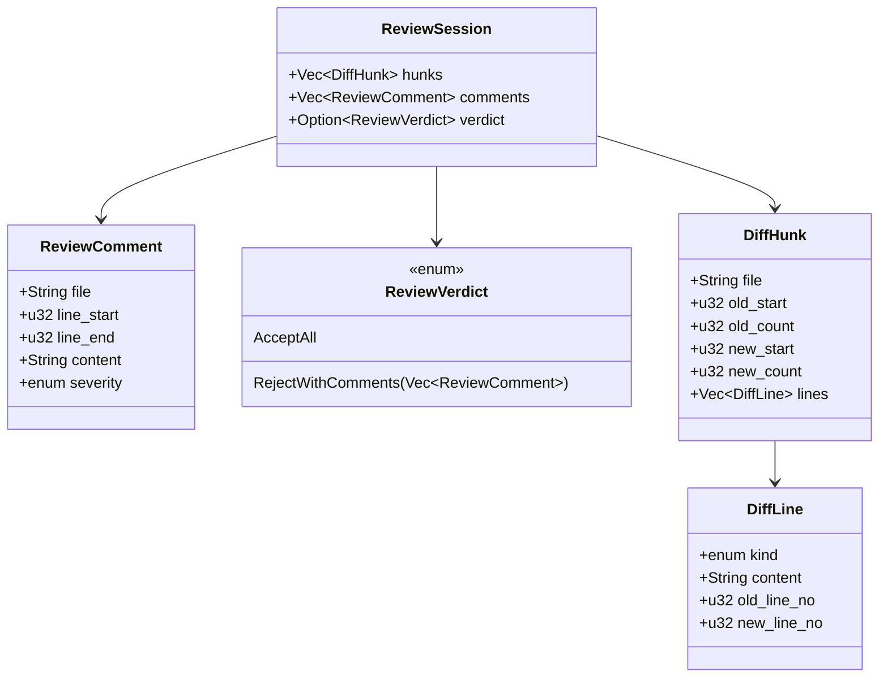
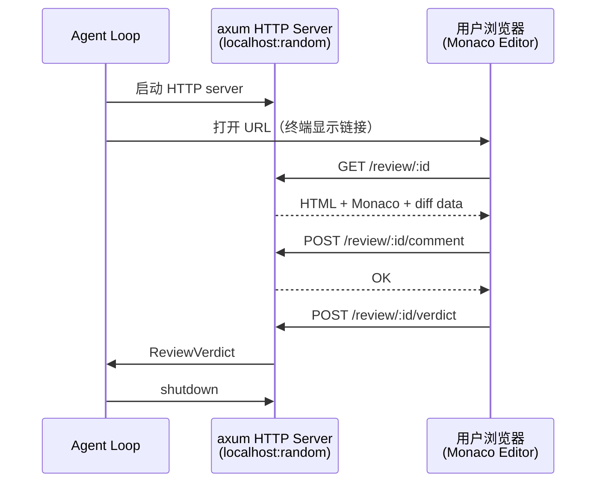

# c75-add-diff-review — Design

## Context

- PRD: §7（交互式 Diff 评审）、§7.1（审查流程）、§7.2（CLI 终端内评审）、§7.3（Web 浏览器评审）、§7.4（共享数据结构）、§7.5（权限门控联动）
- 依赖关系见 proposal.md frontmatter（depends_on / blocks 为 SSOT）

## Goals / Non-Goals

### Goals

- 实现 Diff 生成与渲染（unified diff + 语法高亮）
- CLI 终端内评审（基于 ratatui）
  - 行级评论
  - 交互键位（j/k/c/a/r）
- Web 浏览器评审（axum + Monaco Editor，可选）
- 共享评论数据结构（CLI/Web 复用）
- 审查流程状态机

### Non-Goals

- 不实现 Monaco Editor 自定义插件
- 不实现多人协作评审
- 不实现评审历史持久化（仅当前 session）
- 不实现语法高亮自定义主题（使用 syntect 默认）

## Decisions

### Decision 1: 审查流程状态机



**选择**: 三种审查模式控制触发时机：
- `on-step`: 每个步骤完成后自动进入评审（默认）
- `on-error`: 仅验证失败时进入评审
- `manual`: 用户手动触发

### Decision 2: 共享数据结构



**选择**: `ReviewSession` 包含完整的 diff hunks、评论和最终裁决。CLI 和 Web 共享同一数据结构，仅渲染层不同。

### Decision 3: CLI 终端内评审界面

```mermaid
flowchart TD
    REVIEW["进入评审模式"] --> RENDER["渲染 diff<br/>ratatui Paragraph<br/>syntect 语法高亮"]

    RENDER --> INPUT{"等待键位输入"}

    INPUT -->|"j/k"| NAV["上下移动光标<br/>行级导航"]
    INPUT -->|"g/G"| TOP_BOTTOM["跳到顶部/底部"]
    INPUT -->|"c"| COMMENT_MODE["进入评论模式<br/>ratatui-textarea"]
    INPUT -->|"a"| ACCEPT["接受全部变更"]
    INPUT -->|"r"| REJECT["拒绝 + 添加评论"]
    INPUT -->|"?"| HELP["显示帮助"]
    INPUT -->|"q"| CANCEL["取消评审<br/>（等同 r）"]

    COMMENT_MODE --> SUBMIT["提交评论<br/>附加到当前行"]
    SUBMIT --> RENDER

    NAV --> RENDER

    ACCEPT --> VERDICT["ReviewVerdict::AcceptAll"]
    REJECT --> COLLECT["收集所有评论"]
    COLLECT → VERDICT2["ReviewVerdict::RejectWithComments"]

    style ACCEPT fill:#e8f5e9
    style REJECT fill:#ffebee
```

**选择**: vim-like 键位（j/k/g/G/c/a/r/q/）。`ratatui-textarea` 用于行级评论输入。diff 渲染参考 codex-rs 的 `diff_render.rs`。

### Decision 4: Web 浏览器评审（可选）



**选择**: 内嵌轻量 axum HTTP server，Monaco Editor 渲染 diff。与 CLI 模式共享 `ReviewSession` 数据结构。

**权衡**: Web 模式比 CLI 更适合大文件 diff，但需要 axum 依赖 + 浏览器可用。默认使用 CLI，Web 为可选增强。

## Risks / Trade-offs

| 风险 | 等级 | 缓解 |
|------|------|------|
| ratatui diff 渲染性能（大文件） | 中 | 分页渲染 + 虚拟滚动；大 diff 自动建议 Web 模式 |
| syntect 语法高亮首次加载慢 | 低 | lazy load syntax set；缓存已加载的 syntax |
| Web 模式安全风险（本地 HTTP server） | 低 | 绑定 localhost + 随机端口 + 一次性 token |
| 审查流程与 agent loop 的异步协调 | 中 | 审查期间 agent 挂起（等待 verdict）；超时自动 accept |

### 待确认问题

- 无
