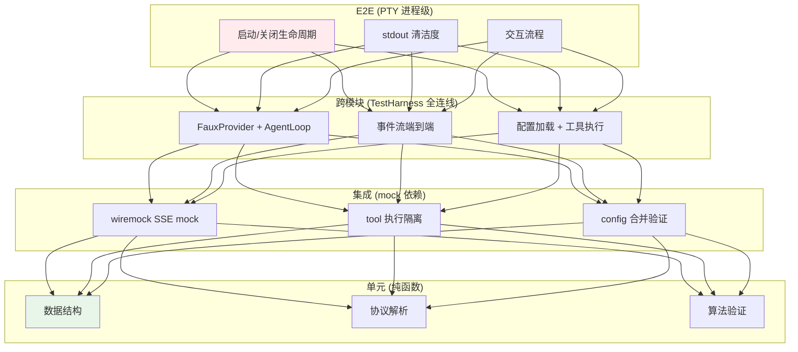
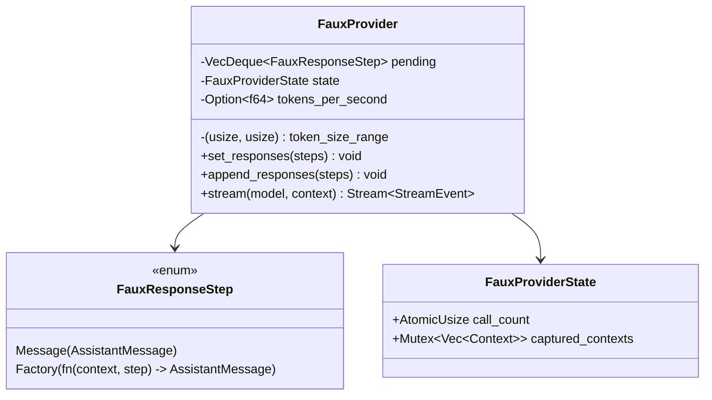
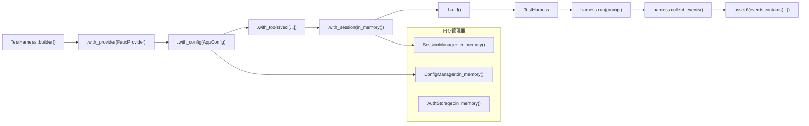

# c88-add-test-infra — Design

## Context

- PRD: §13（测试与验证）、§13.1（测试哲学）、§13.2（技术栈）、§13.3（Harness 架构）、§13.4（TUI 测试）、§13.5（Agent Loop 集成测试）、§13.6（E2E PTY）、§13.9（CI 管道）
- 依赖关系见 proposal.md frontmatter（depends_on / blocks 为 SSOT）

## Goals / Non-Goals

### Goals

- 建立 `tests/support/` 共享测试工具模块
- FauxProvider — 无网络、确定性 mock LLM provider
- TestHarness — Builder 模式全连线测试 session
- VT100Backend — VT100 终端模拟 backend（feature-gated）
- SSE mock 构建器 — wiremock HTTP mock
- 内存管理器模式 — 各组件的 in_memory() 构造
- CI 配置 — nextest 配置 + CI 分层
- 回归测试工作流模板

### Non-Goals

- 不实现真实 LLM API 测试（CI 中按需启用，非基础设施）
- 不实现性能基准测试框架（benches/ 单独管理）
- 不实现 fuzz testing
- 不实现测试覆盖率工具集成

## Decisions

### Decision 1: 测试金字塔四层架构



**选择**: 四层金字塔。每层只 mock 直接依赖（不越层 mock）。确定性优先——默认无网络调用。

### Decision 2: FauxProvider 设计



**选择**: 参考_codex-rs_ `core/tests/common/responses.rs` 设计。`FauxResponseStep::Factory` 支持基于上下文的动态响应（如根据用户输入返回不同工具调用）。

**流式模拟**: 将消息文本按 3-5 字符分块，逐块发送 `StreamEvent`，模拟真实 LLM 流式输出。

### Decision 3: TestHarness Builder



**选择**: Builder 模式构建测试 session。所有 manager 提供 `in_memory()` 构造，避免文件系统依赖。

**事件断言**: `collect_events()` 收集所有 `AgentEvent`，提供 `contains_text()`, `has_tool_call()`, `count_events()` 等断言辅助方法。

### Decision 4: TUI 组件测试双轨

```mermaid
flowchart TD
    subgraph "轨道 A: TestBackend + insta（Widget 级）"
        WIDGET["ratatui widget"] --> TB["TestBackend（60x20）"]
        TB --> BUFFER["渲染到 Buffer"]
        BUFFER → SNAP["insta::assert_snapshot!"]
    end

    subgraph "轨道 B: VT100Backend（完整管线）"
        APP["完整 TUI App"] --> CROSSTERM["crossterm 写入"]
        CROSSTERM --> VT100["vt100 终端模拟<br/>（feature-gated）"]
        VT100 → GRID["获取 grid 输出"]
        GRID → SNAP2["insta::assert_snapshot!"]
    end

    style SNAP fill:#e8f5e9
    style SNAP2 fill:#e8f5e9
```

**轨道 A**（默认，无需额外依赖）: 使用 `ratatui::backend::TestBackend` 渲染单个 widget 到 buffer，insta 快照验证输出。

**轨道 B**（feature-gated `vt100-tests`）: 使用 `vt100` crate 模拟完整终端，验证 crossterm 生成的 ANSI 序列正确性。适用于集成测试。

### Decision 5: CI 配置

```yaml
# .config/nextest.toml
[profile.ci]
fail-fast = false
slow-timeout = "60s"

[profile.ci.junit]
path = "junit.xml"
```

**CI 分层**:

| 层级 | 触发 | 内容 | 超时 |
|------|------|------|------|
| PR check | 每次 push | 单元 + 集成（无 vt100/e2e） | 10 min |
| Full CI | merge to main | 全部 + vt100-tests | 20 min |
| E2E | nightly / manual | PTY 进程级测试 | 30 min |

## Risks / Trade-offs

| 风险 | 等级 | 缓解 |
|------|------|------|
| FauxProvider 与真实 LLM 行为差异 | 中 | 集成测试使用 wiremock 模拟真实 SSE 格式；FauxProvider 用于快速单元测试 |
| insta 快照频繁更新导致 diff 噪音 | 低 | 快照审查流程；`cargo insta review` 交互式确认 |
| vt100 crate 不支持所有 ANSI 序列 | 低 | codex-rs 已验证兼容性；不支持的序列降级跳过 |
| 测试依赖过多增加编译时间 | 中 | dev-dependencies 不影响 release 构建；nextest 并行执行加速 |

### 待确认问题

- 无
