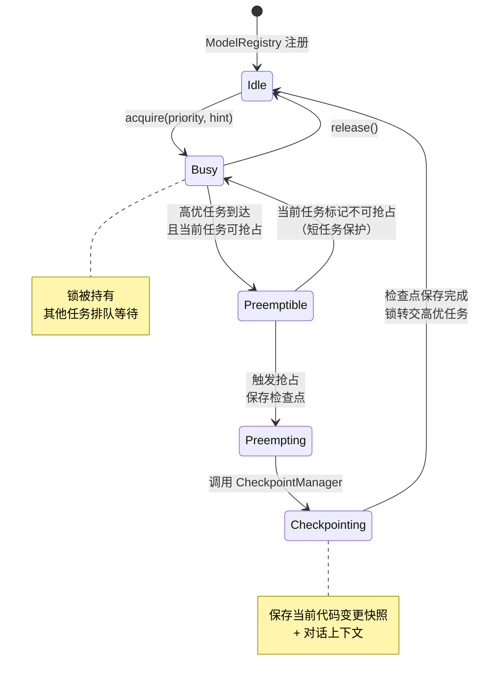
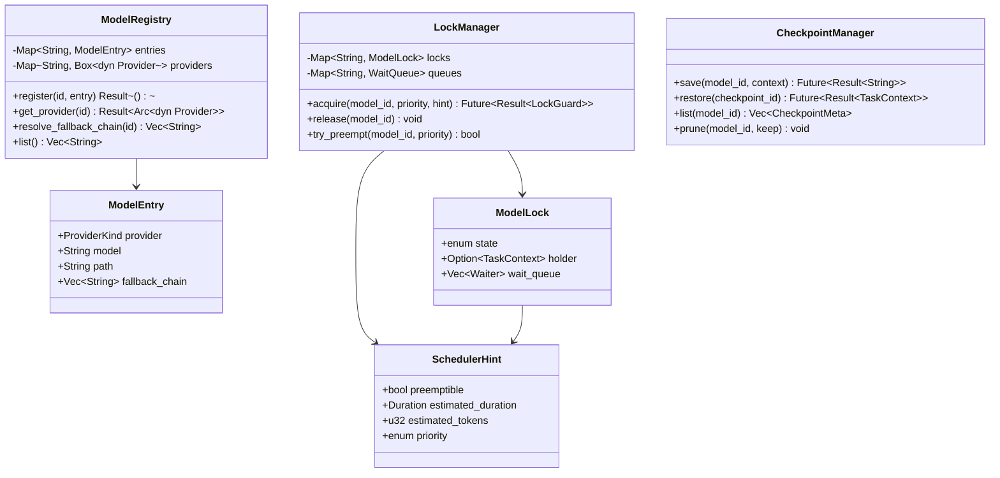

# c60-add-model-lock — Design（Phase 2 — 延后实施）

> **⚠️ Phase 2**: MVP 仅使用远程 API（OpenAI-compatible + Anthropic-compatible），无需模型抢占锁。本 change 延后至支持本地模型时实施。以下设计保留作为未来参考。

## Context

- PRD: §6（模型抢占锁定）、§5（规划-执行分离的调度器）、§10.5（fallback_chain 模型备用链）
- 依赖关系见 proposal.md frontmatter（depends_on / blocks 为 SSOT）

## Goals / Non-Goals

### Goals

- 实现 ModelRegistry（模型实例生命周期管理、Provider 注册）
- 实现 LockManager（锁状态机 Idle → Busy → Preemptible → Preempting）
- 实现 CheckpointManager（保存/恢复被中断任务上下文）
- 基于 priority + deadline 的抢占决策
- SchedulerHint 任务声明

### Non-Goals

- 不实现分布式锁（单进程内）
- 不实现 GPU 显存管理（由本地引擎自行处理）
- 不实现模型热加载/卸载
- 不实现跨进程模型共享

## Decisions

### Decision 1: 锁状态机



**选择**: 四状态锁机。关键决策点是 `Preemptible → Busy` 的回退——如果当前任务声明不可抢占（短任务），则高优任务排队等待而非抢占。

**抢占条件**:
- 新任务 priority > 当前任务 priority
- 当前任务 `SchedulerHint.preemptible = true`
- 当前任务已运行时间 > 最小运行时间阈值（防止刚获得锁就被抢占）

### Decision 2: ModelRegistry 与 Provider 管理



**选择**: `ModelRegistry` 管理 Provider 实例和 fallback_chain。`LockManager` 管理每个 model_id 的独立锁。`LockGuard` 实现 RAII 自动释放。

### Decision 3: 等待队列与优先级调度

```mermaid
flowchart TD
    ACQUIRE["任务请求锁<br/>acquire(model_id, priority, hint)"] --> STATE{"锁状态?"}

    STATE -->|"Idle"| GRANT["直接授予锁<br/>state → Busy"]
    STATE -->|"Busy"| COMPARE{"priority vs<br/>当前持有者?"}

    COMPARE -->|"更高 & 可抢占"| PREEMPT["触发抢占流程<br/>state → Preemptible"]
    COMPARE →|"更高 & 不可抢占"| ENQUEUE["加入等待队列<br/>按 priority 排序"]
    COMPARE →|"更低"| ENQUEUE

    STATE →|"Preemptible / Preempting"| ENQUEUE

    PREEMPT --> CHECKPOINT["保存当前任务检查点"]
    CHECKPOINT --> YIELD["当前任务挂起"]
    YIELD --> GRANT

    ENQUEUE --> WAIT["await 等待<br/>（Future 挂起）"]

    RELEASE["release(model_id)"] --> QUEUE{"等待队列<br/>非空?"}
    QUEUE →|"yes"| POP["弹出最高优先级等待者"]
    QUEUE →|"no"| IDLE["state → Idle"]
    POP → GRANT

    style GRANT fill:#e8f5e9
    style ENQUEUE fill:#fff3e0
```

**选择**: 基于 priority 的优先队列。等待中的任务通过 `tokio::sync::Notify` 挂起，释放锁时唤醒最高优先级等待者。

**SchedulerHint 示例**:
```rust
// 规划器任务：高优先级、不可抢占、预计 30s
SchedulerHint {
    preemptible: false,
    estimated_duration: Duration::from_secs(30),
    estimated_tokens: 5000,
    priority: Priority::High,
}

// 执行器单步：低优先级、可抢占、预计 10s
SchedulerHint {
    preemptible: true,
    estimated_duration: Duration::from_secs(10),
    estimated_tokens: 2000,
    priority: Priority::Low,
}
```

### Decision 4: CheckpointManager 检查点管理

```mermaid
flowchart LR
    PREEMPT["触发抢占"] --> CAPTURE["捕获 TaskContext<br/>conversation + tool_results<br/>+ model_state"]
    CAPTURE --> SERIALIZE["序列化<br/>（serde + MessagePack）"]
    SERIALIZE --> STORE["存储到 SQLite<br/>（adk-session）"]
    STORE --> ID["返回 checkpoint_id"]

    RESTORE["restore(checkpoint_id)"] --> LOAD["从 SQLite 加载"]
    LOAD --> DESERIALIZE["反序列化"]
    DESERIALIZE → RECOVER["恢复 TaskContext<br/>注入到新 agent session"]
```

**选择**: 检查点存储到 SQLite（复用 adk-session 后端）。包含完整的对话上下文和工具结果摘要，使被抢占的任务可以从断点恢复。

**清理策略**: 每个模型保留最近 N 个检查点（默认 5），通过 `prune` 清理旧的。

## Risks / Trade-offs

| 风险 | 等级 | 缓解 |
|------|------|------|
| 抢占过程中检查点保存失败 | 中 | 保存失败时取消抢占，当前任务继续执行 |
| 等待队列饥饿（高优任务不断抢占） | 低 | 每个任务有最小运行时间阈值；相同优先级 FIFO |
| 单进程内锁的复杂度是否必要 | 中 | Phase 2: 仅在使用本地 GGUF 模型时才需要（串行执行）；远程 API 不需要锁。本 change 延后至支持本地模型时实施 |
| CheckpointManager 与 c70 快照系统重叠 | 低 | 检查点更轻量（仅保存恢复所需的最小上下文）；快照是完整持久化 |

### 待确认问题

- 无
