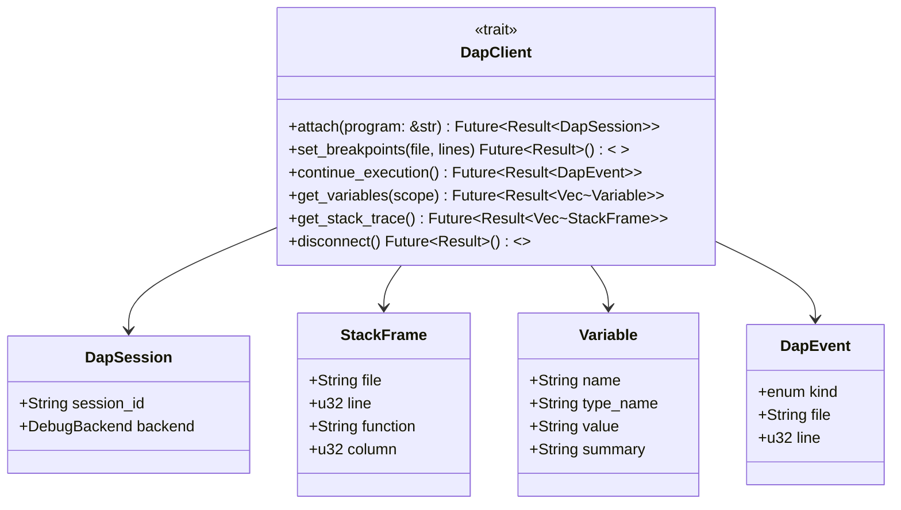

# c85-add-dap-layer — Design

## Context

- PRD: §4（DAP 调试器集成，架构预留，暂不实现）
- 依赖关系见 proposal.md frontmatter（depends_on / blocks 为 SSOT）

## Goals / Non-Goals

### Goals

- 定义 DapClient trait（attach/set_breakpoints/continue/get_variables/get_stack_trace/disconnect）
- 定义 DAP 相关数据结构（StackFrame, Variable, DapEvent 等）
- YAML 配置入口（dap.enabled, dap.backends）
- feature flag `infra-dap` 门控

### Non-Goals

- 不实现任何 DAP 后端（dapz v0.0 极早期）
- 不实际连接调试器
- 不处理 DAP 协议序列化（留到实际集成时）

## Decisions

### Decision 1: DapClient trait 接口设计



**选择**: 纯 async trait，方法签名参考 DAP 协议核心操作。不含协议序列化（如 `ContinueRequest` → JSON），仅暴露业务语义。

**权衡**: 高层 trait 比直接映射 DAP 协议更易用，但后期实际集成时可能需要调整签名。

### Decision 2: YAML 配置入口

```yaml
dap:
  enabled: false
  backends:
    rust: "lldb-dap"
    python: "debugpy"
    typescript: "vscode-js-debug"
```

**选择**: 简单的 string → backend 映射。enabled 默认 false，不启动任何 DAP 功能。

## Risks / Trade-offs

| 风险 | 等级 | 缓解 |
|------|------|------|
| trait 签名与 dapz 最终实现不匹配 | 高 | dapz 极早期，预计会调整。本 change 的 trait 仅作为方向性参考，实际集成时允许重构 |
| DAP 数据结构不完整 | 低 | 当前仅覆盖最核心操作，缺失的结构（如 Scope、Source）在实际集成时补充 |

### 待确认问题

- 无
