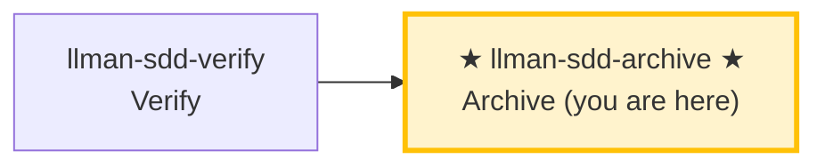

# LLMAN SDD Archive

Use this skill to archive completed changes. Prerequisites: verify all-green, and the change already has Branch binding plus Specs landing (or `needs_specs_change: false`; live specs are on the bound branch). `change finalize` **auto ff-merges** into the default branch, **renames** change docs to `changes/archive/`, then **auto-commits** `archive(sdd): <change-id>` (impl diff + rename in one commit; `--no-commit` skips). `change checkpoint` is removed (r25). `git push` / hosting PR are optional.

## Pipeline Position



> 📍 You are in the archive phase: the last stop in the Git-native lifecycle.
> 📎 If specs get too large, run `llman-sdd-specs-compact` to compress.

## Hard Constraints

- **Must pass verify phase all-green first**: don't archive changes that haven't passed verification.
- **Must already have Branch binding**: `change start` / `attach` done; otherwise STOP.
- **SSOT validation**: every change must pass `llman sdd validate <id> --strict --no-interactive` before archiving.
- **Don't ask "should I continue?"**: execute the full batch to completion unless you hit an unresolvable error.
- **Close-out MUST NOT default to PR/push**: finalize performs a local ff-merge + rename + one auto commit (`archive(sdd): <id>`). `git push` / hosting PR are optional — only when the user or project explicitly requires remote review. **Agent MUST NOT** push or open a PR by default on this skill's account.

## Steps

### 0) Preflight
- `git status --porcelain`: confirm working tree changes belong to completed changes.
- If unexpected changes exist, handle them (stash or report).

### 1) Confirm target changes
- Determine target IDs: single or batch (from user input or `llman sdd list --json`).
- Always announce: "Archiving IDs: <id1>, <id2>, ...".
- Confirm each change has passed verify phase all-green.

### 2) Archive one by one
- **Human review checkpoint (before each id is archived, including batches)**: run `llman sdd review --capability <id>`. Exit code zero → continue; non-zero = CRITICAL findings: STOP, fix, re-run; MUST NOT archive with CRITICAL findings open.
- Validate each first: `llman sdd validate <id> --strict --no-interactive`.
- Validation failure → STOP and report; don't skip validation and force archive.
- Optional preview: `llman sdd change archive <id> --dry-run`.
- Execute archive:
  - default: `llman sdd change archive <id>`
  - tooling-only: `llman sdd change archive <id> --skip-specs`
  - **stop immediately on first failure**, report remaining unprocessed IDs.
- **Git-native close-out**:
  - Prerequisites: Branch binding done (`change start` / `attach`); still on the bound branch (or default branch after auto ff-merge).
  - `change archive` / `change finalize` run **auto ff-merge** (`git merge --ff-only <feature>` into default), **then** rename change docs into `changes/archive/` — rename is never rolled back on merge failure.
  - Legacy `*.feature.delta.toon` or `spec.toon` under specs is a migration blocker — run `llman sdd project migrate --kind toon2features`.
  - **Default: `change finalize` (one-command close)** — gates → locked-rule confirmation → auto ff-merge → docs rename → **auto commit** `archive(sdd): <change-id>` (uncommitted implementation diff + rename in one commit; no manual `git commit` needed):
    ```text
    1. Implement live specs + code (working tree may stay dirty; commits on the branch are free — segmented or none)
    2. llman sdd change finalize <id>    # gates (+ y/n lock-rule confirmation) + ff-merge + rename + auto commit
    3. optional: git commit --amend      # adjust the message; then git branch -d <feature>
    ```
    `--no-commit` skips the auto commit (CI / pre-commit-hook conflicts): finalize then leaves the tree dirty and prints the manual `git commit` command. Idempotent retry: a rerun after a failed auto commit detects the already-archived rename and finishes the commit.
  - **Fallback: plain `change archive <id>`** — same ff-merge + rename, no auto commit; requires a clean tree. `checkpointed`/`checkpoint_sha` fields are removed (r25) — nothing to write beforehand, and nothing to review for the snapshot (use `change diff` instead).

### 3) Full validation
- After all archives complete: `llman sdd validate --all --strict --no-interactive`.
- Confirm post-archive spec artifacts are consistent.

### 4) Commit guidance
- Finalize auto-committed (`archive(sdd): <id>`); with `--no-commit`, commit manually: `git add -A && git commit -m "archive(sdd): <id1>, <id2>"` (or the archive skill's suggested format).
- Optional: `git branch -d <feature>` after ff-merge. push / hosting PR only when the user or project explicitly requires remote review.
- **Breaking contract changes** (removed/renamed frontmatter field, command, tag, or stage value) MUST ship an upgrade path under `migrations/v<from>-v<to>/` (README prompt + one-shot script; r28) — verify it exists before closing the change.
- **Archived `depends_on`**: archive renames the change dir to `archive/YYYY-MM-DD-<id>`, but validate recognizes `depends_on` pointing to archived/frozen ids as INFO (not ERROR), so you do **not** need to manually update other changes' `depends_on` frontmatter after archive.

> 💡 Previous phase `llman-sdd-verify` (passed verification) → this phase completes the loop. If specs grow too large, run `llman-sdd-specs-compact`.

{{ unit("workflow/archive-freeze-guidance") }}

> For command details run `llman sdd <cmd> --help`; the CLI is the command reference — skills embed no command tables (r139).

{{ unit("skills/validation-hints") }}

{{ unit("skills/structured-protocol") }}
