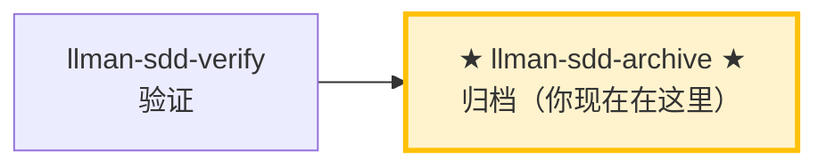

# LLMAN SDD 归档

使用此 skill 归档已完成的变更。前置：verify 全绿，且变更已 Branch binding、Specs landing 完成（或 `needs_specs_change: false`；归档时 live specs 已在绑定分支上）。`change finalize` **自动 ff-merge** 到默认分支、**将** change 文档改名到 `changes/archive/`，然后**自动提交** `archive(sdd): <change-id>`（实现 diff + 改名一次提交；`--no-commit` 跳过）。`change checkpoint` 已移除（r25）。`git push` / Hosting PR 仅为可选。

## Pipeline 位置



> 📍 你现在在归档阶段：Git-native 生命周期的最后一站。
> 📎 若 specs 逐渐膨胀，可运行 `llman-sdd-specs-compact` 压缩。

## 硬约束

- **必须先通过 verify 阶段全绿**：未通过验证的 change 禁止归档。
- **须已 Branch binding**：`change start` / `attach` 已完成；无绑定则 STOP。
- **SSOT 校验**：每个 change 归档前必须通过 `llman sdd validate <id> --strict --no-interactive`。
- **不要问「要不要继续」**：批量归档时间线上一路执行到底，除非遇到无法自动解决的错误。
- **收尾不默认导向 PR/push**：archive/finalize 后由 CLI 处理本地 ff-merge，再一次性 `git commit` 提交文档改名。`git push` / Hosting PR 仅为可选——仅当用户或项目明确要求远程审查时才做。**Agent MUST NOT** 因本 skill 默认执行 push 或创建 PR。

## 步骤

### 0) Preflight
- `git status --porcelain`：确认工作区改动属于已完成的 change。
- 若有未预期改动，先处理（stash 或报告）。

### 1) 确认目标变更
- 确定目标 ID：单个或批量（来自用户输入或 `llman sdd list --json`）。
- 始终说明："归档 IDs：<id1>, <id2>, ..."。
- 确认每个 change 都已通过 verify 阶段的全绿验证。

### 2) 逐个归档
- **人审检查点（每个 id 归档执行前，含批量）**：运行 `llman sdd review --capability <id>`。退出码为零 → 继续；非零 = CRITICAL 发现：STOP 修复后重跑；MUST NOT 带着 CRITICAL 归档。
- 先逐个校验：`llman sdd validate <id> --strict --no-interactive`。
- 校验失败 → STOP 并报告；不要跳过校验强行归档。
- 可选预览：`llman sdd change archive <id> --dry-run`。
- 执行归档：
  - 默认：`llman sdd change archive <id>`
  - 仅工具类变更：`llman sdd change archive <id> --skip-specs`
  - **任一失败立即停止**，报告剩余未处理 ID。
- **Git-native 收尾**：
  - 前置：已 Branch binding（`change start` / `attach`）；仍在绑定分支上（或 ff-merge 后已在默认分支）。
  - `change archive` / `change finalize` **先自动 ff-merge**（`git merge --ff-only <feature>` 到默认分支），**再**将 change 文档改名到 `changes/archive/`——merge 失败也不会回滚改名。
  - specs 下遗留 `*.feature.delta.toon` 或 `spec.toon` 均为迁移阻断项——跑 `llman sdd project migrate --kind toon2features`。
  - **默认：`change finalize`（单命令收口）**——门禁 → 锁定规则确认 → 自动 ff-merge → 文档改名 → **自动提交** `archive(sdd): <change-id>`（未提交的实现 diff + 改名一次提交；无需手动 `git commit`）：
    ```text
    1. 实现 live specs + 代码（工作区可保持脏；分支上提交自由——分段或完全不提交）
    2. llman sdd change finalize <id>    # 门禁（+ 锁定规则 y/n 确认）+ ff-merge + 改名 + 自动提交
    3. 可选：git commit --amend          # 调整提交说明；然后 git branch -d <feature>
    ```
    `--no-commit` 跳过自动提交（CI / pre-commit hook 冲突）：finalize 此时留脏工作区并打印手动 `git commit` 命令。幂等重试：自动提交失败后重跑会识别已归档改名并补提交。
  - **Fallback：普通 `change archive <id>`**——同样的 ff-merge + 改名，无自动提交；要求干净树。`checkpointed`/`checkpoint_sha` 字段已移除（r25）——无需预写任何存档字段，快照审查改用 `change diff`。

### 3) 全量校验
- 全部归档完成后执行：`llman sdd validate --all --strict --no-interactive`。
- 确认归档后的 specs 工件一致。

### 4) Commit 引导
- finalize 已自动提交（`archive(sdd): <id>`）；使用 `--no-commit` 时手动提交：`git add -A && git commit -m "archive(sdd): <id1>, <id2>"`（或本 skill 建议的格式）。
- 可选：ff-merge 后 `git branch -d <feature>`。push / Hosting PR 仅在用户或项目明确要求远程审查时才做。
- **破坏性合约变更**（移除/重命名 frontmatter 字段、命令、tag 或 stage 值域）MUST 提供 `migrations/v<from>-v<to>/` 升级路径（README prompt + 一次性脚本；r28）——收口前确认它存在。
- **archived `depends_on`**：archive 会把 change 目录改名为 `archive/YYYY-MM-DD-<id>`，但 validate 会把指向 archived/frozen id 的 `depends_on` 识别为 INFO（非 ERROR），所以**归档后无需**手动更新其它 change 的 `depends_on` frontmatter。

> 💡 上一阶段 `llman-sdd-verify`（验证通过）→ 本阶段归档后闭环结束。若 specs 逐渐膨胀，可运行 `llman-sdd-specs-compact` 压缩。

{{ unit("workflow/archive-freeze-guidance") }}

> 命令细节用 `llman sdd <cmd> --help` 查看；命令参考以 CLI 为准，skill 不内嵌命令表（r139）。

{{ unit("skills/validation-hints") }}

{{ unit("skills/structured-protocol") }}
