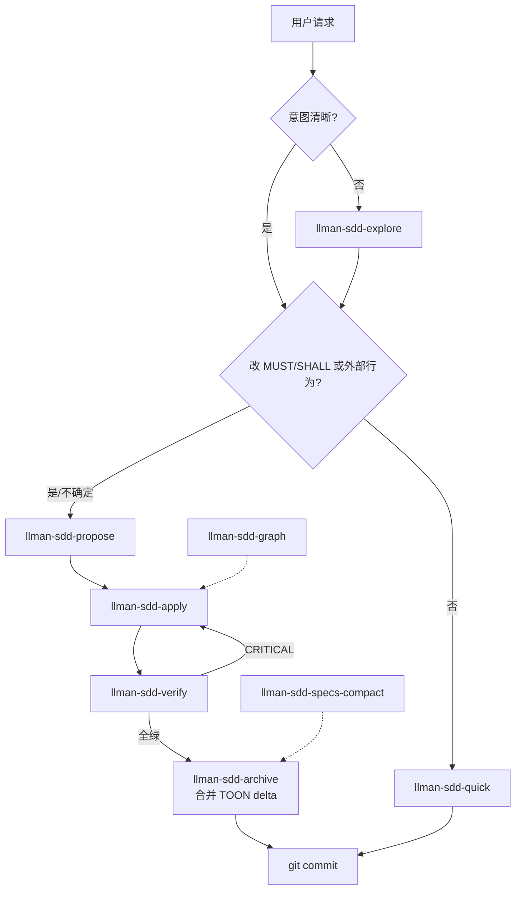
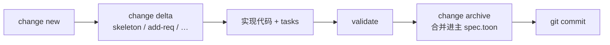

# SDD Pipeline — BDD-off

前提：`llmanspec/config.yaml` **不含** `bdd:` 段。约束与场景写在 change 内 TOON delta；archive 合并进主 `spec.toon`。

## Agent 如何选 skill

## Delta / archive 闭环

不需要：feature 分支、`attach`、`checkpoint`、`finalize`、`.feature` harness（文件若存在，validate 在 BDD-off 下忽略）。

## 关键约束

- Delta 至少含一个 op + 匹配 scenario（含 MUST/SHALL）
- 托管 skill 的 `metadata.llman_sdd.bdd_mode` MUST 为 `off`
- Optional skills 默认不装；需 `extra_skills` 显式启用
