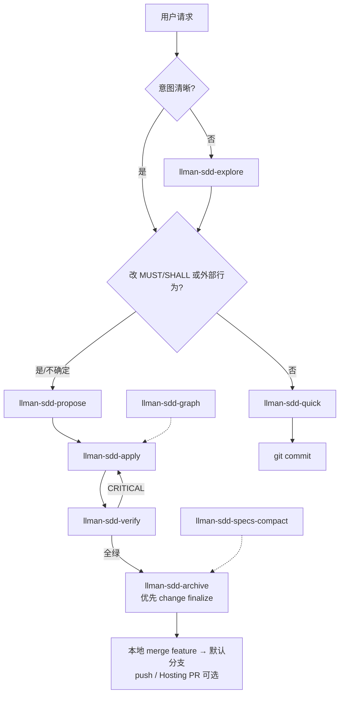

# SDD Pipeline — BDD-on

前提：`llmanspec/config.yaml` 含 `bdd:` 段。可执行 GWT 在 live `*.feature`；约束在 live `spec.toon`。

## Agent 如何选 skill

## Git-native 闭环（实现侧）

Fallback（需严格 `checkpoint_sha = HEAD`）：`checkpoint` → commit → `archive` → commit。

## 关键约束

- 禁止在 main/master 上 propose/实现 BDD-on 变更
- 禁止 `change delta` / `*.feature.delta.toon` / solidify
- 托管 skill 的 `metadata.llman_sdd.bdd_mode` MUST 为 `on`；漂移时跑 `llman sdd init --update`
