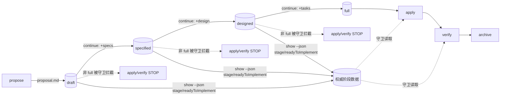

# Design: 将 draft 提案提升为一等公民阶段

## 背景

`ChangeStage` 与 `determine_stage()`（`src/sdd/spec/validation.rs:1565-1595`）已存在，按 artifacts 存在性隐式推断阶段：

```
draft     = proposal.md
specified = proposal.md + specs/*/spec.md
designed  = proposal.md + specs/ + design.md
full      = proposal.md + specs/ + design.md + tasks.md
```

阶段判定**零状态文件、零迁移**，纯文件存在性。本设计不引入任何显式标记，复用该推断。

## 核心决策

### 决策 1：守卫方向 = 守卫 + 引导完善（非轻量直连）

draft 不是"可越级实现的轻量草稿"，而是"还没准备好被实现的过渡态"。apply/verify 检测到非 full 阶段 → 拒绝 → 引导 `continue` 长大。draft 成长的唯一路径是 continue。

> 拒绝过的备选：①允许 draft 直接实现（两条合法路径并存，复杂且违背 spec 驱动意图）；②新增显式 `promote/realize` 命令一键长大（YAGNI，continue 已能按序补齐 artifacts）。

### 决策 2：守卫阈值 = 统一 gate Full（而非只拦 draft）

apply 与 verify 的守卫阈值统一为 **full**。理由：verify 要对照 specs 检查"实现一致性"，无 tasks 意味着尚未实现，verify 无意义。draft 只是"非 full"中最常见的起始态，但 specified/designed 同样不该被实现/验证。

| stage | apply | verify | continue |
|-------|:-----:|:------:|:--------:|
| draft | ✗ 拦截 | ✗ 拦截 | ✓ 长大 |
| specified | ✗ 拦截 | ✗ 拦截 | ✓ 长大 |
| designed | ✗ 拦截 | ✗ 拦截 | ✓ 长大 |
| full | ✓ | ✓ | 引导 apply |

守卫文案对 draft 给最友好的引导（"这是 draft 提案，需先补 specs → design → tasks"），对 specified/designed 给通用文案（"当前 X 阶段，尚未 full，请先 continue"）。

### 决策 3：守卫层数 = skill 文本 + CLI 权威 stage 输出（双层）

- **数据源（Rust）**：`llman sdd show <id> --json` 的 change 输出新增 `stage`、`artifacts`、`readyToImplement` 字段。`readyToImplement = (stage == full)`。
- **守卫执行（skill 文本）**：`apply` / `verify` skill 的前置检查调用 `llman sdd show <id> --json` 读取权威 `stage`，非 full 则 STOP + 引导 continue。

不选择"validate --gate 下沉到 Rust"：守卫是"查询能否进入下一阶段"的语义，属于 show（查询）而非 validate（校验）。validate 仍负责格式/完整度校验，不掺入实现准入逻辑，职责清晰。

> 拒绝过的备选：纯 skill 文本层靠启发式判断阶段（易绕过、不权威）。

### 决策 4：strict 力度 = WARNING（非 ERROR）

draft 在 strict 下 stage 提示为 WARN→ERROR（现有 r45 行为，合理：strict 下 draft 本就该报）。非 strict 下补出 INFO 阶段提示与 tasks_missing WARNING（修 r45 偏差：当前 valid 时直接 return，所有 INFO/WARNING 被吞）。

## 数据流



## 组件改动

### A. Rust：`show` 暴露 stage（sdd/command.rs show handler + 结构体）

change 的 JSON 输出从 `{id, title, deltaCount, deltas}` 扩展为 `{id, title, stage, artifacts, readyToImplement, deltaCount, deltas}`。text 模式在标题行后打印 `Stage: draft`。

- `stage`：`determine_stage().as_str()`（draft/specified/designed/full）
- `artifacts`：已存在的 artifact 文件名列表（`["proposal.md"]` 等）
- `readyToImplement`：`stage == full`

### B. Rust：validate 非 strict 暴露 stage INFO（validation.rs / validate.rs）

当前 `print_single_report` 在 `report.valid` 时直接 return（validate.rs:526-537），导致非 strict 下 draft 的 stage INFO（及 tasks_missing WARNING）被吞。修改：valid 分支也打印 INFO 与 WARNING 级提示——它们是引导而非错误，不应因整体校验通过而静默。`check_tasks_exists` 保持原 WARNING 语义不变。

### C. Skill：apply / verify 守卫（templates/sdd/{locale}/skills/）

`llman-sdd-apply.md` 前置检查升级（verify 同理）：

```markdown
2. Check prerequisites (authoritative):
   - Read stage: stage = llman sdd show <id> --json | jq -r .stage
   - if stage != "full" → STOP with guard:
     "Change <id> is in <stage> stage, not ready to <apply|verify>.
      Grow it to full first: /llman-sdd:continue <id>
      (proposal → specs → design → tasks)"
```

`llman-sdd-continue.md` 补充：draft 阶段显式提示"这是 draft 提案，需先补 specs → design → tasks 长大成 full 才能实现"。

### D. tests：stage 暴露 + 守卫场景 + r45 回归

新增集成测试覆盖：show --json 含 stage/artifacts/readyToImplement；非 strict draft 打印 stage INFO；apply/verify skill 模板含守卫文本。

## 边界与错误处理

- `show` 对不存在/无 proposal 的目录：stage 判定为 draft（与现有 determine_stage 一致），不新增错误。
- 守卫只依赖 `show` 的 stage 字段，若 `show` 失败（如 change 不存在），skill 沿用现有"change not found"路径，不重复实现。
- 阶段推断与 `tasks_without_design`（r44）约束正交：r44 仍由 validate 处理 ERROR，守卫只看 stage。

## 不做（YAGNI）

- 不新增显式 `promote` / `realize` 命令。
- 不新增 `validate --gate=implement` Rust 选项（守卫语义归 show）。
- 不改变 propose/continue/archive 既有流程。
- 不为阶段引入额外状态文件或 frontmatter 字段。
