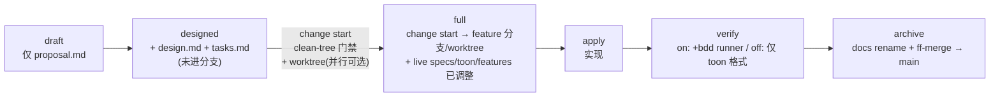

## Why

BDD-on 与 BDD-off 双轨流程让 change 生命周期分叉成两套命令与心智模型
（`change delta` vs `change attach`、TOON delta merge vs docs-only archive），
造成 agent prompt 双轨措辞膨胀、propose 阶段 proposal/tasks 与 live `spec.toon`
requirements 双写重复、以及 `change/specs/` 目录在 BDD-on 下已是 dead weight 却仍被扫描。

实战中观察到 token 浪费的根因不是 `spec.toon` 本身（它是合约层 SSOT，承担
`@req` 链接 / `resolve-req` / verify Spec 轴 / `r86` 全局唯一性），而是：
1. change/specs/ delta 路径在 BDD-on 已被 Git-native attach 替代，旧代码与模板仍维护双轨。
2. propose 阶段 proposal.md「What Changes」与 tasks.md 用自然语言重述一遍 live toon 的 MUST。
3. 进分支、worktree、ff-merge 归档等 Git-native 操作散落在手工 git 命令里，缺乏命令化与友好错误提示。

## What Changes

**统一为单轨 Git-native 流程，零兼容**（不保留 legacy BDD-off delta 路径）：

### Capabilities

- `sdd-workflow`：stage 三态（删 `Specified`）；新增 `change start` / worktree / archive ff-merge / spec scaffold 子命令的合约；重写 r48/r61/r93/r94。
- `sdd-bdd-mode-compat`：`bdd:` 段语义从「流程开关」降级为「runner 开关」；重写 r5/r7/r26/r57/r78/r83/r85/r94；废弃 change/specs delta 路径。
- 删除：`change delta` 命令、`change/specs/` 读路径、archive 的 TOON delta merge、`llman-sdd-sync` skill 模板。

### Impact

- **行为合约**：BDD-off 项目不再能用 `change delta`；必须走 Git-native（进分支 + 动 live specs + ff-merge）。零兼容——不提供自动迁移（迁移另开 change）。
- **代码**：`src/sdd/change/{delta.rs,archive.rs TOON merge 段,git_native.rs change/specs 扫描}` 删除；`determine_stage` 重写为三态；新增 `change start` / worktree / scaffold 实现。
- **模板**：约 13 个 SDD skill 模板（中英双语）去双轨措辞，统一新流程。
- **测试**：`tests/sdd_bdd_compat_tests.rs` 大改（13 子命令 smoke 列表、on/off 兼容语义重写）；新增 change start / worktree / ff-merge 测试。

### Open Questions

无。所有决策已在 explore 阶段闭环（见决策表）。
