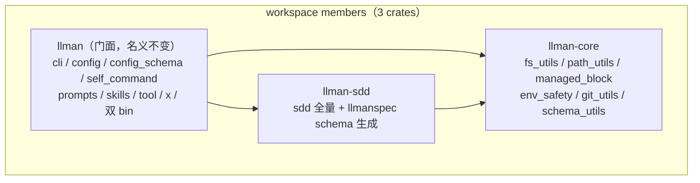

# Design — src-cleanup-pre-split

## 已决事项（用户拍板）

| # | 议题 | 决议 |
|---|------|------|
| D-A | x 双 provider 去重度 | **先叶子后定骨架**：本 change 仅抽逐字相同叶子入 `src/x/shared/`；骨架参数化 + i18n key 命名空间统一不在本 change（Non-goal），叶子落地后凭分歧清单单独评估 |
| D-B | Config 层口径 | **消歧 + 拆 config_schema，不挪窝**：五处 config 所有权不动、文件格式不变；`codex::Config → CodexConfig`；`ToolConfig`/`ToolsConfig` 消歧；config_schema 拆成 schema 定义（留位）+ 通用校验工具（下沉） |
| D-C | 阶段 3 归属 | **本 change 收尾**；附弹性降级条款：阶段 1/2 体量显著超预期时拆分可另立 change（本 design 蓝图直接复用） |
| D-D | change id | `workspace-split-build-tune` → `src-cleanup-pre-split`（features 门控取消后旧名失效） |
| D-E | features 门控 | **不做**：`cargo install llman` 即全功能；编译收益唯一来源是 crate 边界本身 |
| D-F | 测试边界（seam） | S1 既有回归网（22 集成测试 + BDD + `--help` 快照）锁行为零变化；S2 新 arch test（唯一新增测试）；S3 编译基线（本 design 记录）。无新 `.feature`（`skip_specs_landing: true`） |

## 目标分层（arch test 断言表）

顶层工具层 = `fs_utils` / `path_utils` / `managed_block` / `env_safety` + 新增
`git_utils`、`schema_utils`（零重依赖，通用管道）。

| 源 | 禁止 `use crate::` 指向 | 现状 |
|----|------------------------|------|
| `src/sdd/**` | skills, tool, x | ✅ 已成立，锁定 |
| `src/skills/**` | sdd, tool, x | ✅ 已成立，锁定 |
| `src/tool/**` | sdd, skills, x | ❌ git 归并后成立（T2） |
| `src/x/**` | sdd | ✅ 已成立（x 是集成层，允许引 skills/tool/prompts） |
| 顶层工具层 | sdd, skills, tool, x | ✅ 依定义成立 |

`cli.rs` / `config.rs` / `config_schema.rs` / `self_command` / `prompts` 属门面层，
允许引一切（config_schema → sdd 单向，解环后合法）。`test_utils` 不参与断言。

## crate 边界图（阶段 3 终态草案）

- **拆分次序强制**：先 `llman-core`（T11）再 `llman-sdd`（T12）——sdd 依赖
  fs_utils/managed_block/env_safety/schema_utils/git_utils，utils 留门面会形成
  sdd→门面 逆向依赖。`arg_utils`/`editor`/`error`/`config`/`prompts` 仅门面侧
  使用，**留门面不搬**（最小搬运）。
- **导入路径零漂移契约**：门面 `lib.rs` 以 `pub use llman_core::fs_utils;`（等）
  与 `pub use llman_sdd as sdd;` 重导出，`crate::sdd::…` / `llman::sdd::…` 全部
  继续编译，tests/ 与二进制 CLI 零改动。
- **i18n 跨 crate**：rust-i18n 按 crate 嵌入 → llman-sdd、llman-core 各自
  `i18n!("../../locales")`（相对 CARGO_MANIFEST_DIR）+ build.rs
  `rerun-if-changed=locales`；locales 共 64K，嵌入复制成本可忽略；`t!` 调用方
  代码不动。`[patch.crates-io]` 在 workspace root，对全成员生效。
- **test_utils 处置**：sdd 三个子模块的单元测试需要它；复制 81 行 `cfg(test)`
  副本进 llman-sdd（测试基建豁免 SSOT），不进生产 API；若后续痛感明显再抽
  `llman-test-support` dev-dep crate（注记，不在本 change）。

## 解环细节（T1）

现状：`config_schema.rs` 同时承载 GlobalConfig/ProjectConfig schema 定义、
`generate_schema`、通用校验（`validate_yaml_value`/`prepend_schema_header`）、
schema URL 与写盘；sdd 仅在 `sdd/project/config.rs` 两处调用它。

- `validate_yaml_value` / `prepend_schema_header` → 新 `src/schema_utils.rs`
  （后续 = llman-core 成员）；调用方 tool/config、skills/config、sdd/project 改引。
- `generate_schema::<SddConfig>()` 移入 `sdd::project::config`，导出
  llmanspec schema JSON 生成函数；config_schema 的 `ConfigSchemaKind::Llmanspec`
  分支改为调用它 → 门面→sdd 单向，环消失。
- `config_schema` 对 `sdd::shared::constants::LLMANSPEC_DIR_NAME` 的常量引用
  顺带评估上移 schema_utils/core（常量级引用留给门面→sdd 也可，apply 时按
  归属自然度定）。

## git_utils 归并（T2）

新 `src/git_utils.rs` 收编：`skills::shared::git::find_git_root`、
`sdd::change::git_native` 的 `run_git`/`current_branch`/`is_default_branch`/
`resolve_default_branch_ref`，以及 `init_repo` ×4、`git_ref_exists` ×2 的可归并
实例。**逐函数审阅**：含 sdd 专属语义（base_sha 校验等）的留 sdd，纯 git 管道
上移。调用点迁移：tool/sync_ignore、tool/agents_md、sdd/change/{archive,
finalize,lock_gate,start}。`skills/shared` 清空则整目录删除。

## 小工具去重原则（T3）

**语义相同才合并，语义不同就改名**（防错误抽象）。预判：
`is_symlink_dir` 两处完全同义 → 合并；`normalize_newlines` 比对实现后定；
`push_unique` 签名不同（带 seen 集合变体）→ 保留或抽变体；`slugify` 签名与
截断语义不同 → 改名区分（如 `slugify` vs `slugify_truncated`），apply 时定案。

## 编译基线测量方案（T10/T13）

| 口径 | 命令 | 记录 |
|------|------|------|
| 冷全量 | `cargo +nightly clean && cargo +nightly build --timings` | 墙钟 + timings.html 结论 |
| 包级重建 | `cargo +nightly clean -p llman && cargo +nightly build` | 墙钟（拆后对 `-p llman -p llman-sdd` 同口径） |
| 热增量 | `touch src/lib.rs && cargo +nightly build` | 墙钟 |
| 盘占 | `du -sh target` / `du -sh target/debug/deps` | 前后对照 |

`[profile.dev] debug = "line-tables-only"` 做 A/B（会丢变量级调试信息，取舍随
数据记录）。基线在阶段 1/2 完成后、拆分前测一次（T10），拆分后同口径复测（T13）。

## 风险与缓解

- **行为漂移**：每 task 仅机械移动/改名/合并，禁顺手改逻辑；S1 回归网 +
  `--help` 快照逐 task 跑。
- **rust-i18n 跨 crate 陷阱**：`t!` 按当前 crate 解析翻译，成员 crate 漏配
  `i18n!` 会 panic/丢文案 → T12 验收含 BDD 全量与 `--help` 快照比对。
- **git blame 断裂**：一律 `git mv`；rename 检测在 PR 描述注记。
- **slugify/normalize 语义误判**：apply 时先 diff 实现再动，歧义即保留原名不改。
- **长 change staleness**：按 task 小 commit；每阶段末跑 `sdd review`（r48 门禁）。

## expand-contract 说明

T1-T4 为「expand（新增 git_utils/schema_utils 等收编位）→ 分批迁移调用点 →
contract（删旧位）」合并的小步；T5 arch test 是 contract 的自动化收口。
T11/T12 纯目录搬运 + Cargo 重接线，零逻辑改动。

## x-shared-leaves 实测证据（T9 追记，2026-08-28）

提案期「19 个同名命令流函数」复测为 **14 个同名**（claude_code/codex 顶层
`fn` 求交；近期代码演化所致）。逐函数正文 diff：

- **逐字相同叶子：仅 `mask_secret`** → 已收编 `src/x/shared.rs`；
  codex 侧副本零调用（`pub` 曾豁免死码检查）→ 直接删除。
- **同构不同文 13 个**：`run`/`run_gen`/`run_list`/`run_rm`/`run_upsert`/
  `run_wizard`/`handle_account_command`/`handle_account_edit`/
  `handle_account_edit_with`/`handle_interactive_mode`/`handle_main_command`/
  `handle_run_command`/`no_configs_message` —— 差异为 i18n key 前缀与模板路径，
  与 D-A 决议一致，骨架参数化不做（留证即止，后续 change 或放弃）。

## sdd 六子块边界检视（T8 追记，2026-08-28）

可见性收敛后 sdd 对外暴露面（编译器验证，`pub` 全清单）：
`command::{run, SddArgs, SddCommands}`（CLI 入口及 clap 参数类型）、
`project::config::{SddConfig, llmanspec_schema, LLMANSPEC_SCHEMA_URL}`
（schema 生成 API）、`shared::constants::LLMANSPEC_DIR_NAME`、
`shared::discovery::DEFAULT_MAX_SCAN_DEPTH`（门面默认值）、
`context::tree::TreeIndex`（兼容测试契约）。其余全部 `pub(crate)`。

| 子块 | 检视结论 |
|------|---------|
| change | 生命周期命令 + git binding。git 管道已归 git_utils（T2/T7），`change_dir`/`proposal_path` 薄别名删除、直连 discovery；`no_interactive`/`skip_specs` 旗标为 flag-matrix uniformity 有意保留（`allow(dead_code)` 注记） |
| project | config/schema/config_skills/init/migrate/interop/templates/update_skills/skill_consistency。`regions`（region 展开语法）整文件无生产引用 → 删除；`update_skills::run` 无参入口死 → 仅留 `run_with_root` |
| shared | 归并落点：`json.rs`（print_json）、`types.rs`（ItemType/normalize_type，T7/T8 新增）。discovery 单源 change/spec 定位；`flat_change_dir` 被 T7 路径构建器取代 → 删 |
| spec | `parser::Spec/SpecMetadata`、`ir::DeltaSpecDoc/DeltaOpEntry`（delta 废除残留）→ 删；`Change.deltas` 序列化形状保留（JSON 契约稳定，恒空数组）。`ProposalFrontmatter` 全字段模型保留（r124 SSOT 完整性，未消费字段注记） |
| context | `check_rebuild_lock` 生产路径已死、单测钉住 r128 embed 语义 → `cfg_attr(not(test))` 保留；`TreeIndex` 因兼容测试保持 pub |
| authoring | spec 写入侧，无死码，可见性收敛零阻力 |

边界图输入（T11/T12 用）：spec 与 shared 是纯叶子；context 依赖 spec::ir
（serde 模型）；change 依赖 shared + spec；project 依赖 shared；无反向边。

