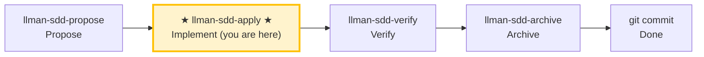

# LLMAN SDD Apply

Implement all tasks in `llmanspec/changes/<id>/tasks.md` **in one closed loop**:
Implement code → Add tests/acceptance → Run gates → Self-heal on failures → Report results when all pass.
Unless there is a clear blocker, **DO NOT stop halfway to ask "should I continue?"**

## Pipeline Position



> 📍 You are in the implement phase → after this phase: `llman-sdd-verify` (verify)

## Hard Constraints

- **SSOT-driven**: `proposal.md` / `design.md` / `tasks.md` / `specs/` are the single source of truth; every MUST/SHALL in specs must be fulfilled.
- **Scope-locked**: Only implement what's in the current change; don't fix "unrelated issues" on the side.
- **Minimal changes**: Keep changes minimal and strictly scoped to current tasks.
- **No guessing**: If requirements are unclear, or specs contradict reality, STOP and report — don't assume behavior.
- **No legacy compatibility layers**: If a change requires new behavior, upgrade all call sites directly, unless tasks/proposal explicitly require compatibility.
- **Don't ask "should I continue?"**: Execute to loop closure unless you hit an unresolvable blocker.

## Steps

### 0) Preflight (required)
- Read and obey: `llmanspec/config.yaml`, `AGENTS.md` (if present).
- `git status --porcelain`:
  - If working tree is dirty and changes don't belong to the current change: `git stash push -u -m "llman-sdd-apply autopilot backup"`.
- Run `llman sdd validate --all --strict --no-interactive`:
  - If it fails for reasons unrelated to the current change, stop and report (inconsistent artifacts prevent SSOT-driven implementation).
- **Check spec valid_scope integrity**: use `llman sdd list --specs --json` to list all specs, then for each spec verify every path in its `valid_scope` exists on disk. If any scope file/directory is missing, stop and suggest updating the spec (remove the deleted path from `valid_scope`).

### 1) Select change id and check prerequisites
- If a change id is provided, use it directly.
- Otherwise infer from context; if ambiguous, run `llman sdd list --json` and let user pick.
- Always announce: "Using change: <id>" and how to override.

- BDD-on: confirm you are on the non-default feature branch bound via `llman sdd change attach <id>` (attach with `--force` only to rebind). Specs/features on the branch are SSOT — do not invent change-scoped `feature_delta`.

- Check the stage gate:
  ```bash
  llman sdd show <id> --json --type change
  ```
  - `draft`: change not ready to implement → STOP, suggest using `llman-sdd-propose` to grow to at least `spec` stage.
  - `specified` / `designed` / `full`: proceed.
- Use `llman sdd context --task "<goal from proposal>" --paths "<scope from specs>"` to get relevant specs.
  - If context is unavailable, run `llman sdd index rebuild` and retry.

### 2) Read SSOT artifacts
You must read through:
- `llmanspec/changes/<id>/proposal.md`
- `llmanspec/changes/<id>/design.md` (if present)
- `llmanspec/changes/<id>/tasks.md`

- Live specs on the feature branch: `llmanspec/specs/**` (`spec.toon` + `*.feature`) — these are SSOT under BDD-on
- Change-scoped `llmanspec/changes/<id>/specs/**` only if leftover docs exist (ignored by BDD-on archive; prefer live specs)

- `llmanspec/changes/<id>/specs/**`


Extract hard constraints from proposal.md and design.md decisions. Convert tasks.md into a minimal executable step sequence (preserving original order).

### 3) Show status
- Progress: "N/M tasks complete"
- Next 1–3 unchecked tasks (brief overview)

### 4) Implement tasks one by one (closed-loop execution)
For each unchecked task:
1. **Implement**: strictly per task description + specs requirements, keep changes minimal.
2. **Update checkbox immediately** after completion: `- [ ]` → `- [x]`.
3. If task is unclear, you hit a blocker, or specs/design don't match reality → STOP and report the blocker, don't assume.

> 💡 Previous phase `llman-sdd-propose` (generated tasks); after this phase → `llman-sdd-verify` (verify)

### 5) Verification and self-healing loop (run after each task or batch)
Run project gate commands (adapt to the actual project):
- Relevant test suite: `just test` or `cargo test --all`
- Format/lint: `just check` or `just lint` + `just fmt`

- BDD-on (Git-native Partitioned SSOT): stay on the attached feature branch; edit live `spec.toon` (constraints) and `*.feature` (`@req`); implement steps; after `llman sdd validate --specs` passes, clean tree then `change checkpoint <id>`. Do not run solidify or create feature_delta.

- SDD validation: `llman sdd validate <id> --strict --no-interactive`

**On failure → enter self-healing loop (don't ask "should I continue?"):**
1. Parse failure cause (test failure / lint / format / validation error).
2. Apply minimum fix (don't expand scope).
3. Re-run the "minimum failure repro command" first, then re-run all gates.
4. Log as one self-healing round: `Round N: failure → fix → re-run → pass/fail`.

**Self-healing cap: 8 rounds**; exceeding this is a blocker: stop and output a blocker report (last failing command + output summary + what you tried).

### 6) Completion report
After all tasks complete + all gates green, output a structured report (see Output Contract below).
Then suggest running `llman-sdd-verify` for the verification phase.

> 💡 Implementation done → next: `llman-sdd-verify` (verify)

{{ unit("skills/sdd-commands") }}

## Context
- Confirm current change/spec status before execution.
- Prefer `llman sdd context --task --paths` to find relevant specs rather than reading all or guessing.
- This is the implementation phase: proposal/specs/tasks are ready, you just need to deliver.

## Goal
- Complete all task implementation + verification + self-healing in one closed loop, producing all-green gate results.

## Constraints
- Keep changes minimal and clearly scoped.
- Don't guess when identifiers or intent are ambiguous.
- Don't stop halfway to ask "should I continue?" — only STOP on blockers.
- Behavioral contract changes must go through full SDD (this skill only handles changes already at apply stage).

## Workflow
- Use `llman sdd` command output as the source of truth.
- Validate whenever files/specs change.
- Prefer `llman sdd context` to get relevant specs over reading all or guessing.
- When context unavailable, follow error hints (rebuild index or fall back to `list --specs --json`).
- Implement → verify → fail → self-heal → re-verify → until pass or 8 rounds exceeded.

## Decision Policy
- High-impact ambiguity must be clarified first.
- Don't force-proceed with known validation errors.
- Self-healing fixes must be minimal, not expanding scope.

## Output Contract
After all tasks complete (or on blocker), you MUST output:
- **Implementation summary**: completed tasks and key changed files.
- **Verification commands and results**: list every command you actually ran + key output/pass conclusion.
- **Self-healing rounds**: each round: `Round N: failure point → fix → re-run command → passed/failed`.
- **Validation status**: result of `llman sdd validate <id> --strict --no-interactive`.
- **Residual risks / known uncertainties**: including items that couldn't be automatically resolved.
- **Next step**: suggest running `llman-sdd-verify` for the verification phase.

## Ethics Governance
- `ethics.risk_level`: tag risk as `low|medium|high|critical`.
- `ethics.prohibited_actions`: list actions absolutely forbidden.
- `ethics.required_evidence`: list evidence required before high-impact output.
- `ethics.refusal_contract`: define when to refuse and what safe alternative response to give.
- `ethics.escalation_policy`: define when to escalate for user confirmation / human review.
