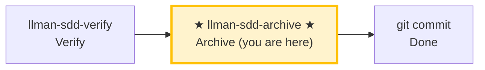

# LLMAN SDD Archive

Use this skill to archive completed changes, merge delta specs into main specs, and guide the commit.

## Pipeline Position

> 📍 You are in the archive phase: the last stop in the pipeline.
> 📎 If specs get too large, run `llman-sdd-specs-compact` to compress.

## Hard Constraints

- **Must pass verify phase all-green first**: don't archive changes that haven't passed verification.
- **SSOT validation**: every change must pass `llman sdd validate <id> --strict --no-interactive` before archiving.
- **Don't ask "should I continue?"**: execute the full batch to completion unless you hit an unresolvable error.

## Steps

### 0) Preflight
- `git status --porcelain`: confirm working tree changes belong to completed changes.
- If unexpected changes exist, handle them (stash or report).

### 1) Confirm target changes
- Determine target IDs: single or batch (from user input or `llman sdd list --json`).
- Always announce: "Archiving IDs: <id1>, <id2>, ...".
- Confirm each change has passed verify phase all-green.

### 2) Archive one by one
- Validate each first: `llman sdd validate <id> --strict --no-interactive`.
- Validation failure → STOP and report; don't skip validation and force archive.
- Optional preview: `llman sdd archive <id> --dry-run`.
- Execute archive:
  - default: `llman sdd archive run <id>`
  - tooling-only: `llman sdd archive run <id> --skip-specs`
  - **stop immediately on first failure**, report remaining unprocessed IDs.

### 3) Full validation
- After all archives complete: `llman sdd validate --all --strict --no-interactive`.
- Confirm post-archive spec artifacts are consistent.

### 4) Commit guidance
- Output suggested commit message (format: `feat(sdd): archive <id1>, <id2> - <short summary>`).
- Prompt user: `git add -A && git commit -m "..."`.
- If user requests auto-commit, execute and output commit hash.

> 💡 Previous phase `llman-sdd-verify` (passed verification) → this phase completes the loop. If specs grow too large, run `llman-sdd-specs-compact`.

{{ unit("workflow/archive-freeze-guidance") }}

{{ unit("skills/sdd-commands") }}

{{ unit("skills/validation-hints-toon") }}

{{ unit("skills/structured-protocol") }}
