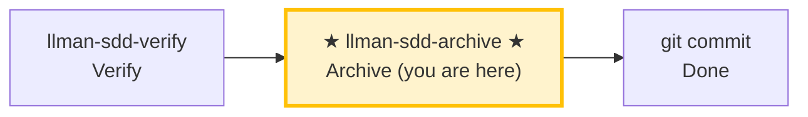

# LLMAN SDD Archive

Use this skill to archive completed changes. **BDD-off**: merge delta specs into main specs. **BDD-on**: move change docs only (specs already live on the feature branch), then merge via Git/PR.

## Pipeline Position



> 📍 You are in the archive phase: the last stop in the pipeline.
> 📎 If specs get too large, run `llman-sdd-specs-compact` to compress.

## Hard Constraints

- **Must pass verify phase all-green first**: don't archive changes that haven't passed verification.
- **SSOT validation**: every change must pass `llman sdd validate <id> --strict --no-interactive` before archiving.
- **Don't ask "should I continue?"**: execute the full batch to completion unless you hit an unresolvable error.

## Steps

### 0) Preflight
- `git status --porcelain`: confirm working tree changes belong to completed changes.
- If unexpected changes exist, handle them (stash or report).

### 1) Confirm target changes
- Determine target IDs: single or batch (from user input or `llman sdd list --json`).
- Always announce: "Archiving IDs: <id1>, <id2>, ...".
- Confirm each change has passed verify phase all-green.

### 2) Archive one by one
- Validate each first: `llman sdd validate <id> --strict --no-interactive`.
- Validation failure → STOP and report; don't skip validation and force archive.
- Optional preview: `llman sdd change archive <id> --dry-run`.
- Execute archive:
  - default: `llman sdd change archive <id>`
  - tooling-only: `llman sdd change archive <id> --skip-specs`
  - **stop immediately on first failure**, report remaining unprocessed IDs.
- **BDD-on (Git-native Partitioned SSOT)**:
  - Prerequisites: `llman sdd change attach <id>` done, still on the feature branch.
  - `change archive` / `change finalize` move **change documentation only** into `changes/archive/` — they do **not** merge TOON deltas as SSOT and never apply `feature_delta`.
  - Legacy active `*.feature.delta.toon` under the change is a migration blocker — remove/migrate before archive.
  - After archive, promote live `llmanspec/specs/**` via normal Git/PR merge of the feature branch into the default branch.
  - **Recommended: single-commit close (`change finalize`)** — same process runs gates → writes frontmatter (`checkpointed` / `checkpoint_sha = base_sha`) → docs-only archive; leaves the tree dirty once for **one `git commit`**:
    ```text
    1. Implement live specs + code (working tree may stay dirty)
    2. llman sdd change finalize <id>   # gates + frontmatter + move change docs
    3. git commit                       # one commit: impl + frontmatter + archive rename
    ```
    **`checkpoint_sha` semantics**: finalize writes attach-time `base_sha`, not the implementation HEAD (under single-commit mode that commit has not happened yet). For a strict implementation SHA, use the fallback below.
  - **Fallback: multi-commit sequence (`checkpoint` + `archive`)** — when you need a strict `checkpoint_sha`, or want a mid-flight review snapshot:
    ```text
    1. git commit   # commit live specs + code (clean tree required for checkpoint)
    2. llman sdd change checkpoint <id>   # writes checkpointed / checkpoint_sha (implementation HEAD)
    3. git commit   # commit proposal.md checkpoint metadata
    4. llman sdd change archive <id>      # moves change docs only
    5. git commit   # commit archive rename
    ```
- **BDD-off**:
  - `change archive` merges change-scoped TOON deltas into main `spec.toon` as today.
  - No attach / checkpoint / feature-branch / harness requirements.

### 3) Full validation
- After all archives complete: `llman sdd validate --all --strict --no-interactive`.
- Confirm post-archive spec artifacts are consistent.

### 4) Commit / merge guidance
- BDD-off: suggest commit message (format: `feat(sdd): archive <id1>, <id2> - <short summary>`), then `git add -A && git commit -m "..."`.
- BDD-on: after docs archive, open/merge the feature-branch PR so live specs/features land on the default branch.
- If user requests auto-commit of the archive docs commit, execute and output commit hash.
- **Archived `depends_on`**: archive renames the change dir to `archive/YYYY-MM-DD-<id>`, but validate recognizes `depends_on` pointing to archived/frozen ids as INFO (not ERROR), so you do **not** need to manually update other changes' `depends_on` frontmatter after archive.

> 💡 Previous phase `llman-sdd-verify` (passed verification) → this phase completes the loop. If specs grow too large, run `llman-sdd-specs-compact`.

{{ unit("workflow/archive-freeze-guidance") }}

{{ unit("skills/sdd-commands") }}

{{ unit("skills/validation-hints-toon") }}

{{ unit("skills/structured-protocol") }}
