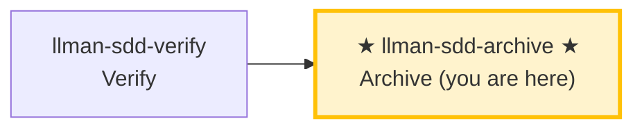

# LLMAN SDD Archive

Use this skill to archive completed changes. Prerequisites: verify all-green, and the change already has Branch binding plus Specs landing (or `skip_specs_landing`; live specs are on the bound branch). Archive/finalize **auto ff-merges** into the default branch, then **renames** change docs to `changes/archive/` (one follow-up `git commit` for the dirty rename). `git push` / hosting PR are optional.

## Pipeline Position


```mermaid
flowchart LR
    verify["llman-sdd-verify<br/>Verify"] --> archive
    archive["★ llman-sdd-archive ★<br/>Archive (you are here)"]

    style archive fill:#fff3cd,stroke:#ffc107,stroke-width:3px
```

> 📍 You are in the archive phase: the last stop in the Git-native lifecycle.
> 📎 If specs get too large, run `llman-sdd-specs-compact` to compress.

## Hard Constraints

- **Must pass verify phase all-green first**: don't archive changes that haven't passed verification.
- **Must already have Branch binding**: `change start` / `attach` done; otherwise STOP.
- **SSOT validation**: every change must pass `llman sdd validate <id> --strict --no-interactive` before archiving.
- **Don't ask "should I continue?"**: execute the full batch to completion unless you hit an unresolvable error.
- **Close-out MUST NOT default to PR/push**: after archive/finalize, default to a local ff-merge (handled by the CLI) and one `git commit` for the docs rename. `git push` / hosting PR are optional — only when the user or project explicitly requires remote review. **Agent MUST NOT** push or open a PR by default on this skill's account.

## Steps

### 0) Preflight
- `git status --porcelain`: confirm working tree changes belong to completed changes.
- If unexpected changes exist, handle them (stash or report).

### 1) Confirm target changes
- Determine target IDs: single or batch (from user input or `llman sdd list --json`).
- Always announce: "Archiving IDs: <id1>, <id2>, ...".
- Confirm each change has passed verify phase all-green.

### 2) Archive one by one
- **Human review checkpoint (before each id is archived, including batches)**: run `llman sdd review --capability <id>`. Exit code zero → continue; non-zero = CRITICAL findings: STOP, fix, re-run; MUST NOT archive with CRITICAL findings open.
- Validate each first: `llman sdd validate <id> --strict --no-interactive`.
- Validation failure → STOP and report; don't skip validation and force archive.
- Optional preview: `llman sdd change archive <id> --dry-run`.
- Execute archive:
  - default: `llman sdd change archive <id>`
  - tooling-only: `llman sdd change archive <id> --skip-specs`
  - **stop immediately on first failure**, report remaining unprocessed IDs.
- **Git-native close-out**:
  - Prerequisites: Branch binding done (`change start` / `attach`); still on the bound branch (or default branch after auto ff-merge).
  - `change archive` / `change finalize` run **auto ff-merge** (`git merge --ff-only <feature>` into default), **then** rename change docs into `changes/archive/` — rename is never rolled back on merge failure.
  - Legacy `*.feature.delta.toon` or `spec.toon` under specs is a migration blocker — run `llman sdd project migrate --kind toon2features`.
  - **Recommended: single-commit close (`change finalize`)** — same process runs gates → auto ff-merge → docs rename; leaves the tree dirty once for **one `git commit`**:
    ```text
    1. Implement live specs + code (working tree may stay dirty)
    2. llman sdd change finalize <id>   # gates + ff-merge + rename change docs
    3. git commit                       # one commit: impl + frontmatter + archive rename
    ```
    **`checkpoint_sha` semantics**: finalize writes attach-time `base_sha`, not the implementation HEAD (under single-commit mode that commit has not happened yet). For a strict implementation SHA, use the fallback below.
  - **Fallback: multi-commit sequence (`checkpoint` + `archive`)** — when you need a strict `checkpoint_sha`, or want a mid-flight review snapshot:
    ```text
    1. git commit   # commit live specs + code (clean tree required for checkpoint)
    2. llman sdd change checkpoint <id>   # writes checkpointed / checkpoint_sha (implementation HEAD)
    3. git commit   # commit proposal.md checkpoint metadata
    4. llman sdd change archive <id>      # ff-merge + rename change docs
    5. git commit   # commit archive rename
    ```

### 3) Full validation
- After all archives complete: `llman sdd validate --all --strict --no-interactive`.
- Confirm post-archive spec artifacts are consistent.

### 4) Commit guidance
- Suggest commit message (format: `feat(sdd): archive <id1>, <id2> - <short summary>`), then `git add -A && git commit -m "..."` if not already committed.
- Optional: `git branch -d <feature>` after ff-merge. push / hosting PR only when the user or project explicitly requires remote review.
- If user requests auto-commit of the archive docs commit, execute and output commit hash.
- **Archived `depends_on`**: archive renames the change dir to `archive/YYYY-MM-DD-<id>`, but validate recognizes `depends_on` pointing to archived/frozen ids as INFO (not ERROR), so you do **not** need to manually update other changes' `depends_on` frontmatter after archive.

> 💡 Previous phase `llman-sdd-verify` (passed verification) → this phase completes the loop. If specs grow too large, run `llman-sdd-specs-compact`.

{{ unit("workflow/archive-freeze-guidance") }}

{{ unit("skills/sdd-commands") }}

{{ unit("skills/validation-hints") }}

{{ unit("skills/structured-protocol") }}
