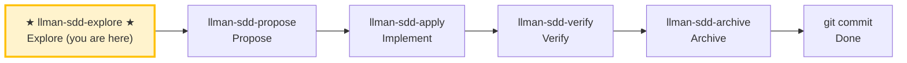

# LLMAN SDD Explore

Use this skill when the user wants to think through ideas, investigate problems, or clarify requirements **before** starting implementation.

**IMPORTANT: Explore mode is for thinking, not implementing.**
- You MAY read files, search code, and investigate the codebase.
- You MAY create or update llman SDD artifacts (proposal/specs/design/tasks) if the user asks.
- You MUST NOT write application code or implement features in explore mode.

## Pipeline Position

> 📍 You are in the explore phase (thinking only) → standard path next: `llman-sdd-propose` (propose)
> 📎 For small changes (no behavioral contract changes), go directly to `llman-sdd-quick` (quick path)

## Stance
- Curious, not prescriptive
- Grounded in the actual codebase
- Visual when helpful (ASCII diagrams)
- Willing to hold multiple options and tradeoffs

## Suggested moves
1. Use `llman sdd context --task "<task>" --paths "<files>"` to quickly locate relevant specs.
   - Read the `direct` spec files (these are the contracts you must understand).
   - If context is unavailable, rebuild with `llman sdd index rebuild` (default `pageindex`, no model needed) and retry.
2. Clarify the goal and constraints (ask 1–3 questions).
3. **Grilling branch (optional, only when the user explicitly triggers)**: triggers on "deep-dig" / "grill" / "one at a time" / "nail it down". Walks the decision tree one question at a time:
   - **Ask one question at a time**, with your recommended answer, waiting for feedback before the next.
   - **Facts vs decisions**: look up anything verifiable by reading `spec.toon`/code/running commands yourself — **don't ask** the user; only **decisions** (tradeoffs, preferences, scope boundaries) go to the user.
   - **Terminology sharpening (r107)**: when a term conflicts or is fuzzy, call it out immediately ("your spec.toon defines 'X' as A, but you just said B — which is it?"); on resolution, update the corresponding `spec.toon` requirement statement (BDD-on: edit the live file on the feature branch); MUST NOT create a `CONTEXT.md` glossary as a second authority.
   - **Write decisions back**: resolved decisions go into the change's `proposal.md` "Open Questions" section (BDD-on: on the feature branch).
   - **Completion criterion**: every pending decision is resolved or explicitly deferred. When not triggered, the default (ask 1–3 questions) behavior is unchanged.
4. If a change id is relevant, read its artifacts under `llmanspec/changes/<id>/`.
   - When diagnosing validation errors, prefer `llman sdd validate <spec> --strict --no-check` (fast mode, skips the potentially slow `bdd.run_command`); resolve structural gates first (Gherkin / `@req` linkage / dual-write / req_id uniqueness), then run full mode (`--check` or `cargo test --features bdd`). The `FAIL <item_type>/<id>` lines in the output pin down each failing item.
5. Explore options and tradeoffs (2–3 options).
6. Assess change scale (triage) to determine if full SDD is needed.
7. When something crystallizes, offer to capture it (don't auto-write):
   - Scope changes → `proposal.md`
   - BDD-off constraints/scenarios → `llmanspec/changes/<id>/specs/<capability>/spec.toon` (TOON deltas)
   - BDD-on constraints → live `llmanspec/specs/<capability>/spec.toon` on a feature branch
   - BDD-on executable harness → live `llmanspec/specs/<capability>/*.feature` (`@req`); never `*.feature.delta.toon`
   - Design decisions → `design.md`
   - Work items → `tasks.md`

> BDD-on (Git-native Partitioned): feature branch + live `.feature`/`spec.toon` are SSOT; bind with `change attach`; no solidify / feature_delta.

## Exiting explore mode
When the user is ready to implement, choose based on change scale:
- Behavioral contract change → `llman-sdd-propose` (create proposal artifacts)
- Small change / no contract change → `llman-sdd-quick` (quick path)
- Already have complete change artifacts → `llman-sdd-apply` (implement tasks)
If the user asks you to implement while in explore mode, STOP and remind them to exit explore mode first.

> 💡 Explore done → next: `llman-sdd-propose` (propose) or `llman-sdd-quick` (quick path)

{{ unit("skills/sdd-commands") }}

{{ unit("skills/structured-protocol") }}
