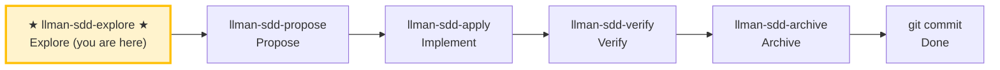

# LLMAN SDD Explore

Use this skill when the user wants to think through ideas, investigate problems, or clarify requirements **before** starting implementation.

**IMPORTANT: Explore mode is for thinking, not implementing.**
- You MAY read files, search code, and investigate the codebase.
- You MAY create or update llman SDD artifacts (proposal/specs/design/tasks) if the user asks.
- You MUST NOT write application code or implement features in explore mode.

## Pipeline Position

> 📍 You are in the explore phase (thinking only) → standard path next: `llman-sdd-propose` (propose)
> 📎 For small changes (no behavioral contract changes), go directly to `llman-sdd-quick` (quick path)

## Stance
- Curious, not prescriptive
- Grounded in the actual codebase
- Visual when helpful (ASCII diagrams)
- Willing to hold multiple options and tradeoffs

## Suggested moves
1. Use `llman sdd context --task "<task>" --paths "<files>"` to quickly locate relevant specs.
   - Read the `direct` spec files (these are the contracts you must understand).
   - If context is unavailable, rebuild with `llman sdd index rebuild` (default `pageindex`, no model needed) and retry.
2. Clarify the goal and constraints (ask 1–3 questions).
3. If a change id is relevant, read its artifacts under `llmanspec/changes/<id>/`.
4. Explore options and tradeoffs (2–3 options).
5. Assess change scale (triage) to determine if full SDD is needed.
6. When something crystallizes, offer to capture it (don't auto-write):
   - Scope changes → `proposal.md`
   - Constraints / non-executable scenarios → `llmanspec/changes/<id>/specs/<capability>/spec.toon`
   - Executable harness (BDD-on) → `.feature` or `*.feature.delta.toon` (`@req`)
   - Design decisions → `design.md`
   - Work items → `tasks.md`

> BDD-on (Partitioned): `.feature` = harness authority; `spec.toon` = constraints; do not suggest toon projection over feature.

## Exiting explore mode
When the user is ready to implement, choose based on change scale:
- Behavioral contract change → `llman-sdd-propose` (create proposal artifacts)
- Small change / no contract change → `llman-sdd-quick` (quick path)
- Already have complete change artifacts → `llman-sdd-apply` (implement tasks)
If the user asks you to implement while in explore mode, STOP and remind them to exit explore mode first.

> 💡 Explore done → next: `llman-sdd-propose` (propose) or `llman-sdd-quick` (quick path)

{{ unit("skills/sdd-commands") }}

{{ unit("skills/structured-protocol") }}
