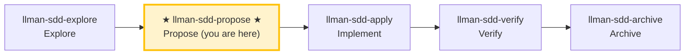

# LLMAN SDD Propose


Create a new change with planning artifacts (proposal + tasks; design optional), edit live `spec.toon` / `*.feature` on a feature branch, `change attach`, validate, and suggest next actions.

Create a new change and generate all planning artifacts in one pass (proposal + delta specs + tasks; design optional), then validate and suggest next actions.


## Pipeline Position



> 📍 You are in the propose phase → next: `llman-sdd-apply` (implement)
> 📎 For small changes (no behavioral contract changes), use `llman-sdd-quick` (quick path)

## Hard Constraints

- **Must confirm change id with user before writing files**: change boundaries must stay clear. **Exception**: when the user requests the lightweight draft path (see "Lightweight draft path" below), MUST NOT ask for an id — derive it via `change new --from` and announce it.
- **BDD-off delta specs must have at least one op + one scenario**: otherwise validation fails. (BDD-on uses live specs on the feature branch instead.)
- **Don't ask "should I continue?"**: execute the full propose phase in one pass, generate artifacts and validate.

- **If change already exists**: STOP and suggest `llman-sdd-continue` or `llman-sdd-apply`.

- **If change already exists**: STOP and suggest `llman-sdd-apply`; to fill missing artifacts, edit `llmanspec/changes/<id>/` directly (or enable `extra_skills: [llman-sdd-continue]`).


## Lightweight draft path (draft proposal only)

When the user's intent is to **quickly capture a proposal** (e.g. "draft a proposal", "draft a change", "note down X") and no change id is provided, take this lightweight path — do **not** run the full propose flow:

1. **MUST NOT ask the user for a change id.**
2. Generate a legal, meaningful change id directly from the user's description:
   - Prefer naming conventions declared in the repo's `llmanspec/AGENTS.md` (if any).
   - With no explicit convention, name by the description's semantics (CLI `--from` does kebab-case sanitizing + legality checks).
3. Call the CLI scaffolding to create the draft shell:
   ```bash
   llman sdd change new --from "<user description>"
   ```
   This creates only `proposal.md` (draft skeleton) under `llmanspec/changes/<derived id>/` — no tasks/design/specs/attach required.
4. **MUST announce the derived id to the user** (e.g. "Created draft change `<id>`; flesh it out at `llmanspec/changes/<id>/proposal.md`"). The user may rename or promote it to a formal change on request.
5. Full propose (triage + tasks + specs + attach) starts only when the user **explicitly asks to formalize**.

Boundary: if the description involves MUST/SHALL behavioral contract changes, multi-file impact, or needs triage, suggest upgrading to full propose rather than stopping at a draft.

## Steps

### 0) Preflight
- Read `llmanspec/config.yaml` for project context, rules, locale.
- `llman sdd validate --all --strict --no-interactive`: ensure current artifacts are clean.
  - If pre-existing errors, stop and report (stacking new changes on dirty artifacts causes cascading errors).
- **Check spec valid_scope integrity**: use `llman sdd list --specs --json` to list all specs, then for each spec verify every path in its `valid_scope` exists on disk. If any scope file/directory is missing, stop and suggest updating the spec (remove the deleted path from `valid_scope`).

### 1) Assess change scale (triage)
   - **Behavioral contract change** (modify MUST/SHALL, change external behavior) → full SDD workflow
   - **Implementation change** (refactor, typo, perf) → quick path via `llman-sdd-quick`
   - **Meta-spec change** (SDD templates/process) → full SDD workflow
   - When uncertain, choose full SDD (conservative).
2. Use `llman sdd context --task "<goal>" --paths "<scope>"` to find relevant specs.
   - If context unavailable, rebuild with `llman sdd index rebuild` (default `pageindex`, no model needed) and continue.
3. Gather input:
   - A short description of the change
   - A change id (or derive one; kebab-case, verb prefix: `add-`, `update-`, `remove-`, `refactor-`)
   - The impacted capability/capabilities (to name `specs/<capability>/`)
   - Confirm the final id before writing files

### 2) Ensure project is initialized:
   - `llmanspec/` must exist; if missing, tell the user to run `llman sdd init`, then STOP.

### 3) Create change directory and artifacts
   - Prefer `llman sdd change new <change-id>` for the draft `proposal.md` shell (or create `llmanspec/changes/<change-id>/` manually).

   - If the change already exists, STOP and suggest `llman-sdd-continue`.

   - If the change already exists, STOP and suggest filling missing artifacts or `llman-sdd-apply` (optionally enable continue via `extra_skills`).

   - Flesh out `proposal.md` (Why / What Changes / Capabilities / Impact)
   - `design.md` only when tradeoffs/migrations matter
   - **Confirm seams before writing tasks.md**: list the seams to be tested and confirm with the user. A seam = the public boundary driven by `*.feature` GWT steps (CLI subprocess or public interface) — MUST reuse existing harness seams, MUST NOT invent seams detached from `.feature`. BDD-off without `.feature`: seam = the CLI subcommand or public function boundary under test.
   - `tasks.md`: split into **vertical slices** (each task cuts a narrow but complete path through schema→API→UI→tests, independently verifiable), with `[blocked-by: <task-id>]` dependency markers. **Wide-refactor exception** (one mechanical change sweeping the codebase, single edit breaks many call sites): sequence as expand-contract (add new beside old → migrate call sites in batches → delete old), don't force into a vertical slice.
   - **BDD-off**: also create `specs/<capability>/spec.toon` deltas (standalone TOON, one per file):
     - Prefer authoring helpers: `llman sdd change delta skeleton` / `add-req` / `add-scenario`
     - Include at least one `add_requirement`/`modify_requirement` op (statement MUST contain MUST/SHALL) and at least one matching op scenario row
   - **BDD-on**: do **not** use `change delta` (CLI rejects it) — edit live `llmanspec/specs/**` on the feature branch (see 4b); then `llman sdd change attach <change-id>`

### 4) Validate:
   ```bash
   llman sdd validate <change-id> --strict --no-interactive
   ```
   This MUST pass before proceeding. If TOON parse errors appear, fix quoting:
   values containing commas/colons/brackets must be double-quoted in tabular rows.

### 4a) BDD mode check — before deciding scenario authoring style
- Read `llmanspec/config.yaml`. Is there a `bdd:` block?
  - **Yes (BDD-on)**: follow section 4b below for BDD-on authoring rules.
  - **No (BDD-off)**: if this change involves executable behavior scenarios (Given/When/Then the user will want to run), ask **once, up front**: "This change looks like it has executable behavior. Enable BDD-on mode so scenarios can be validated as `.feature` files? (adds a `bdd:` block to `config.yaml`.)"
    - If **yes**: show the exact `bdd:` block to add (pick a `run_command` matching the project's test framework — `cargo test --features bdd` for rstest-bdd, `pytest {feature_dir} -k {feature_name} -v` for pytest-bdd). Let the user confirm or edit it, write it to `config.yaml`, then proceed with 4b rules.
    - If **no**: proceed with BDD-off authoring (scenarios stay in TOON as documentation; the `feature` field is ignored).
- **Do NOT silently add the `bdd:` block** — always ask first. Adding it changes how `validate`/`index` behave project-wide.

### 4b) BDD-on mode — only when `config.yaml` has a `bdd:` block (Git-native)
- Work on a **non-default Git feature branch** (never propose/implement BDD-on changes on main/master).
- **Partitioned SSOT**: edit live `spec.toon` (constraints) and `*.feature` (executable GWT + `@req`); never dual-write the same scenario id. Dual-write shape reference:

  | Scenario type | `spec.toon` `scenarios[]` | `*.feature` |
  |---|---|---|
  | Executable (`@req` / harness-driven) | **MUST NOT** appear (requirements in toon, examples in .feature) | **only** place for executable GWT |
  | Non-executable (doc-only) | `feature: false` + GWT ok | n/a (do not place) |

  Key point: under Partitioned SSOT, do **not** write `feature: true` rows in toon at all; requirement statements live in toon, executable examples live in `.feature` linked back via `@req:<req_id>`.
- Change shell: `llman sdd change new <change-id>` → fill proposal/tasks → `llman sdd change attach <change-id>`.
- Do **not** run solidify / use `change delta` / create feature_delta; if an active `*.feature.delta.toon` already exists, migrate first.
- **BDD-off** (no `bdd:`): use `change delta …`; no feature branch / attach / checkpoint.

### 4c) BDD-off delta authoring (no `bdd:` block)
- Create the change shell: `llman sdd change new <change-id>`.
- Constraints and scenarios stay in change-scoped TOON via `llman sdd change delta skeleton|add-req|…`.
- Archive later: `llman sdd change archive <id>` merges those deltas into main `spec.toon`.

### 5) Summarize and suggest next step:
   - Enter implementation phase: `llman-sdd-apply`.
   - If you need to think more: `llman-sdd-explore`.

> 💡 Proposal done → next: `llman-sdd-apply` (implement)

{{ unit("skills/sdd-commands") }}
{{ unit("skills/validation-hints-toon") }}

{{ unit("skills/structured-protocol") }}
