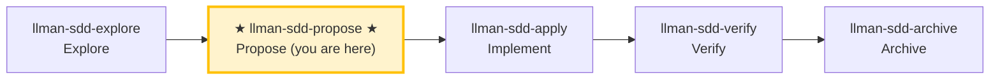

# LLMAN SDD Propose

Create a new change and generate all planning artifacts in one pass (proposal + delta specs + tasks; design optional), then validate and suggest next actions.

## Pipeline Position



> 📍 You are in the propose phase → next: `llman-sdd-apply` (implement)
> 📎 For small changes (no behavioral contract changes), use `llman-sdd-quick` (quick path)

## Hard Constraints

- **Must confirm change id with user before writing files**: change boundaries must stay clear.
- **Delta specs must have at least one op + one scenario**: otherwise validation fails.
- **Don't ask "should I continue?"**: execute the full propose phase in one pass, generate artifacts and validate.
- **If change already exists**: STOP and suggest `llman-sdd-continue` or `llman-sdd-apply`.

## Steps

### 0) Preflight
- Read `llmanspec/config.yaml` for project context, rules, locale.
- `llman sdd validate --all --strict --no-interactive`: ensure current artifacts are clean.
  - If pre-existing errors, stop and report (stacking new changes on dirty artifacts causes cascading errors).
- **Check spec valid_scope integrity**: use `llman sdd list --specs --json` to list all specs, then for each spec verify every path in its `valid_scope` exists on disk. If any scope file/directory is missing, stop and suggest updating the spec (remove the deleted path from `valid_scope`).

### 1) Assess change scale (triage)
   - **Behavioral contract change** (modify MUST/SHALL, change external behavior) → full SDD workflow
   - **Implementation change** (refactor, typo, perf) → quick path via `llman-sdd-quick`
   - **Meta-spec change** (SDD templates/process) → full SDD workflow
   - When uncertain, choose full SDD (conservative).
2. Use `llman sdd context --task "<goal>" --paths "<scope>"` to find relevant specs.
   - If context unavailable, rebuild with `llman sdd index rebuild` (default `pageindex`, no model needed) and continue.
3. Gather input:
   - A short description of the change
   - A change id (or derive one; kebab-case, verb prefix: `add-`, `update-`, `remove-`, `refactor-`)
   - The impacted capability/capabilities (to name `specs/<capability>/`)
   - Confirm the final id before writing files

### 2) Ensure project is initialized:
   - `llmanspec/` must exist; if missing, tell the user to run `llman sdd init`, then STOP.

### 3) Create change directory and artifacts
   - Create `llmanspec/changes/<change-id>/` and `llmanspec/changes/<change-id>/specs/`.
   - If the change already exists, STOP and suggest `llman-sdd-continue`.
   - `proposal.md` (Why / What Changes / Capabilities / Impact)
   - `specs/<capability>/spec.toon` for each capability (a standalone TOON document, one per file):
     - Prefer generating via authoring helpers so the TOON payload is well-formed:
       - `llman sdd delta skeleton <change-id> <capability>`
       - `llman sdd delta add-op ...`
       - `llman sdd delta add-scenario ...`
     - Include at least one `add_requirement`/`modify_requirement` op (statement MUST contain MUST/SHALL) and at least one matching op scenario row
   - `design.md` only when tradeoffs/migrations matter
   - `tasks.md` as an ordered checklist (include validation commands)

### 4) Validate:
   ```bash
   llman sdd validate <change-id> --strict --no-interactive
   ```
   This MUST pass before proceeding. If TOON parse errors appear, fix quoting:
   values containing commas/colons/brackets must be double-quoted in tabular rows.

### 4a) BDD mode check — before deciding scenario authoring style
- Read `llmanspec/config.yaml`. Is there a `bdd:` block?
  - **Yes (BDD-on)**: follow section 4b below for BDD-on authoring rules.
  - **No (BDD-off)**: if this change involves executable behavior scenarios (Given/When/Then the user will want to run), ask **once, up front**: "This change looks like it has executable behavior. Enable BDD-on mode so scenarios can be validated as `.feature` files? (adds a `bdd:` block to `config.yaml`.)"
    - If **yes**: show the exact `bdd:` block to add (pick a `run_command` matching the project's test framework — `cargo test --features bdd` for rstest-bdd, `pytest {feature_dir} -k {feature_name} -v` for pytest-bdd). Let the user confirm or edit it, write it to `config.yaml`, then proceed with 4b rules.
    - If **no**: proceed with BDD-off authoring (scenarios stay in TOON as documentation; the `feature` field is ignored).
- **Do NOT silently add the `bdd:` block** — always ask first. Adding it changes how `validate`/`index` behave project-wide.

### 4b) BDD-on mode — only when `config.yaml` has a `bdd:` block
- `spec.toon` is the single source of truth for BDD-on specs (same structure as BDD-off: `kind`/`name`/`purpose`/`valid_scope`/`requirements`/`scenarios`).
- Scenarios have a `feature` field (default `true`): `true` → eligible for `.feature` generation during `solidify`; `false` → stays in TOON as documentation only.
- Delta is always TOON only (`ops` + `op_scenarios`). Do NOT create `.feature` delta files during propose.
- After `apply` completes, run `llman sdd solidify <change-id>` to generate/update `.feature` files from the delta's executable scenarios.
- The `.feature` file is a derived artifact — never edit it by hand. The TOON `scenarios` table is the SSOT.

### 5) Summarize and suggest next step:
   - Enter implementation phase: `llman-sdd-apply`.
   - If you need to think more: `llman-sdd-explore`.

> 💡 Proposal done → next: `llman-sdd-apply` (implement)

{{ unit("skills/sdd-commands") }}
{{ unit("skills/validation-hints-toon") }}

{{ unit("skills/structured-protocol") }}
