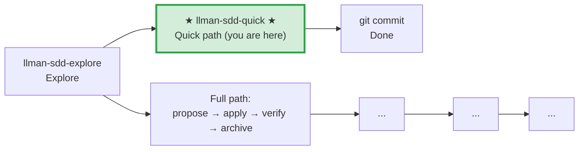

# LLMAN SDD Quick Path

Use this path for small changes that don't modify behavioral contracts.

## Pipeline Position

> 📍 Quick path: no behavioral contract changes, modify code and commit directly. If you find you need to change a contract → STOP, switch to full path `llman-sdd-propose`

## Conditions (all must hold)
- Does not change any MUST/SHALL-defined externally observable behavior
- Does not cross capability boundaries
- Does not involve migration or compatibility concerns
- Is not a meta-spec change (SDD templates/process)

## Steps
1. Use `llman sdd context --task "..." --paths "..."` to confirm no spec changes needed.
   - If context returns `quality: "unavailable"`, rebuild with `llman sdd index rebuild` (default `pageindex`, no model needed).
   - Use `llman sdd list --specs --json` for keyword-level spec metadata.
2. Modify the code directly.
3. If spec maintenance is needed (typo fix, scope tightening), edit the spec file directly and run `llman sdd validate --specs`.
4. git commit (message must explain why).
5. No change directory, no archive needed.

## Boundary handling
- If during modification you find a behavioral contract change → STOP, switch to `llman-sdd-propose` (full path).
- If multiple files are involved and scope is unclear → verify with `llman sdd context` first.

> 💡 Quick path done → git commit. If you need the full path → `llman-sdd-propose` → `llman-sdd-apply` → `llman-sdd-verify` → `llman-sdd-archive`

{{ unit("skills/sdd-commands") }}

{{ unit("skills/structured-protocol") }}
