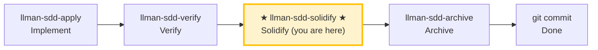

# LLMAN SDD Solidify

Use this skill to generate (regenerate) the executable `.feature` files for a change, from its delta `spec.toon` scenarios. BDD-on projects only.

## Pipeline Position

> 📍 You are in the solidify phase: after verify passes, before archive.
> BDD-off projects: this is a no-op (nothing to generate).

## Mental Model

- `spec.toon` is the SSOT. `.feature` files are the **executable subset** of its scenarios, serialized as Gherkin.
- Each scenario has a `feature` field (default `true`):
  - `feature: true` (or omitted) → solidify writes it into `.feature`.
  - `feature: false` → stays in `spec.toon` as documentation only.
- A scenario whose `when` invokes `llman sdd validate|archive|solidify` is **self-referencing** and is skipped (would recurse the BDD runner).
- **Framework-agnostic**: solidify does NOT scan `tests/bdd_steps.rs` or any BDD framework's step bindings. Whether a scenario is *executable* at runtime is decided by `bdd.run_command`, not by solidify.

## Hard Constraints

- **BDD-on only**: if `config.yaml` has no `bdd:` block, solidify is a no-op. Stop and report.
- **Don't edit `.feature` by hand**: they are generated artifacts. Edit `spec.toon` scenarios, then re-run solidify.
- **Don't ask "should I continue?"**: run to completion unless you hit an unresolvable error.

## Steps

### 1) Confirm target change
- Determine the change id (from user input or context).
- Always announce: "Solidifying change: <id>".

### 2) (Optional) Dry-run preview
- `llman sdd solidify <id> --dry-run` to preview which scenarios write vs skip.
- Review the skip reasons: `feature=false` and self-referencing scenarios are expected.

### 3) Execute solidify
- `llman sdd solidify <id>`
- This writes one `.feature` per capability under `llmanspec/specs/<capability>/<capability>.feature`.

### 4) Report
- Summarize: per capability, how many scenarios written vs skipped, and the output path.
- Skipped scenarios list their reason.

## When to use which command

| Situation | Command |
|-----------|---------|
| Generate `.feature` for one change | `llman sdd solidify <id>` |
| Preview without writing | `llman sdd solidify <id> --dry-run` |
| Upgrade legacy BDD-on specs (minimal spec.toon + .feature) to full structure | `llman sdd project solidify-migrate [--dry-run]` |

> 💡 Previous phase `llman-sdd-verify` (passed) → this phase generates `.feature` → next phase `llman-sdd-archive` (archive).

{{ unit("skills/sdd-commands") }}

{{ unit("skills/validation-hints-toon") }}

{{ unit("skills/structured-protocol") }}
