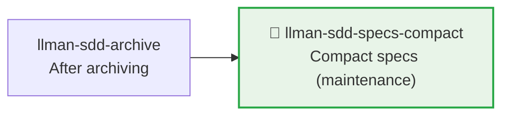

# LLMAN SDD Specs Compact

Use this skill to compact specs without changing normative behavior.

## Pipeline Position

> 📎 Maintenance tool, typically run after accumulating many archives. For daily development → `llman-sdd-propose` / `llman-sdd-apply`.

## Context
- Specs grow bloated with duplicate requirements/scenarios as changes accumulate.
- Compaction must remain verifiable and regressible.
- When archive history is too large, it interferes with compaction review and navigation.

## Goal
- Identify and merge redundant requirements/scenarios.
- Form a more compact and maintainable spec structure.

## Constraints
- Don't delete normative behavior without explicit replacement.
- Try to keep requirement titles stable.
- Each retained requirement must have at least one valid scenario.

## Workflow
1. Inventory current specs (`llman sdd list --specs`).
2. If archived history is large, run archive freeze first:
   - Preview: `llman sdd archive freeze --dry-run`
   - Execute: `llman sdd archive freeze --before <YYYY-MM-DD> --keep-recent <N>`
3. Identify overlapping items across capabilities.
4. Produce a compaction plan (canonical requirements + keep/merge/remove decisions + migration notes).
5. Execute and validate (`llman sdd validate --specs --strict --no-interactive`).

## Decision Policy
- Prefer merging when two requirements are semantically equivalent.
- Only extract shared spec text when reference relationships are clear.
- When archive directory is noisy, suggest freezing first before compacting.
- If compaction would change external behavior, pause and ask the user first.

## Output Contract
- Output compaction plan grouped by capability.
- Include: keep/merge/remove decisions with rationale.
- Include validation commands and expected results.

> 💡 After maintenance, new work goes through the normal pipeline: `llman-sdd-propose` → `llman-sdd-apply` → `llman-sdd-verify` → `llman-sdd-archive`.

{{ unit("skills/sdd-commands") }}

{{ unit("skills/validation-hints-toon") }}

{{ unit("skills/structured-protocol") }}
