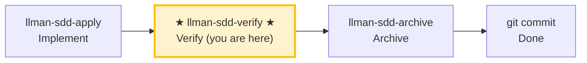

# LLMAN SDD Verify

Use this skill to verify that the implementation matches the change's artifacts.

## Pipeline Position



> 📍 You are in the verify phase → if pass: next `llman-sdd-archive` (archive); if fail: go back to `llman-sdd-apply` (fix)

## Hard Constraints

- **Must pass apply phase all-green first**: don't skip to verify on changes that haven't been implemented.
- **CRITICAL issues must be fixed**: CRITICAL problems must be resolved before archive.
- **Don't ask "should I continue?"**: run the full verification flow, output a complete report.

## Steps
1. Select the change id (or ask the user to pick from `llman sdd list --json`).
2. Check the stage gate (authoritative):
   ```bash
   stage=$(llman sdd show <id> --json --type change | jq -r .stage)
   ```
   (If `jq` is unavailable, parse the `stage` value from the JSON with any tool.)
   - If `stage` is not `full`, the change has nothing implemented to verify → STOP with a guard:
     - `draft`: "Change <id> is a draft proposal (proposal.md only); nothing to verify yet. Generate full artifacts with llman-sdd-propose, then implement with llman-sdd-apply <id>." Under BDD-on, `draft` with proposal+design+tasks present means the change is **not attached** — the fix is `llman sdd change attach <id>` (not adding `changes/<id>/specs/`).
     - other non-full (`specified`/`designed`): "Change <id> is in <stage> stage, not ready to verify. Implement first with llman-sdd-apply."
3. Run a fast validation gate:
   - `llman sdd validate <id> --strict --no-interactive`
   - **When diagnosing structural issues (Gherkin parse / `@req` linkage / dual-write / global req_id uniqueness), prefer adding `--no-check`** (skips the potentially slow `bdd.run_command` under BDD-on); run the full `--check` (full mode) only after structural gates are green. Each `FAIL <item_type>/<id>` line lists a failing item (above the Totals line).
4. Read:
   - Delta specs under `llmanspec/changes/<id>/specs/`
   - `proposal.md` and `design.md` if present
   - `tasks.md` to understand what was implemented
5. Compare artifacts vs code:
   - Identify mismatches (missing behavior, wrong behavior, missing tests/docs)
   - Suggest minimal fixes or artifact updates
6. **BDD-on verification (Git-native Partitioned SSOT)** — only when `config.yaml` has a `bdd:` block:
   - Confirm the change is attached and you are on that feature branch.
   - `llman sdd validate --specs`: Gherkin + `@req`/dual-write gates; runs `bdd.run_command` by default (`--no-check` to skip).
   - Optional read-only review: `llman sdd change diff <id>` (or `--export-patch <path>`). Diff is review/export only — never treat it as an apply step.
   - Before archive: clean tree, then `llman sdd change checkpoint <id>`.
   - Check: executable GWT only in live `.feature`; `morphology.dualWriteCount` should be 0; if an active `*.feature.delta.toon` already exists, migrate first (do not invent a solidify / repair hunt).

   - Extra requirement: {{ bdd_verify_prompt }}

7. Produce a short report:
   - **CRITICAL** (must fix before archive)
   - **WARNING** (should fix)
   - **SUGGESTION** (nice to have)
8. If CRITICAL exists, suggest `llman-sdd-apply` for fixes. If clean (BDD-on: also checkpointed), suggest archive: `llman sdd change archive <id>`.

> 💡 Verify pass → next: `llman-sdd-archive` (archive); CRITICAL issues → go back to `llman-sdd-apply` (fix)

{{ unit("skills/sdd-commands") }}

{{ unit("skills/structured-protocol") }}
