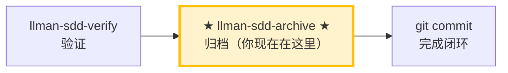

# LLMAN SDD 归档

使用此 skill 归档已完成的变更，合并 delta specs 到主 specs，并引导 commit。

## Pipeline 位置

> 📍 你现在在归档阶段：pipeline 最后一站。
> 📎 若 specs 逐渐膨胀，可运行 `llman-sdd-specs-compact` 压缩。

## 硬约束

- **必须先通过 verify 阶段全绿**：未通过验证的 change 禁止归档。
- **SSOT 校验**：每个 change 归档前必须通过 `llman sdd validate <id> --strict --no-interactive`。
- **不要问「要不要继续」**：批量归档时间线上一路执行到底，除非遇到无法自动解决的错误。

## 步骤

### 0) Preflight
- `git status --porcelain`：确认工作区改动属于已完成的 change。
- 若有未预期改动，先处理（stash 或报告）。

### 1) 确认目标变更
- 确定目标 ID：单个或批量（来自用户输入或 `llman sdd list --json`）。
- 始终说明："归档 IDs：<id1>, <id2>, ..."。
- 确认每个 change 都已通过 verify 阶段的全绿验证。

### 2) 逐个归档
- 先逐个校验：`llman sdd validate <id> --strict --no-interactive`。
- 校验失败 → STOP 并报告；不要跳过校验强行归档。
- 可选预览：`llman sdd archive <id> --dry-run`。
- 执行归档：
  - 默认：`llman sdd archive run <id>`
  - 仅工具类变更：`llman sdd archive run <id> --skip-specs`
  - **任一失败立即停止**，报告剩余未处理 ID。
- **BDD-on（Partitioned SSOT）**：
  - `archive run` 合并 delta `spec.toon` → 主 `spec.toon`（约束 / 不可执行 scenarios）。
  - 若 change 含 `*.feature.delta.toon`，archive **同时**按 scenario id apply 到主 `.feature`。
  - 归档前运行 `llman sdd solidify <id>` 做一致性门禁（非投影生成）。
  - 禁止整文件覆盖复制 `.feature` 作为默认归档路径。

### 3) 全量校验
- 全部归档完成后执行：`llman sdd validate --all --strict --no-interactive`。
- 确认归档后的 specs 工件一致。

### 4) Commit 引导
- 输出建议的 commit message（格式：`feat(sdd): archive <id1>, <id2> - <简短总结>`）。
- 提示用户：`git add -A && git commit -m "..."`。
- 若用户要求自动 commit，执行后输出 commit hash。

> 💡 上一阶段 `llman-sdd-verify`（验证通过）→ 本阶段归档后闭环结束。若 specs 逐渐膨胀，可运行 `llman-sdd-specs-compact` 压缩。

{{ unit("workflow/archive-freeze-guidance") }}

{{ unit("skills/sdd-commands") }}

{{ unit("skills/validation-hints-toon") }}

{{ unit("skills/structured-protocol") }}
