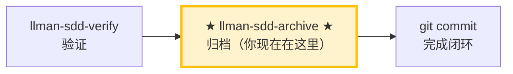

# LLMAN SDD 归档

使用此 skill 归档已完成的变更。**BDD-off**：合并 delta specs 到主 specs。**BDD-on**：仅移动 change 文档（specs 已在 feature 分支上 live），再经 Git/PR merge 提升。

## Pipeline 位置



> 📍 你现在在归档阶段：pipeline 最后一站。
> 📎 若 specs 逐渐膨胀，可运行 `llman-sdd-specs-compact` 压缩。

## 硬约束

- **必须先通过 verify 阶段全绿**：未通过验证的 change 禁止归档。
- **SSOT 校验**：每个 change 归档前必须通过 `llman sdd validate <id> --strict --no-interactive`。
- **不要问「要不要继续」**：批量归档时间线上一路执行到底，除非遇到无法自动解决的错误。

## 步骤

### 0) Preflight
- `git status --porcelain`：确认工作区改动属于已完成的 change。
- 若有未预期改动，先处理（stash 或报告）。

### 1) 确认目标变更
- 确定目标 ID：单个或批量（来自用户输入或 `llman sdd list --json`）。
- 始终说明："归档 IDs：<id1>, <id2>, ..."。
- 确认每个 change 都已通过 verify 阶段的全绿验证。

### 2) 逐个归档
- 先逐个校验：`llman sdd validate <id> --strict --no-interactive`。
- 校验失败 → STOP 并报告；不要跳过校验强行归档。
- 可选预览：`llman sdd change archive <id> --dry-run`。
- 执行归档：
  - 默认：`llman sdd change archive <id>`
  - 仅工具类变更：`llman sdd change archive <id> --skip-specs`
  - **任一失败立即停止**，报告剩余未处理 ID。
- **BDD-on（Git-native Partitioned SSOT）**：
  - 前置：已 `llman sdd change attach <id>`，仍在 feature 分支上。
  - `change archive` / `change finalize` **只移动 change 文档**到 `changes/archive/`——**不会**把 TOON delta 当 SSOT 合并，也永不 apply `feature_delta`。
  - change 下遗留活跃 `*.feature.delta.toon` 是迁移阻断项——归档前须移除/迁移。
  - 归档后，通过正常 Git/PR 将 feature 分支合并进默认分支，以提升 live `llmanspec/specs/**`。
  - **推荐：单 commit 收尾（`change finalize`）**——同进程跑门禁 → 写 frontmatter（`checkpointed` / `checkpoint_sha = base_sha`）→ docs-only archive，结束后工作区脏一次，**一次 `git commit`** 收尾：
    ```text
    1. 实现 live specs + 代码（工作区可保持脏）
    2. llman sdd change finalize <id>   # 门禁 + 写 frontmatter + 移动 change 文档
    3. git commit                       # 一次提交：实现 + frontmatter + archive 改名
    ```
    **`checkpoint_sha` 语义**：finalize 写入的是 attach 时的 `base_sha`，不是实现 commit 的 HEAD（单 commit 模式下实现 commit 尚未发生）。如需精确指向实现 commit，走下方 fallback。
  - **Fallback：多 commit 时序（`checkpoint` + `archive`）**——需要严格 `checkpoint_sha`、或想中途 review 实现快照时使用：
    ```text
    1. git commit   # 提交 live specs + 代码（让工作区干净，checkpoint 才能跑）
    2. llman sdd change checkpoint <id>   # 写入 checkpointed / checkpoint_sha（指向实现 commit HEAD）
    3. git commit   # 提交 proposal.md 的 checkpoint 元数据
    4. llman sdd change archive <id>      # 仅移动 change 文档到 archive/
    5. git commit   # 提交 archive 改名
    ```
- **BDD-off**：
  - `change archive` 按今日流程将 change 内 TOON delta 合并进主 `spec.toon`。
  - 不要求 attach / checkpoint / feature 分支 / harness。

### 3) 全量校验
- 全部归档完成后执行：`llman sdd validate --all --strict --no-interactive`。
- 确认归档后的 specs 工件一致。

### 4) Commit / merge 引导
- BDD-off：输出建议 commit message（格式：`feat(sdd): archive <id1>, <id2> - <简短总结>`），然后 `git add -A && git commit -m "..."`。
- BDD-on：文档归档后，打开/合并 feature 分支 PR，使 live specs/features 进入默认分支。
- 若用户要求自动 commit 归档文档提交，执行后输出 commit hash。
- **archived `depends_on`**：archive 会把 change 目录改名为 `archive/YYYY-MM-DD-<id>`，但 validate 会把指向 archived/frozen id 的 `depends_on` 识别为 INFO（非 ERROR），所以**归档后无需**手动更新其它 change 的 `depends_on` frontmatter。

> 💡 上一阶段 `llman-sdd-verify`（验证通过）→ 本阶段归档后闭环结束。若 specs 逐渐膨胀，可运行 `llman-sdd-specs-compact` 压缩。

{{ unit("workflow/archive-freeze-guidance") }}

{{ unit("skills/sdd-commands") }}

{{ unit("skills/validation-hints-toon") }}

{{ unit("skills/structured-protocol") }}
