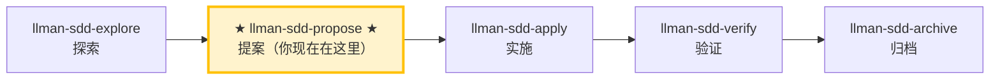

# LLMAN SDD 提案（Propose）


创建一个新变更并生成规划工件（proposal + tasks；design 可选），在 feature 分支上编辑 live `spec.toon` / `*.feature`，然后 `change attach`、校验并建议下一步。

创建一个新变更，并一次性生成所有规划工件（proposal + delta specs + tasks；design 可选），然后执行校验并建议下一步动作。


## Pipeline 位置



> 📍 你现在在提案阶段 → 下一步 `llman-sdd-apply`（实施）
> 📎 如果只是小改动（不改行为合约），可直接 `llman-sdd-quick`（快速路径）

## 硬约束

- **必须与用户确认 change id 后再写文件**：不同变更的边界不能模糊。**例外**：用户请求轻量 draft 路径（见下方「轻量 draft 路径」）时，MUST NOT 询问 id——由 `change new --from` 推导并告知用户。
- **BDD-off 的 delta specs 至少含一个 op + 一个 scenario**：否则验证不通过。（BDD-on 以 feature 分支上的 live specs 为 SSOT。）
- **不要问「要不要继续」**：在 propose 阶段内一路执行到底，生成工件并校验。

- **若变更已存在**：STOP 并建议用户使用 `llman-sdd-apply` 或 `llman-sdd-continue`。

- **若变更已存在**：STOP 并建议用户使用 `llman-sdd-apply`；若需补齐缺失 artifact，直接编辑 `llmanspec/changes/<id>/`（或启用 `extra_skills: [llman-sdd-continue]` 后使用 continue）。


## 轻量 draft 路径（仅 draft proposal）

当用户意图是**快速记一个提案**（如「draft 提案」「draft change」「记一个提案」「先把 X 记下来」）且未提供 change id 时，走此轻量路径，**不要**走完整 propose：

1. **MUST NOT 询问用户 change id**。
2. 从用户描述内容直接生成一个合法且有意义的 change id：
   - 优先遵循该仓库 `llmanspec/AGENTS.md` 声明的命名约定（若有）。
   - 若无显式约定，按描述语义合理命名（CLI `--from` 会做 kebab-case 清洗 + 合法性校验）。
3. 直接调用 CLI 脚手架建 draft shell：
   ```bash
   llman sdd change new --from "<用户描述>"
   ```
   该命令仅在 `llmanspec/changes/<生成的 id>/` 下创建 `proposal.md`（draft skeleton），**不**强制 tasks/design/specs/attach。
4. **MUST 告知用户已生成的 id**（例如「已创建草案 change `<id>`，可在 `llmanspec/changes/<id>/proposal.md` 完善」）。用户可应要求修改 id 或补全为正式 change。
5. 完整 propose（triage + tasks + specs + attach）仅在用户**明确要求正式化**时启动。

适用边界：若用户描述涉及 MUST/SHALL 行为合约变更、多文件改动、或需要 triage，应建议升级到完整 propose 而非停在 draft。

## 步骤

### 0) Preflight
- 读取 `llmanspec/config.yaml` 了解项目上下文、规则、locale。
- `llman sdd validate --all --strict --no-interactive`：确保当前工件状态干净。
  - 若预存错误，先停下报告（在脏工件上叠加新变更会导致级联错误）。
- **检查 spec valid_scope 完整性**：使用 `llman sdd list --specs --json` 列出所有 spec，然后对每个 spec 验证其 `valid_scope` 中的每个路径是否存在于磁盘上。若存在缺失的文件/目录，停下并建议更新 spec（从 `valid_scope` 中移除已删除的路径）。

### 1) 判断变更规模（triage）
   - **行为合约变更**（改 MUST/SHALL、改外部行为）→ 走完整 SDD 流程
   - **实现变更**（重构、typo、性能）→ 建议走快速路径，用 `llman-sdd-quick`
   - **元规范变更**（改 SDD 模板/流程）→ 必须走完整 SDD 流程
   - 不确定时走完整 SDD 流程（保守选择）
2. 使用 `llman sdd context --task "<目标>" --paths "<范围>"` 获取相关 specs。
   - 如果 context 不可用，运行 `llman sdd index rebuild`（默认 `pageindex`，无需模型）后继续。
3. 收集输入：
   - 变更的简要描述
   - change id（若未给出则推导；kebab-case，动词前缀：`add-`、`update-`、`remove-`、`refactor-`）
   - 受影响的 capability/capabilities（用于命名 `specs/<capability>/`）
   - 在写入任何文件前确认最终 id

### 2) 确保项目已初始化：
   - 必须存在 `llmanspec/`；若不存在，提示先运行 `llman sdd init`，然后 STOP。

### 3) 创建变更目录与工件
   - 建议先用 `llman sdd change new <change-id>` 生成草稿 `proposal.md`（或手动创建 `llmanspec/changes/<change-id>/`）。

   - 若变更已存在，STOP 并建议使用 `llman-sdd-continue`。

   - 若变更已存在，STOP 并建议补齐缺失 artifact 或改用 `llman-sdd-apply`（可选启用 `extra_skills` 中的 continue）。

   - 充实 `proposal.md`（Why / What Changes / Capabilities / Impact）
   - 仅在涉及权衡/迁移时创建 `design.md`
   - **测试边界前置确认（在写 tasks.md 之前）**：列出将测试的边界（seam）并与用户确认。seam = `*.feature` 的 GWT 步骤所驱动的公共边界（CLI 子进程或 public interface）——MUST 复用已有 harness 的边界，MUST NOT 另行发明脱离 `.feature` 的边界。BDD-off 无 `.feature` 时，seam 取被测的 CLI 子命令或 public 函数边界。
   - `tasks.md`：按**垂直切片**拆分（每个 task 一刀切穿 schema→API→UI→tests 的完整窄路径，且可独立验证），支持 `[blocked-by: <task-id>]` 依赖标记。**大范围机械重构例外**（一个机械改动横扫全库、单次编辑破坏大量调用点）：按「新旧并存再切换」顺序排列（先并存 → 分批迁移 → 删旧），不强行塞进垂直切片。
   - **BDD-off**：同时创建 `specs/<capability>/spec.toon` delta（独立 TOON，每文件一份）：
     - 建议优先通过 authoring helpers：`llman sdd change delta skeleton` / `add-req` / `add-scenario`
     - 至少包含一个 `add_requirement`/`modify_requirement` op（statement 必须含 MUST/SHALL），以及至少一行匹配的 op scenario
   - **BDD-on**：不要使用 `change delta`（CLI 会拒绝）——在 feature 分支上编辑 live `llmanspec/specs/**`（见 4b）；然后 `llman sdd change attach <change-id>`

### 4) 校验：
   ```bash
   llman sdd validate <change-id> --strict --no-interactive
   ```
   此步骤必须通过后才能继续。若出现 TOON 解析错误，需修复引号：表格化行中包含逗号/冒号/方括号的值必须用双引号包裹。

### 4a) BDD 模式检查——在决定 scenario 写法之前
- 读取 `llmanspec/config.yaml`。是否含 `bdd:` 段？
  - **是（BDD-on）**：按下方 4b 的 BDD-on 写作规则进行。
  - **否（BDD-off）**：如果本次变更涉及可执行的行为场景（用户会想实际运行的 Given/When/Then），**一次性 upfront 询问**：「本次变更似乎包含可执行行为。是否启用 BDD-on 模式，让场景能作为 `.feature` 文件被校验？（会在 `config.yaml` 添加 `bdd:` 段）」
    - **是**：展示要添加的确切 `bdd:` 段（`run_command` 按项目测试框架选——rstest-bdd 用 `cargo test --features bdd`，pytest-bdd 用 `pytest {feature_dir} -k {feature_name} -v`）。让用户确认或编辑后写入 `config.yaml`，再按 4b 规则继续。
    - **否**：按 BDD-off 写作继续（场景留在 TOON 内仅作文档；`feature` 字段被忽略）。
- **禁止静默添加 `bdd:` 段**——必须先询问。添加它会改变 `validate`/`index` 在整个项目的行为。

### 4b) BDD-on 模式——仅当 `config.yaml` 含 `bdd:` 段时（Git-native）
- 在**非默认 Git feature 分支**上工作（禁止在 main/master 上 propose/实现 BDD-on 变更）。
- **Partitioned SSOT**：编辑 live `spec.toon`（约束）与 `*.feature`（可执行 GWT + `@req`）；禁止同一 scenario id 双写。双写形状对照：

  | 场景类型 | `spec.toon` `scenarios[]` | `*.feature` |
  |---|---|---|
  | 可执行场景（有 `@req` / 走 harness） | **MUST NOT** 出现（requirements 放 toon，例子放 .feature） | **唯一**存放可执行 GWT 的地方 |
  | 不可执行场景（纯文档） | `feature: false` + GWT 可填 | n/a（不要放） |

  要点：Partitioned SSOT 下 toon 里 **不要** 写 `feature: true` 的行；requirement 语句放 toon，可执行例子放 `.feature` 并用 `@req:<req_id>` 挂回。
- Change 壳：`llman sdd change new <change-id>` → 充实 proposal/tasks → `llman sdd change attach <change-id>`。
- **不要**跑 solidify / 写 `change delta` / 新建 feature_delta；若仓库里已有活跃 `*.feature.delta.toon`，先迁移再继续。
- **BDD-off**（无 `bdd:`）：用 `change delta …`；不要求 feature 分支 / attach / checkpoint。

### 4c) BDD-off delta 写作（无 `bdd:` 段）
- 创建变更壳：`llman sdd change new <change-id>`。
- 约束与场景通过 `llman sdd change delta skeleton|add-req|…` 写在 change 内 TOON。
- 后续用 `llman sdd change archive <id>` 将 delta 合并进主 `spec.toon`。

### 5) 总结已创建内容，并建议下一步：
   - 进入实现阶段：`llman-sdd-apply`。
   - 若需要先理清思路：`llman-sdd-explore`。

> 💡 提案完成 → 下一步 `llman-sdd-apply` 进入实施阶段。

{{ unit("skills/sdd-commands") }}
{{ unit("skills/validation-hints-toon") }}

{{ unit("skills/structured-protocol") }}
