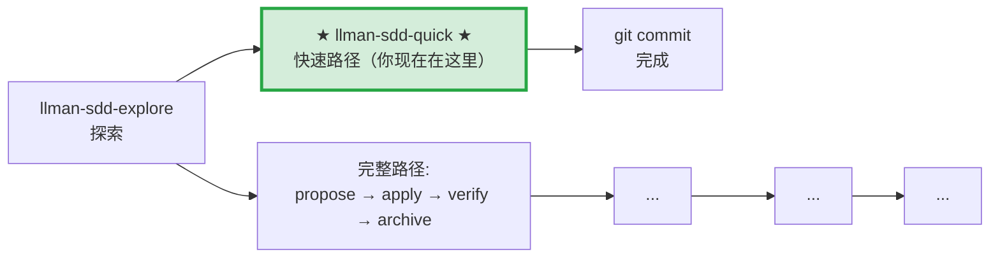

# LLMAN SDD Quick Path

对于不涉及行为合约变更的小改动使用此路径。

## Pipeline 位置

> 📍 快速路径：不改行为合约，直接改代码 commit。如果发现需要改合约 → STOP，改走完整路径 `llman-sdd-propose`

## 使用条件（所有条件必须满足）
- 不改变任何 spec 中 MUST/SHALL 定义的外部可观测行为
- 不涉及跨 capability 的修改
- 不涉及迁移/兼容性
- 不是 SDD 元规范变更

## 步骤
1. 用 `llman sdd context --task "..." --paths "..."` 确认无相关 spec 变更需要。
   - 如果 context 返回 `quality: "unavailable"`，运行 `llman sdd index rebuild`（默认 `pageindex`，无需模型）。
   - 可以用 `llman sdd list --specs --json` 查看 specs 元数据。
2. 直接修改代码。
3. 如果涉及 spec 的维护性调整（修错字、收紧 scope），直接编辑 spec 文件并用 `llman sdd validate --specs` 校验。
4. git commit（message 写明 why）。
5. 无需 change 目录，无需 archive。

## 边界处理
- 如果在修改中发现需要改变行为合约 → STOP，改走 `llman-sdd-propose`（完整路径）。
- 如果涉及到多个文件且不确定 scope → 先用 `llman sdd context` 确认。

> 💡 快速路径完成 → git commit 即可。若需要走完整路径 → `llman-sdd-propose` → `llman-sdd-apply` → `llman-sdd-verify` → `llman-sdd-archive`

{{ unit("skills/sdd-commands") }}

{{ unit("skills/structured-protocol") }}
