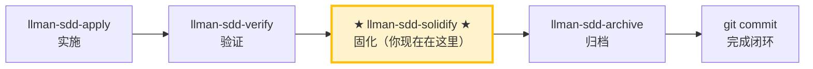

# LLMAN SDD Solidify

使用此 skill 为某个 change 生成（重新生成）可执行的 `.feature` 文件，来源是其 delta `spec.toon` 中的 scenarios。仅 BDD-on 项目。

## Pipeline 位置

> 📍 你现在在 solidify 阶段：verify 通过之后、archive 之前。
> BDD-off 项目：此命令为 no-op（无内容可生成）。

## 心智模型

- `spec.toon` 是 SSOT。`.feature` 文件是其 scenarios 的**可执行子集**，序列化为 Gherkin。
- 每个 scenario 有一个 `feature` 字段（默认 `true`）：
  - `feature: true`（或省略）→ solidify 写入 `.feature`。
  - `feature: false` → 留在 `spec.toon` 作文档，不写入 `.feature`。
- 当 scenario 的 `when` 调用 `llman sdd validate|archive|solidify` 时为**自指递归**，会被跳过（否则 BDD runner 会递归 spawn）。
- **框架无关**：solidify 不扫描 `tests/bdd_steps.rs` 或任何 BDD 框架的 step 绑定。scenario 是否在运行时「可执行」由 `bdd.run_command` 判定，而非 solidify。

## 硬约束

- **仅 BDD-on**：若 `config.yaml` 无 `bdd:` 段，solidify 直接 no-op。停下并报告。
- **禁止手工编辑 `.feature`**：它们是生成产物。改 `spec.toon` 的 scenarios，再重新运行 solidify。
- **不要问「要不要继续」**：一路执行到底，除非遇到无法自动解决的错误。

## 步骤

### 1) 确认目标 change
- 确定 change id（来自用户输入或上下文）。
- 始终说明："固化的变更：<id>"。

### 2)（可选）Dry-run 预览
- `llman sdd solidify <id> --dry-run` 预览哪些 scenario 写入、哪些跳过。
- 检查跳过原因：`feature=false` 与自指 scenario 的跳过是预期的。

### 3) 执行 solidify
- `llman sdd solidify <id>`
- 会为每个 capability 在 `llmanspec/specs/<capability>/<capability>.feature` 写入一个文件。

### 4) 报告
- 汇总：每个 capability 写入/跳过的 scenario 数量，及输出路径。
- 跳过的 scenario 列出原因。

## 命令选择

| 场景 | 命令 |
|------|------|
| 为单个 change 生成 `.feature` | `llman sdd solidify <id>` |
| 预览不写入 | `llman sdd solidify <id> --dry-run` |
| 升级遗留 BDD-on spec（最小 spec.toon + .feature）到完整结构 | `llman sdd project solidify-migrate [--dry-run]` |

> 💡 上一阶段 `llman-sdd-verify`（已通过）→ 本阶段生成 `.feature` → 下一步 `llman-sdd-archive`（归档）。

{{ unit("skills/sdd-commands") }}

{{ unit("skills/validation-hints-toon") }}

{{ unit("skills/structured-protocol") }}
