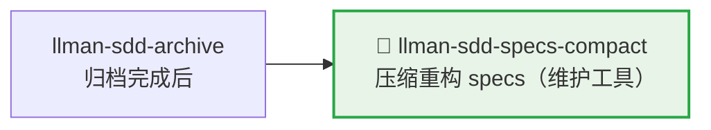

# LLMAN SDD Specs Compact

使用此 skill 在不改变规范行为的前提下压缩 specs。

## Pipeline 位置

> 📎 维护工具，通常在归档积累较多后执行。日常开发 → `llman-sdd-propose` / `llman-sdd-apply`。

## Context
- specs 会随着变更积累而膨胀，并出现重复 requirement/scenario。
- 压缩必须保持可验证、可回归。
- 当 archive 历史过大时，会干扰压缩评审与定位。

## Goal
- 识别并合并冗余 requirement/scenario。
- 形成更紧凑且可维护的规范结构。

## Constraints
- 未经明确替代，不得删除规范性行为。
- 尽量保持 requirement 标题稳定。
- 每个保留 requirement 至少保留一个有效 scenario。

## Workflow
1. 盘点当前 specs（`llman sdd list --specs`）。
2. 如果已归档历史较大，先执行 archive freeze：
   - 预览：`llman sdd archive freeze --dry-run`
   - 执行：`llman sdd archive freeze --before <YYYY-MM-DD> --keep-recent <N>`
3. 识别跨 capability 的重叠项。
4. 产出压缩计划（canonical requirements + keep/merge/remove 决策 + 迁移说明）。
5. 执行并验证（`llman sdd validate --specs --strict --no-interactive`）。

## Decision Policy
- 两条 requirement 语义等价时优先合并。
- 仅在引用关系清晰时提取共享规范文本。
- archive 目录噪声较大时，优先建议先 freeze 再压缩。
- 若压缩会改变外部行为，必须先暂停并询问用户。

## Output Contract
- 输出按 capability 分组的压缩方案。
- 包含：keep/merge/remove 决策及理由。
- 包含验证命令与预期结果。

> 💡 维护完成后，新需求走正常 pipeline：`llman-sdd-propose` → `llman-sdd-apply` → `llman-sdd-verify` → `llman-sdd-archive`。

{{ unit("skills/sdd-commands") }}

{{ unit("skills/validation-hints-toon") }}

{{ unit("skills/structured-protocol") }}
