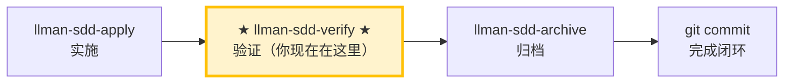

# LLMAN SDD Verify

使用此 skill 验证实现是否与该 change 的 artifacts 一致。

## Pipeline 位置



> 📍 你现在在验证阶段 → 通过后下一步 `llman-sdd-archive`（归档）；失败则回到 `llman-sdd-apply`（修复）

## 硬约束

- **必须先通过 apply 阶段全绿**：未完成实现的 change 跳过验证。
- **CRITICAL 必须修复**：标记为 CRITICAL 的问题归档前必须修复。
- **不要问「要不要继续」**：跑完整个验证流程，输出完整报告。

## 步骤
1. 确定 change id（不明确时让用户从 `llman sdd list --json` 选择）。
2. 检查阶段守卫（权威）：
   ```bash
   stage=$(llman sdd show <id> --json --type change | jq -r .stage)
   ```
   （若无 `jq`，可用任意工具从 JSON 中解析 `stage` 值。）
   - 若 `stage` 不为 `full`，变更尚未实现、无可验证内容 → 必须停止并给出守卫提示：
     - `draft`："变更 <id> 是 draft 提案（仅 proposal.md），尚无可验证的实现。请先用 llman-sdd-propose 生成完整工件，再用 llman-sdd-apply <id> 实现。"
     - 其他非 full 阶段（`specified`/`designed`）："变更 <id> 处于 <stage> 阶段，尚未准备好被验证。请先用 llman-sdd-apply 实现。"
3. 先跑一个快速校验门禁：
   - `llman sdd validate <id> --strict --no-interactive`
4. 阅读：
   - `llmanspec/changes/<id>/specs/` 下的 delta specs
   - `proposal.md` 与 `design.md`（如存在）
   - `tasks.md`（理解实现范围）
5. 对比 artifacts 与代码：
   - 标出不一致（缺失行为、错误行为、缺测试/文档）
   - 给出最小修复建议或建议更新 artifacts
6. **BDD-on 验证（Partitioned SSOT）**——仅当 `config.yaml` 含 `bdd:` 段时：
   - `llman sdd validate <spec>`：Gherkin + `@req`/双写门禁；默认跑 `bdd.run_command`（可用 `--no-check` 跳过）。
   - 确认已运行 `llman sdd solidify <id>` 且 stdout 含 `consistency ok`。
   - 检查：可执行 GWT 只在 `.feature`；`morphology.dualWriteCount` 应为 0。

   - 额外要求: {{ bdd_verify_prompt }}

7. 输出简短报告：
   - **CRITICAL**（归档前必须修复）
   - **WARNING**（建议修复）
   - **SUGGESTION**（可选优化）
8. 若存在 CRITICAL，建议用 `llman-sdd-apply` 修复；若通过则建议归档：`llman sdd archive run <id>`。

> 💡 验证通过 → 下一步 `llman-sdd-archive`（归档）；有 CRITICAL → 回到 `llman-sdd-apply`（修复）

{{ unit("skills/sdd-commands") }}

{{ unit("skills/structured-protocol") }}
