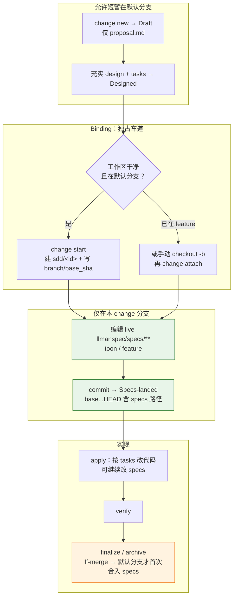

## Git-native 生命周期（权威）

**两层勿混**：**Git-native 生命周期**（Branch binding → Specs landing → apply-ready）与 **skill 导航**（explore→propose→apply→verify→archive）是不同层。Specs landing **不是**独立 skill。

硬规则：
1. **先** `change start` / `attach`（Branch binding）进入 Full；**再**在绑定的非默认分支编辑 `llmanspec/specs/**` 并 commit（Specs landing）。
2. 无 live 合约变更时可设 frontmatter `skip_specs_landing: true`。进入 apply 前 `llman sdd show <id> --json` 的 `readyToImplement` 须为 true（`Full ∧ (specsLanded ∨ skip)`）。
3. **禁止**为过干净树门禁把 live specs commit 到默认分支；已 attach 时不要重复 `start`。
